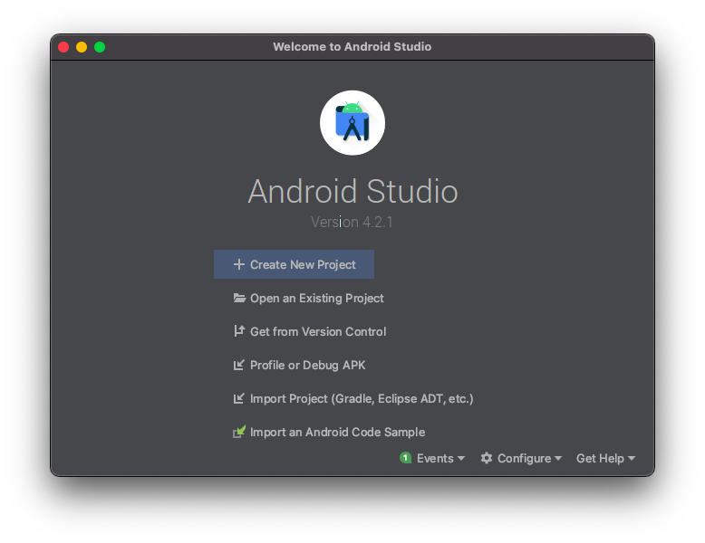
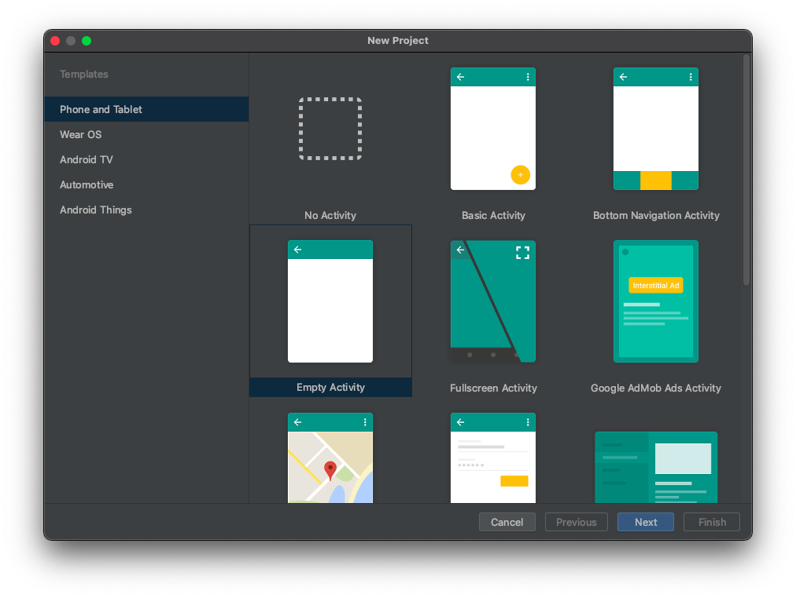
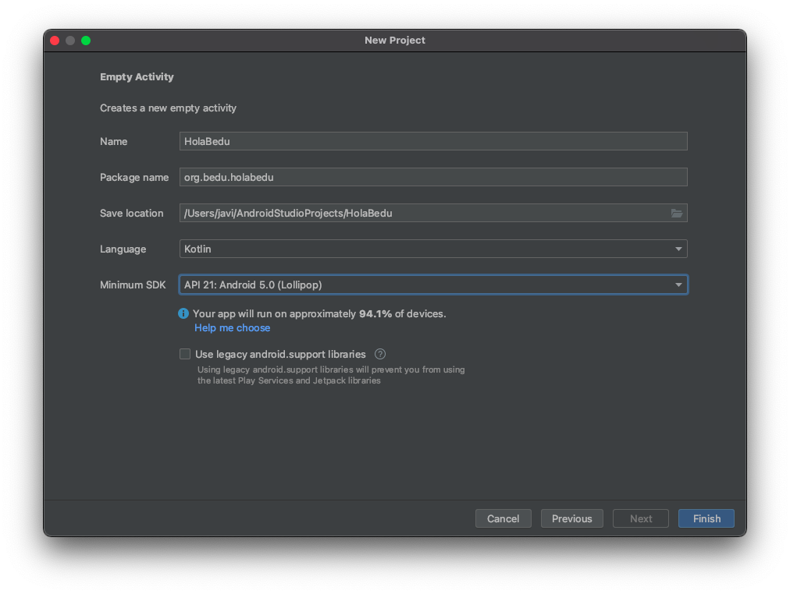

[`Kotlin Intermedio`](../../Readme.md) > [`Sesión 01`](../Readme.md) > `Ejemplo 1`

## Ejemplo 1: Crear un proyecto con Android Studio

### 1. Objetivos :dart:

- Crear un nuevo proyecto andriod desde cero
- Estudiar la estructura básica de un proyecto android

### 2. Requisitos :clipboard:

1. Android Studio Instalado en nuestra computadora.

### 3. Desarrollo :computer:

1. Abre __Android Studio__

2. En esta ventana, veremos distintas opciones para abrir un proyecto Android, para nuestro caso, abriremos un nuevo proyecto android (la opción marcada.)

   
   
3. Visualizaremos una ventana para seleccionar un template, que da una configuración inicial de acuerdo a la orientación de nuestro proyecto. Las distintas pestañas (seleccionadas en amarillo), nos dan acceso a diferentes tipos de dispositivo:

   - **Phone and Tablet**: Para teléfonos móviles y tabletas (la opción que estaremos usando).
   - **Wear OS**: Dispositivos wearables como smart watches.
   - **TV**: Para hacer aplicaciones en Smart TVs.
   - **Automotive**: Para vehículos que implementen [Android Auto](https://www.android.com/auto/).
   - **Android Things**: Dispositivos IoT (Internet of Things) que implementen [Android Things](https://developer.android.com/things/).
   
Nosotros nos concentraremos en desarrollo para teléfonos móviles.

   

4. Configuraremos algunos parámetros de nuestra aplicación. 

    - _Name_ es el nombre de nuestro proyecto.

    - El _Package Name_ debe ser único; es por eso que el paquete toma el nombre del dominio web de la organización y lo invierte, dejando al final el nombre de nuestro proyecto en minúsculas. En este caso, el dominio de la organización es [bedu.org](bedu.org) y el nombre del proyecto es holabedu, por lo tanto, el package name es ___org.bedu.holabedu___.

    - _Save location_ contiene la ruta donde se guarda el proyecto.

    - En _Language_ podremos elegir entre __Kotlin__ y __Java__. En este módulo utilizaremos siempre Kotlin.

    - El SDK mínimo determina la versión mínima de Android a la que le daremos soporte.

    - Por último, la opción _Use legacy android.support libraries_ utiliza una biblioteca vieja para dar soporte a versiones android antiguas en el desarrollo con una API más nueva. Su uso no es recomendable en proyectos nuevos, ya que la biblioteca de compatibilidad _AndroidX_ provee de la misma funcionalidad y de muchas herramientas nuevas por medio de Jetpack (conjunto de bibliotecas que agregan nuevas funcionalidades).

    - Terminado todo, daremos ___finish___ para crear el proyecto.

   
   
  
**¡Felicidades! Haz creado tu primer proyecto con Android Studio**

[`Anterior`](../Readme.md#setup-inicial) | [`Siguiente`](../Ejemplo-02/Readme.md)

