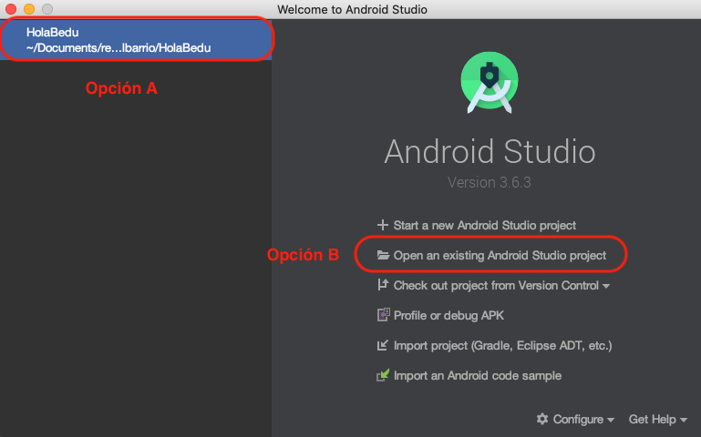
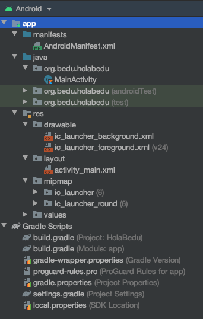
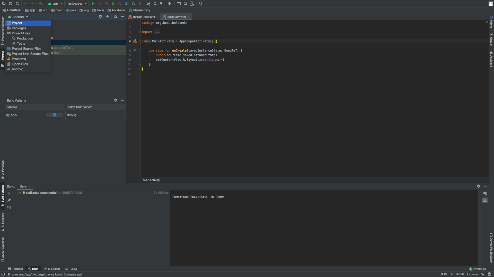
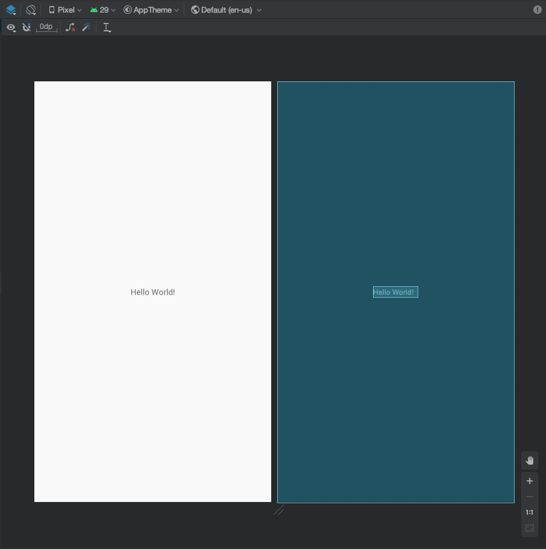
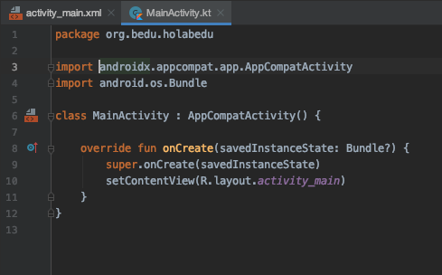

[`Kotlin Intermedio`](../../Readme.md) > [`Sesión 01`](../Readme.md) > `Ejemplo 2`

## Ejemplo 2: Estructura del proyecto

### 1. Objetivos :dart:

- Analizar la estructura de un proyecto en blanco.
- Correr el proceso de _Make Project_

### 2. Requisitos :clipboard:

1. Android Studio Instalado en nuestra computadora.

### 3. Desarrollo :computer:

1. Abre __Android Studio__

2. Vamos a abrir nuestro proyecto del [Ejemplo 1](../Ejemplo-01). En esta ventana, tenemos dos opciones para abrir nuestro proyecto. 
	- La __Opción A__, es un shortcut (atajo) para abrir un proyecto abierto recientemente. Basta con dar click a la sección.
	- La __Opción B__, abrir nuestro proyecto seleccionando la ruta.

   
   
3. Al abrirse la IDE, visualizaremos una estructura de directorios que conforman nuestro proyecto. Explicamos cada directorio:

- **manifest**: Contiene el archivo AndroidManifest.xml.
- **java**: Contiene los archivos Java, o en este caso Kotlin, de código fuente separados por nombres de paquetes, incluido el código de prueba JUnit.
- **res**: Contiene todos los recursos de nuestro proyecto, tales como archivos XML que almacenan colores, strings y elementos gráficos: imágenes de mapa de bits, divididos en subdirectorios pertinentes.
	- **drawable**: Archivos de mapas de bits (.png, .9.png, .jpg y .gif) o archivos XML.
	- **layout**: Aquí se almacenan los archivos XML de nuestra Interfaz de Usuario, donde se declaran las Vistas a utilizar, sin definir funcionalidad alguna.
	- **mipmap**: Archivos de elementos de diseño para diferentes densidades de los íconos de selectores.
	- **values**: Archivos XML que contienen valores simples, como strings, valores enteros y colores.
	

   
   
> La raíz __Gradle Scripts__ forman parte de nuestro proyecto, pero los analizaremos adelante con detalle.
 
 La estructura anterior es una representación simplificada de nuestro proyecto y no muestra la estructura de directorios y archivos en nuestro proyecto, por lo tanto, si queremos visualizarla tal cual es, haremos lo siguiente: En la ventana _Project_, podremos ver un selector que tiene elegido la opción android por defecto, dar click a este y elegir __Project__.

   
   
Esta versión contiene la organización real del proyecto. Algunas cosas a notar, son las carpetas repetidas en ___res___ tales como __drawable__ o __mipmap__. Tomando como ejemplo el anterior, observamos una nomenclatura como ___hdpi___ o ___mdpi___. Se organiza así para definir imágenes con distintas densidades y que el sistema asigne el recurso para un dispositivo android de acuerdo a la resolución de su pantalla. Existen nomenclaturas para otros tipos de clasificación como el idioma o versión.

   
   
En general, la opciones de visualización del proyecto adecuado dependerá del objetivo que tengas en el momento al abrir la IDE.

#### MainActivity.kt y activity_main.xml

Al momento de crear tu proyecto, estos dos archivos estaban abiertos. Si damos click en _activity_main.xml_, visualizaremos lo que parece ser una pantalla de una aplicación y su _Blueprint_. En el archivo _MainActivity.kt_, encontraremos código en Kotlin definiendo un *Activity* definiendo un callback *onCreate* que setea el contenido del archivo xml. Por ahora, podemos describir esto:

- __activity_main.xml__ es un layout y contiene la descripción de la interfaz gráfica de nuestro menú principal.

   
   
- __MainActivity.kt__ contiene una clase que hereda de ___AppCompactActivity___, por lo tanto sabemos que es una Activity y que contiene el código fuente para hacer funcionar nuestro menú principal.

   

[`Anterior`](../Ejemplo-01/Readme.md) | [`Siguiente`](../Ejemplo-03/Readme.md)

