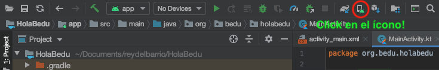
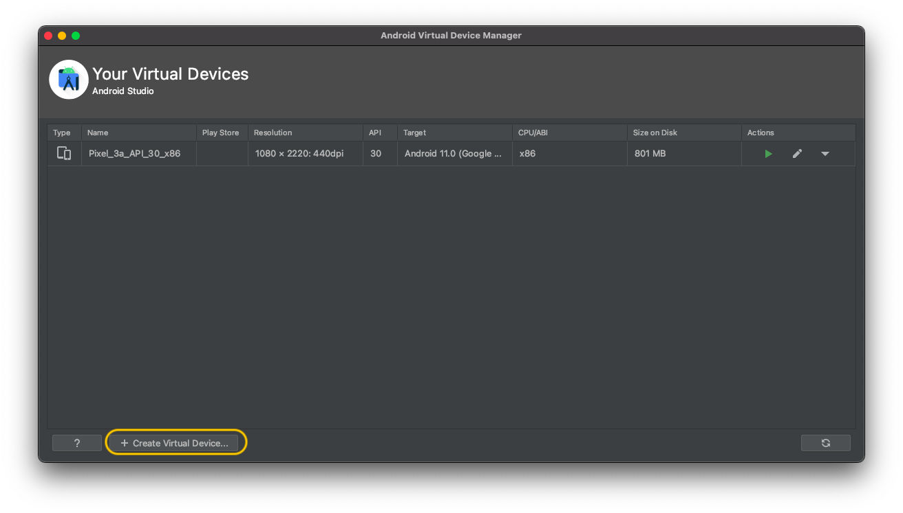
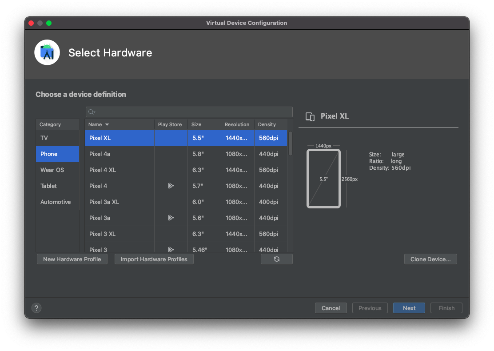
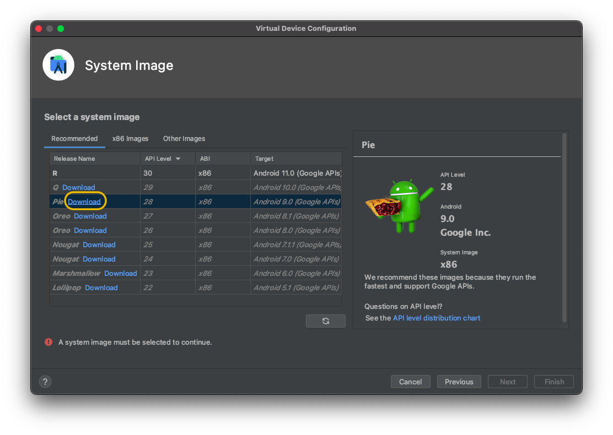
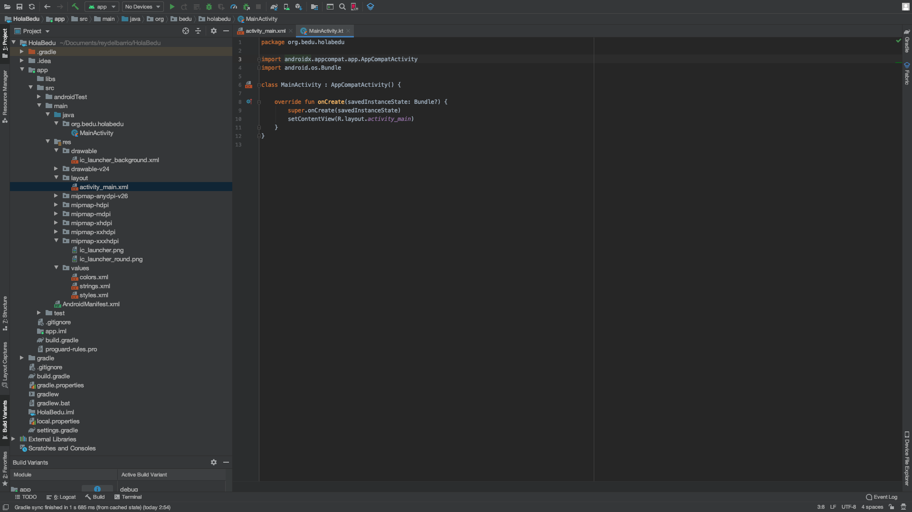
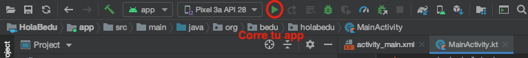
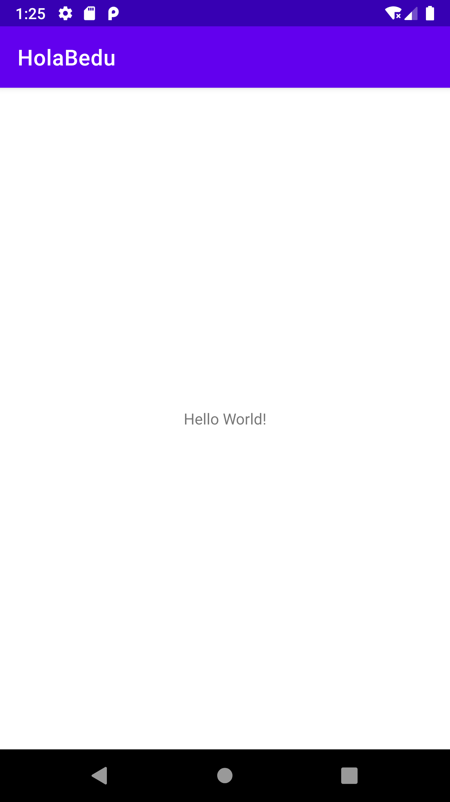

[`Kotlin Intermedio`](../../Readme.md) > [`Sesión 01`](../Readme.md) > `Ejemplo 3`

## Ejemplo 3: Emulación de dispositivos

### 1. Objetivos :dart:

- Crear un dispositivo virtual Android
- Ejecutar nuestro proyecto en el emulador configurado

### 2. Requisitos :clipboard:

1. Android Studio Instalado en nuestra computadora.

### 3. Desarrollo :computer:

Para poder probar cualquier aplicación a desarrollarse, es necesario tener un dispositivo Android a la mano, pero no tiene qué ser físico debido a que Android Studio puede crear emuladores de teléfonos reales y personalizados a través del __AVD MANAGER__. Vamos a aprender a crear un __AVD__ (Android Virtual Device) o Dispositivo Virtual Android.

1. Inicia __Android Studio__ y abre el proyecto creado anteriormente.

2. En la barra de herramientas, localiza un ícono de un celular con la cabeza de la mascota de android, descubrirás que es un botón que da acceso al __AVD MANAGER__, donde crearemos nuestro dispositivo virtual. Da click sobre este.

3. Al abrirse la ventana, si no tenemos dispositivos creados previamente, nos saldrá una ventana que tiene un botón con la leyenda _Create virtual device_, da click sobre él.

4. Explora un poco! verás distintos teléfonos con configuraciones diferentes de pantalla, algunos con la Play Store disponible. Selecciona uno y da click en siguiente.

5. Vamos a probar a instalar Android Pie en nuestro dispositivo (pero también puedes instalar otra versión si así lo deseas). Da click en Download, al lado del nombre de la versión.

6. Acepta los términos y condiciones, y espera a que la descarga termine; cuando esto suceda, click en finalizar.

7. De regreso en la selección de _Imagen de Sistema_, selecciona __Android Pie__ y dale Next.

8. En el último paso, deja las configuraciones finales intactas (orientación inicial del dispositivo etc.) y finaliza el proceso.

Listo! nuestro dispositivo está configurado, podemos hacer más configuraciones de dispositivos virtuales si así lo deseamos.

Ahora vamos a correr nuestra aplicación! La forma más práctica es dando click en el botón verde de play :arrow_forward:.

Espera un momento y listo! la aplicación corre en nuestro emulador.

  
**¡Felicidades! Ahora estás listo para correr tu aplicación en un dispositivo real**

[`Anterior`](../Ejemplo-02/Readme.md) | [`Siguiente`](../Reto-01/Readme.md)

