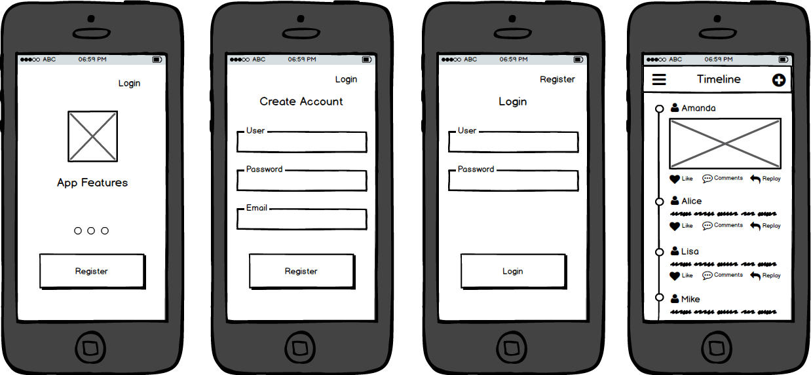

[`Kotlin Intermedio`](../../Readme.md) > [`Sesión 01`](../Readme.md) > `Postwork`

## Postwork

### 1. Objetivos :dart:

- Definir el proyecto con el que trabajaremos todo el curso.
- Programar la idea básica de nuestra aplicación.

### 2. Requisitos :clipboard:

1. Android Studio Instalado en nuestra computadora.

### 3. Desarrollo :computer:

A continuación veremos ciertos puntos que nos ayudarán a aterrizar nuestro proyecto.

* __Definir el concepto de nuestra aplicacion__. Teniendo en cuenta cuál es el núcleo de la app (un e-commerce, un catálogo de viajes, una red social simple, administración de gastos, etc.).

* __Tener en mente el temario, pensar a futuro__. Tener conciencia de los temas que se van a abordar en el módulo nos va a permitir dimensionar lo que se puede abarcar en nuestro proyecto, para evitar atorarnos en el desarrollo y terminar desechando ideas. Sin embargo, toma en cuenta que este proyecto es una base a retomarse en el siguiente módulo, por lo que está bien tomar en cuenta futuras implementaciones de ideas más avanzadas. 

* __Planear el flujo de nuestra app__. Con el concepto claro, hay que definir cómo va interactuar el usuario con nuestra aplicación, por lo que recomendamos hacer esbozos de cada pantalla a utilizar, mediante wireframes. Entonces, si tendremos un login, diseñar la pantalla y después pensar en la pantalla principal al iniciarse la sesión. Pensar en implementar un botón de cerrar sesión y dónde colocarlo. Aconsejamos explorar distintas aplicaciones para identificar las tendencias.

    

[`Anterior`](../Proyecto/Readme.md) | [`Siguiente`](../../Sesion-02/Readme.md#sesión-2-views)

