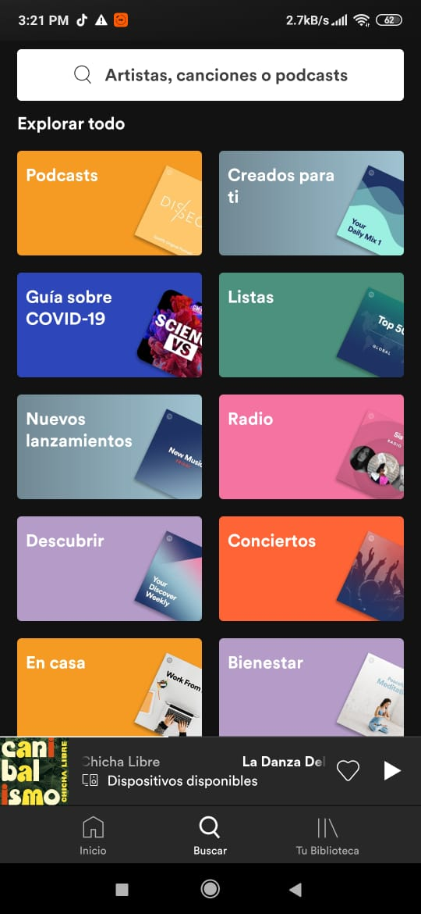
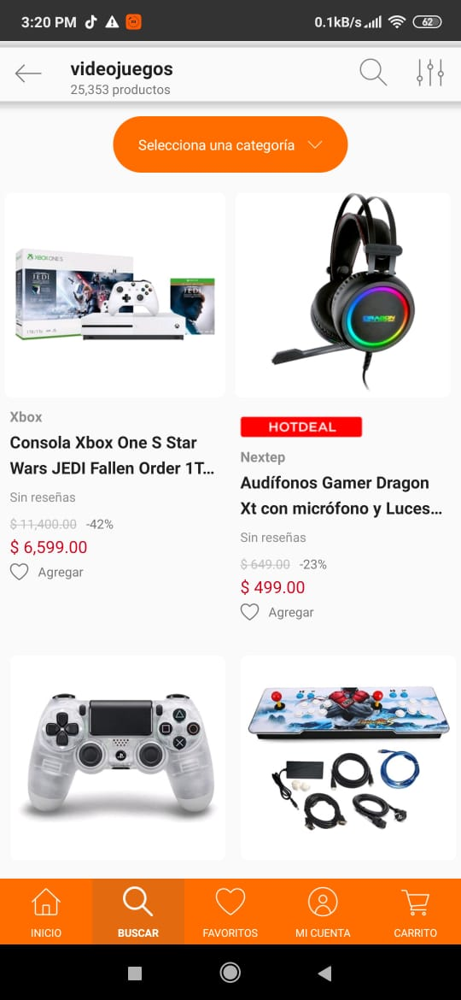
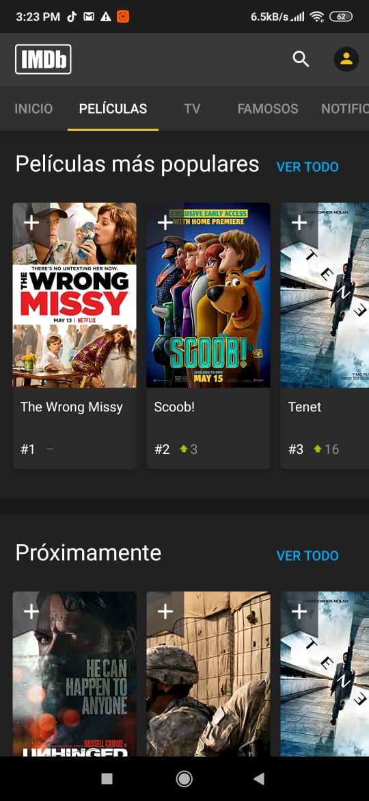

[`Kotlin Intermedio`](../../Readme.md) > [`Sesión 01`](../Readme.md) > `Proyecto`

## Proyecto: Lineamientos 

### 1. Objetivos :dart:

- Definir el proyecto con el que trabajaremos todo el curso.
- Interpretar los lineamientos que integra el proyecto.
- Programar la idea básica de nuestra aplicación.

### 2. Requisitos :clipboard:

1. Android Studio Instalado en nuestra computadora.

### 3. Desarrollo :computer:

##### cómo definir el proyecto

En esta primera parte del curso, debemos definir un proyecto con el que trabajemos las 8 sesiones. Este proyecto va ir tomando mayor complejidad conforme se vaya avanzando en nuevos temas, obteniendo herramientas que nos permitan realizar nuevas funcionalidades.

Si previamente tomaraon el curso de __Kotlin fundamentals__, pueden retomar la idea original del proyecto e ir adaptándolo a este módulo, con esto tendrán una integración más completa de conceptos de Android y Kotlin.

Para poder elegir el proyecto adecuado, hay que considerar ciertos factores:

* Se basa en una idea de proyecto que ya existe (spotify, amazon,rappi, etc).
* Soluciona un problema de la vida real.
* Se puede plantear como una aplicación móvil.
* Se limita a una simulación sencilla de la prestación de algún servicio o producto.

A continuación damos unos ejemplos de aplicaciones que se pueden retomar para el concepto de nuestro proyecto.

__NOTA:__ Estas muestras no tienen como objetivo que sean replicadas, más bien es para tomar el concepto y algunas referencias de interfaz o una versión reducida de estas, para no dificultar el desarrollo de manera innecesaria.

    
        
   ###### Spotify
   Es un buen ejemplo si tomamos en cuenta que la aplicación no reproducirá música en este módulo (En el módulo avanzado se le da continuidad al manejo multimedia y se puede retomar el proyecto). La aplicación se podría limitar a crear listas de reproducciones, agregar y quitar canciones de la lista y seleccionar favoritos. Podríamos simular una pantalla de perfil e inicio de sesión.
   
    
   

    
        
   ###### linio
   Esta aplicación de pago es una buena guía de concepto al poder implementar una lista de productos, seleccionar algunos de ellos para el carrito de comprar, eliminar del carrito y simular un perfil con saldo para realizar compras. Incluso se le pueden restar características y seguir siendo una aplicación bastante completa.
   
    
   

    
        
   ###### IMDB
En esta aplicación podemos consultar sinopsis, calificaciones y listas de películas, programas de TV, actores etc. Podríamos tomar de este ejemplo el desplegar una lista de películas, tener la capacidad de calificarlas y leer su sinopsis, o tomar otras ideas de ella.
   
    
   

##### lineamientos para comenzar el proyecto

- Aconsejamos no definir una idea muy compleja del proyecto, puesto a que su propósito es meramente didáctico.
- La aplicación debe ser pensada únicamente para teléfonos móviles y con orientación vertical, esto para reducir complejidad y ahorrar tiempo en los diseños de layouts.
- Se puede retomar la idea del curso __Kotlin Fundamentals__ o crear uno desde cero, pero la idea es darle continuidad.
- Se evaluarán únicamente las implementaciones de los temas vistos en el curso, si bien se pueden tomar conceptos vistos de otras fuentes, deberán ser moderados para no perder de vista lo fundamental.
- La estructura del código irá tomando forma a lo largo del proyecto, por lo que adelantarse a los temas no es aconsejable.
- Crearemos nuestro proyecto con el nombre que le asignemos a la aplicación.
- Este setup inicial cubrirá el diseño del concepto y la creación del proyecto, pero las implementaciones al código comienzan en la siguiente sesión.

[`Anterior`](../Reto-01/Readme.md) | [`Siguiente`](../Postwork/Readme.md)

