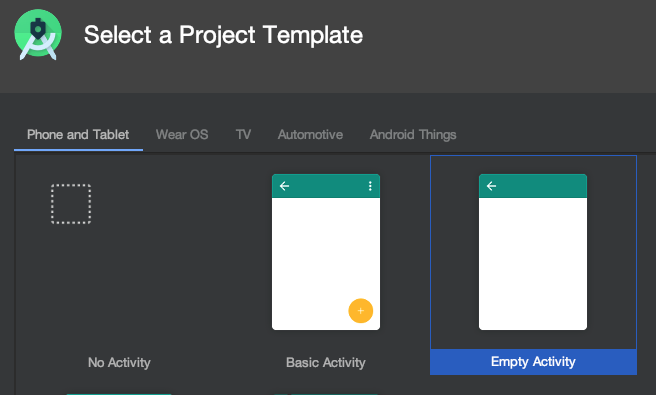
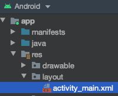
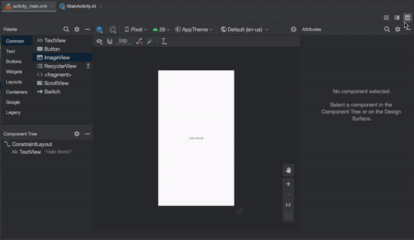
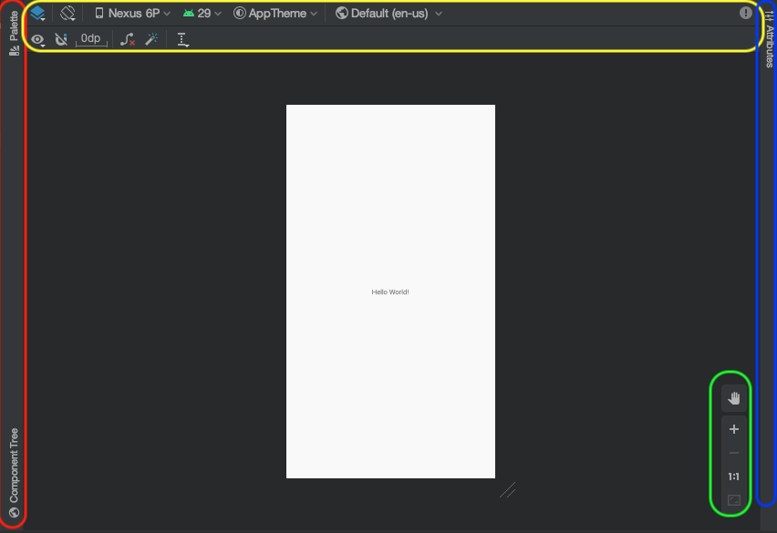
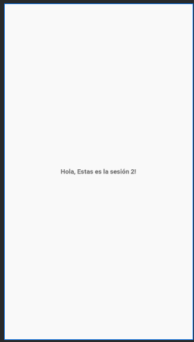
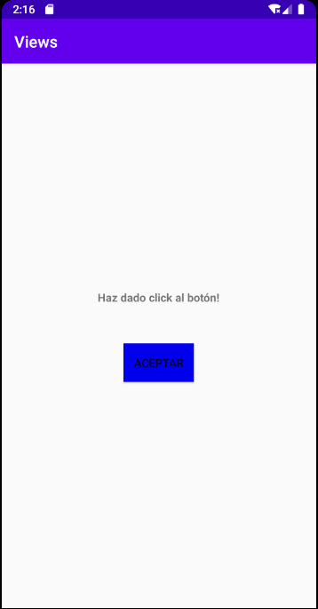

[`Kotlin Intermedio`](../../Readme.md) > [`Sesión 02`](../Readme.md) > `Ejemplo 1`

## Ejemplo 1: Views, Button

<div style="text-align: justify;">

### 1. Objetivos :dart:

- Crear un View desde el layout.
- Explorar los atributos básicos de un View.

### 2. Requisitos :clipboard:

1. Android Studio Instalado en nuestra computadora.
2. Seguir la instrucción específica para esta sesión.

### 3. Desarrollo :computer:

1. Abre __Android Studio__ y crea un nuevo proyecto con Activity Vacía (Empty Activity).

   

2. Una vez creado el proyecto, nos dirigimos al directorio de nuestro proyecto, localizamos la carpeta de recursos y abrimos el archivo XML enconatrado en la carpeta _layout_.

   
   
3. Se abrirá una nueva pestaña con una ventana que muestra el diseño de la pantalla principal, esta es una interpretación gráfica del código XML que se encuentra en nuestro archivo, y por supuesto podemos visualizarlo en Android Studio. Las formas de visualizar este archivo son por código,diseño o mixto y se muestran en el siguiente gif:

      
     
4. Ahora vamos a explorar un poco las herramientas que la IDE nos brinda para este tipo de archivos:

      

   * : La barra vertical izquierda contiene __Palette__ Que nos muestra una serie de Views para insertar en el layout y __Component tree__ Que muestra la estructura de nuestro layout. 
   * : En la barra superior vertical, tenemos opciones para mostrar el diseño con su _blueprint_, una opción para colocar el diseño en formato vertical/horizontal, seleccionar la resolución de la pantalla mediante móviles predefinidos o con medidas personalizadas, la API de android entre otras cosas. 
   * :En la barra lateral derecha, tenemos la opción ___attributes___ que despliegan los atributos de un _View_ seleccionado con el cursor.
   * : Este menú flotante posibilita el zoom in/out al layout, capacidad de pan, escalar la app a resolución 1:1.

5. Elegiremos un tipo de visualización para nuestro archivo. En este caso, elegiremos la opción mixta para permitirnos visualizar nuestro código con el que trabajaremos manualmente y visualizar los cambios que genera en el layout.

6. Utilizaremos [Este código](../Readme.md#instrucciones-de-las-sesion) para sustituir el _ViewGroup_ actual (_ConstraintLayout_) con uno de manejo más sencillo (_LinearLayout_), este tema se toca a mayor profundidad en la siguiente sesión.

7. Agregamos el siguiente código XML para agregar un _TextView_:

```kotlin
<TextView
        android:id="@+id/text"
        android:layout_width="wrap_content"
        android:layout_height="wrap_content"
        />
```

8. Agregaremos un texto para nuestro _TextView_, para eso, abrirermos el recurso ___strings.xml___ ubicado en ___res/values/___ . Dentro del tag resources, agregamos un nuevo string:

```xml
<string name="hello_text">Hola, Estas es la sesión 2!</string>
```

   y agregamos un nuevo atributo ___text___ al _TextView_ para insertarle un texto. Adicionalmente, haremos el texto en negritas y definiremos el tamaño de la fuente:
   
 ```xml
android:text="@string/hello_text"
android:textStyle="bold"
android:textSize="14sp"
```
   en textSize, tenemos el sufijo "sp" que significa scale-independent pixels.
   Deberíamos poder visualizar el texto correctamente!
   
   


9. Añadimos ahora un botón, ponemos esta línea de código abajo del Textview para generar uno.

```xml
<Button 
        android:id="@+id/btnAccept"
        android:background="@color/mexicanPink"
        android:text="@string/accept_button"
        android:layout_width="wrap_content"
        android:layout_height="wrap_content" />
```

   Ingresamos el texto _accept_button_ en _strings.xml_ :

```xml
<string name="accept_button">ACEPTAR</string>
```

   Y el color rosa mexicano a _colors.xml_:
   
```xml
<color name="mexicanPink">#E4007C</color>
```

En el diseño se visualiza correctamente el botón, sin embargo, el botón está pegado al _TextView_, así que le daremos un margen en la parte superior:

```xml
android:layout_marginTop="48dp"
```

10. Ahora agregaremos funcionalidad a este botón. Abrimos El archivo ___MainActivity.kt___ en ___java/nombre.del.paquete/___. Dentro de la clase homónima, declaramos dos objetos _Button_ y _TextView_ para representar los Views en nuestra Activity.

```kotlin
private lateinit var btnAccept: Button
private lateinit var text: TextView
```


   al final del método ___onCreate___ , agregamos la siguiente línea de código para asignarles los Views correspondientes (mediante sus id's):

```kotlin
btnAccept = findViewById(R.id.btnAccept)
text = findViewById(R.id.text)
```

y por último asignamos el código a reproducirse cuando se pulse el botón: 

```kotlin
btnAccept.setOnClickListener {
            text.text = "Haz dado click al botón!"
        }
```

   Lo que estamos haciendo aquí es asignar un nuevo texto a nuestro ___TextView___ al hacer click en el botón. Corremos la aplicación para comprobar que todo funcione bien.

   Por buena práctica, todo texto de la aplicación va en _strings.xml_ por lo que trasladamos el texto del _TextView_ al archivo:

```xml
<string name="button_clicked">Haz dado click al botón!</string>
```

   y el texto ahora se asigna de la siguiente form:

```kotlin
text.text = getString(R.string.button_clicked)
```


Nuestra aplicación debe verse de la siguiente forma:




[`Anterior`](../Readme.md) | [`Siguiente`](../Reto-01/Readme.md)

</div>
