[`Kotlin Intermedio`](../../Readme.md) > [`Sesión 02`](../Readme.md) > `Ejemplo 1`

## Ejemplo 2: Inputs e imágenes

<div style="text-align: justify;">

### 1. Objetivos :dart:

- Posicionar imágenes en el layout a través de un View.
- Explorar los atributos básicos de un View.

### 2. Requisitos :clipboard:

1. Android Studio Instalado en nuestra computadora.
2. Seguir la instrucción específica para esta sesión.

### 3. Desarrollo :computer:

### ImageView

1. Abre __Android Studio__ y crea un nuevo proyecto con Activity Vacía (Empty Activity).

2. Abrimos el archivo XML encontrado en la carpeta _layout_.
   
3. Reemplazamos el código autogenerado por [este](../Readme#instrucciones-de-la-sesión) y agregamos un ImageView, mediante el siguiente código:

```kotlin
<ImageView
        android:layout_height="wrap_content"
        android:layout_width="wrap_content"
        android:src="@drawable/beto"
        />
```

4. Notamos que existe un atributo ___src___ con un drawable llamado _beto_, por lo que tenemos qué agregar una imagen con ese nombre en el directorio ___res/drawable/___.

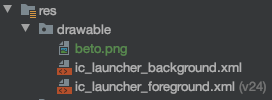

5. Nuestro diseño se visualiza así:

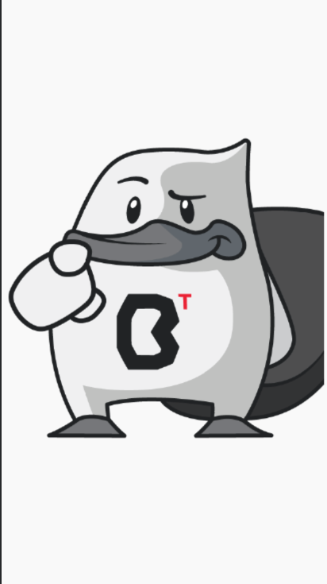

El tamaño excesivo se debe a que el ImageView por asignarle _wrap_content_ al ancho y alto, se ajusta al tamaño de la imagen.

Vamos a definir un tamaño específico para nuestro _View_:

```xml
android:layout_height="48dp"
android:layout_width="120dp"
```

6. Aunque la imagen se alcanza a ver completamente, las dimensiones del _ImageView_ no corresponden a la escala de la imagen. En este _View_ tenemos disponible un atributo para describir el escalamiento que llevará nuestra imagen:


VALOR | ENUM en ImageView.ScaleType | DESCRIPCION | EJEMPLO
------|------------------|-------------|----------
center | CENTER | centra la imagen sin escalamiento |   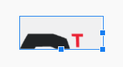
centerCrop | CENTER_CROP | centra la imagen y mantiene su proporción, haciendo un recorte si la imagen es más grande que el _View_ | 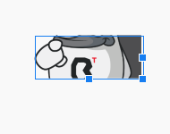
centerInside | CENTER_INSIDE | redimensiona la imagen manteniendo su proporción para que sus medidas quepan en el _View_ (igual o menor). |  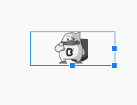
fitEnd | FIT_START | redimensiona la imagen manteniendo su proporción para que quepa y se alinee al principio del _View_ | 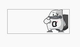
fitCenter | FIT_CENTER | redimension la imagen manteniendo su proporción para que quepa y se centre en el _View_ | 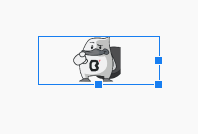
fitEnd | FIT_END | reescala la imagen manteniendo su proporción para que quepa y se alinee al final del _View_ | 
fitEnd | FIT_END | redimensiona la imagen cambiando su proporción para ajustarse a las medidas del _View_ | 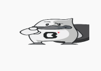

Experimentemos con cada una de estas opciones. Finalmente, utilizaremos la opción ___centerInside___.

### EditText

1. Ahora vamos a agregar un EditText. Agregamos las siguientes líneas de código después de nuestro ImageView:

```xml
<EditText
        android:id="@+id/editText"
        android:layout_width="wrap_content"
        android:layout_height="wrap_content"
        />
```

Tendremos lo siguiente:

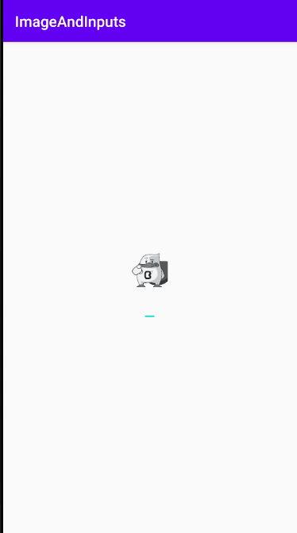

2. Como el tamaño lo ponemos en función del contenido, este se redimensiona al agregar texto, esto no es deseable así que tenemos qué determinar un tamaño fijo, por lo que modificaremos el EditText:

```xml
<EditText
        android:id="@+id/editText"
        android:hint="@string/add_text"
        android:textColorHint="@color/colorAccent"
        android:layout_width="match_parent"
        android:layout_height="wrap_content"
        android:layout_marginTop="24dp"
        android:layout_marginHorizontal="24dp"
        android:inputType="text"
        android:drawableLeft="@drawable/boy"
        android:drawablePadding="12dp
        />
```

3. En este caso, utilizamos el ancho de nuestro _LinearLayout_ con un margen de 24dp para cada lado, e incluimos el ___inputType___ como text (con eso evitamos un texto multilínea), este último atributo regula el tipo de dato que introducimos y por ende modifica el teclado, de modo que si nuestro InputType es _phone_, nos desplegará un teclado numérico, o si se trata de un _textEmailAddress_, saldrá un teclado alfanumérico que nos facilita caracteres como el . y @. El texto de descripción se controla por la propiedad ___hint___ y su color por ___textColorHint___. En este caso, haría falta agregar un string llamado _add_text_ para que funcione correctamente. finalmente, ___drawableLeft___ nos da la posibilidad de poner una imagen del lado izquierdo para personalizarlo, existen otros atributos para agregar en otros lados las imágenes e incluso para añadir padding al drawable con ___drawablePadding___.

4. Ahondaremos ahora en el concepto de _focus_. El foco determina si un elemento está activo, en el caso de un _EditText_, es cuando está seleccionada, apareciendo el cursor en este y mostrándose el teclado para edición. Se puede deshabilidar la propiedad _focusable_ de un EditText, pero por ahora esto no es requerido. Cuando tenemos varios campos, podemos seleccionar qué elemento se va a enfocar después de terminar de editar en un _EditText_. Por defecto, esto está seteado de arriba para abajo. 

Agregaremos un nuevo _EditText_ que pida un teléfono, para esto, limitaremos los caracteres a 10 y agregaremos y declararemos el tipo de input a ___phone___:

```xml
<EditText
        android:id="@+id/editText2"
        android:hint="@string/phone"
        android:textColorHint="@color/colorAccent"
        android:layout_width="match_parent"
        android:layout_height="wrap_content"
        android:layout_marginTop="24dp"
        android:maxLength="10"
        android:layout_marginHorizontal="24dp"
        android:inputType="phone"
        android:drawableLeft="@drawable/phone"
        android:drawablePadding="12dp"
        />
```

Al correr el código tenemos lo siguiente:

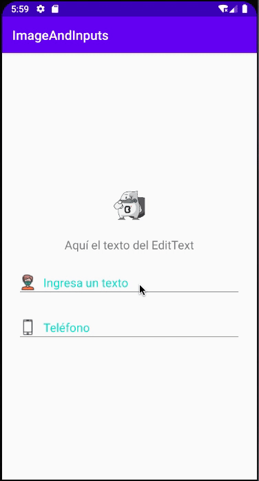

Podemos determinar los siguientes campos manualmente mediante los siguientes atributos:


ATRIBUTO | DESCRIPCION 
---------|-------------
nextFocusDown | determina el siguiente campo navegando hacia abajo
nextFocusUp | determina el siguiente campo navegando hacia arriba
nextFocusLeft | determina el siguiente campo navegando hacia la izquierda
nextFocusRight | determina el siguiente campo navegando hacia la derecha

también esto se puede hacer de forma programática.


5. Ahora, nos queda manejar algunos eventos del _EditText_, primero vamos a detonar una acción cuando el texto se modifique. Para eso utilizaremos un _TextWatcher_.

   Agregamos las variables:

```kotlin
    private lateinit var editText: EditText
    private lateinit var editText2: EditText
    private lateinit var textView: TextView
```

   relacionamos las variables con los id's del layout:
   
```kotlin
    textView = findViewById(R.id.textView)
    editText = findViewById(R.id.editText)
    editText2 = findViewById(R.id.editText2)
```

   Y agregamos el _listener_ para los eventos de cuando el texto cambia:
   
```kotlin
editText.addTextChangedListener(object : TextWatcher {
            override fun afterTextChanged(s: Editable) {}
            override fun beforeTextChanged(
                s: CharSequence, start: Int,
                count: Int, after: Int
            ) {
            }

            override fun onTextChanged(
                s: CharSequence, start: Int,
                before: Int, count: Int
            ) {
                textView.text = editText.text
            }
        })
```

Como vemos anteriormente, hay tres callbacks a definir (_afterTextChanged, beforeTextChanged_ y _onTextChanged_), utilizamos el último callback y asignaremos el texto del _EditText_ en nuestro _TextView_.

y listo! lo que aparezca en el EditText lo visualizamos en el TextView!


Por último, imprimiremos los valores de los editText, para esto imprimiremos los valores en nuestra línea de comandos ___Logcat___ al pulsar sobre un botón.

```xml
<Button
        android:id="@+id/button"
        android:layout_height="wrap_content"
        android:layout_width="wrap_content"
        android:layout_marginTop="12dp"
        android:text="@string/accept"/>
```

Agregamos el botón y lo asociamos a su id, para no redundar en código omitiremos este paso. Finalmente, imprimimos en consola los textos de los _EditText_ cuando demos click al botón:

```kotlin
Log.d("Test","Los valores son: ${editText.text} y ${editText2.text}")
```

Corroboramos el funcionamiento:

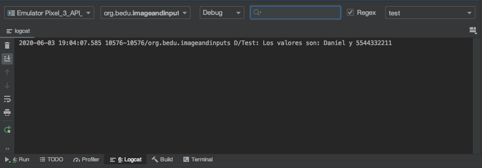


[`Anterior`](../Reto-01/Readme.md) | [`Siguiente`](../Reto-02/Readme.md)

</div>
