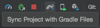
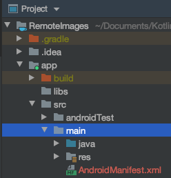
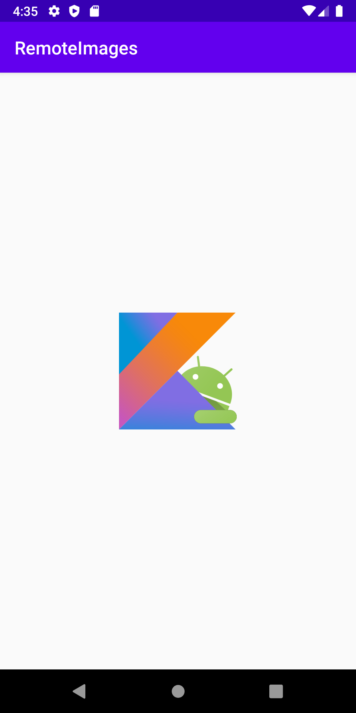

[`Kotlin Intermedio`](../../Readme.md) > [`Sesión 02`](../Readme.md) > `Ejemplo 3`

## Ejemplo 3: Imágenes mediante URL

<div style="text-align: justify;">

### 1. Objetivos :dart:

- Instalar dependencias mediante _gradle_/
- extender _ImageView_ para recuperar imágenes por medio de una URL.

### 2. Requisitos :clipboard:

1. Android Studio Instalado en nuestra computadora.
2. Coil instalado en el proyecto.
2. Seguir la instrucción específica para esta sesión.

### 3. Desarrollo :computer:

Para que un ImageView pueda cargar una imagen remota a través de una URL, tenemos qué instalar alguna dependencia (o descargarla con un cliente y asignarla, pero eso es mucho más complicado). Las opciones más populares son:

- Fresco
- Picasso
- Glide

Mientras que todos los anteriores tienen una amplia comunidad, nos enfocaremos en una cuarta opción: ___coil___ ( COroutine Image Loader), que como dice su nombre, utiliza las populares coroutines de Kotlin. 

1. Insertamos la implementación de la dependencia en el archivo ___app/buid.grade___ la siguiente línea:

```kotlin
dependencies{
	implementation"io.coil-kt:coil:0.11.0"
}
```

nótese que esta línea va dentro del bloque ___dependencies___, aquí es donde se declara la implementación de dependencias de la app. Cada dependencia se vaja de un repositorio; en este caso, coil se encuentra alojado en __Maven Central___, pero también en el _Jcenter Maven Repository de Bintray_ y podemos ver que ese repositorio se incluye en nuestro proyecto entrando en el archivo ___build.gradle___ en la carpeta raíz.

```kotlin
buildscript {
    ext.kotlin_version = '1.3.71'
    repositories {
        google()
        jcenter() // de aquí se obtiene nuestra librería
        
    }
    ...
    }

```

2. En ___app/build.gradle/___, agregaremos compatibilidad con Java 8:

```kotlin
android{
...
	compileOptions {
		sourceCompatibility JavaVersion.VERSION_1_8
		targetCompatibility JavaVersion.VERSION_1_8
	    }
}

...

tasks.withType(org.jetbrains.kotlin.gradle.tasks.KotlinCompile).all {
    kotlinOptions {
        jvmTarget = "1.8"
    }
}
```

3. Con todos los cambios hechos en ___gradle___, sincronizamos nuestro proyecto. Cada vez que se modifican los archivos ___gradle___, emerge esta barra superior: 


Podemos dar click en ___Sync now___ en la parte derecha de esa barra, o sincronizamos mediante la herramienta (dicha opción es un elefante con una flecha azul).



4. Requeriremos permisos de internet, por lo que entramos al manifest en ___app/src/main/AndroidManifest.xml___ e insertamos el permiso:

<manifest xmlns:android="http://schemas.android.com/apk/res/android"
    package="NOMBRE.DEL.PAQUETE">
    <uses-permission android:name="android.permission.INTERNET"/>
    ...
</manifest>



5. Agregamos el código de setup inicial de [la sesión](../Readme.md)

6. Dentro del _LinearLayout_, insertar el siguiente _ImageView_:

```xml
<ImageView
        android:id="@+id/imageView"
        android:layout_width="130dp"
        android:layout_height="130dp"
/>
```

7. Por último, agregamos la variable para el _ImageView_.

```kotlin
private lateinit var imageView: ImageView
```

asignamos valor a un campo:

```kotlin
imageView = findViewById(R.id.imageView)
```

y utilizamos la función _load_ (es un método que extiende de _ImageView_) para cargar imágenes desde URLS etc.

```kotlin
imageView.load("https://raw.githubusercontent.com/beduExpert/Kotlin-Intermedio-2020/master/images/android-kotlin.png")
```

Corremos el código y comprobamos!




[`Anterior`](../Reto-02/Readme.md) | [`Siguiente`](../Proyecto/Readme.md)

</div>
