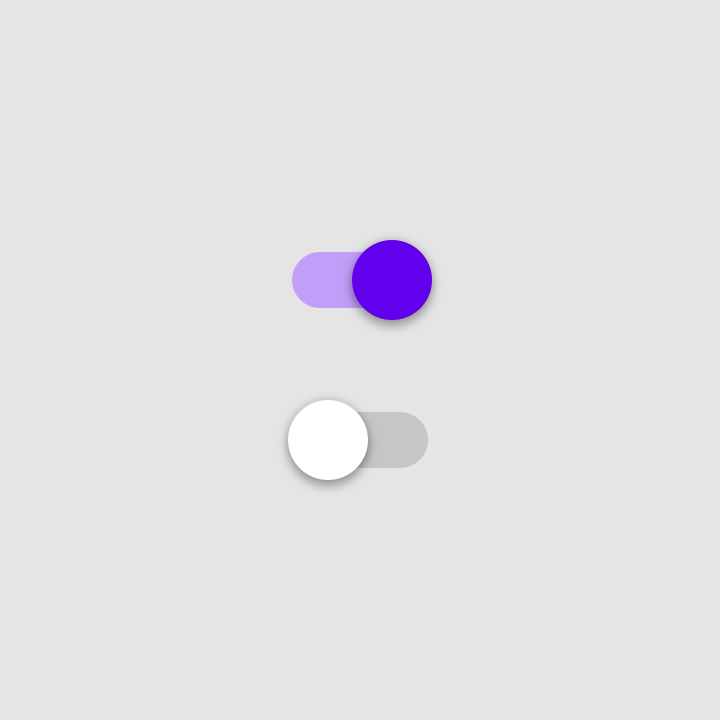
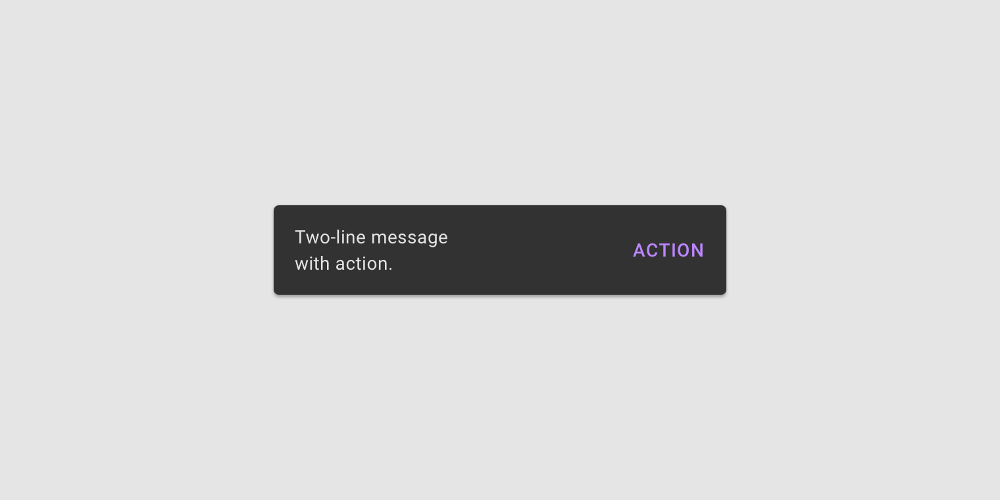

[`Kotlin Intermedio`](../../Readme.md) > [`Sesión 02`](../Readme.md) > `Postwork`

## Postwork

<div style="text-align: justify;">

### 1. Objetivos :dart:

- Programar la idea básica de nuestra aplicación.
- Implementar nuevas _Views_ al proyecto.

### 2. Requisitos :clipboard:

1. Android Studio Instalado en nuestra computadora.


### 3. Desarrollo :computer:


Puede que sea deseable o necesario utilizar algunos _Views_ no vistos durante la sesión, algunos de estos ejemplos abarcan los siguientes:


#### Switch



Este elemento es capaz de poder controlar dos estados: ___On/Off___. Dichos estados se representan por medio de un booleano, que indicará su estado actual. Para poder implementar un listener que escuche el cambio de un estado a otro, se implementaría de la siguiente forma:

```kotlin
switch.setOnCheckedChangeListener { _, isChecked ->
  Toast.makeText(this,isChecked.toString(),Toast.LENGTH_SHORT).show() //Mostrar el estado actual en un Toast
}
```

y para determinar programáticamente su estado con ___property syntax___, utilizamos:

```kotlin
switch.isChecked = true // para encender el switch
```

#### Checkbox


Comparte funcionalidades con un ___Switch___, incluyendo los métodos anteriormente descritos.


#### Slider

Este elemento de material design, puede ser escuchado al cambiar su valor por medio de lo siguiente:

```kotlin
slider.addOnChangeListener { slider, value, fromUser ->
    // Leemos el cambio del slider
}
```

También podemos reaccionar a cuando se empieza a utilizar o al terminar de utilizarlo:

```kotlin
slider.addOnSliderTouchListener(object : Slider.OnSliderTouchListener {
    override fun onStartTrackingTouch(slider: Slider) {
        // Reacción al iniciar el touch event
    }

    override fun onStopTrackingTouch(slider: Slider) {
        // Reacción al finalizar el touch event
    }
})
```

y sus valores mínimo, máximo y el paso se pueden definir desde el layout

```xml
<com.google.android.material.slider.Slider
    ...
    android:valueFrom="0.0"
    android:valueTo="100.0"
    android:stepSize="10.0"  />
``` 

Aunque también pueden ser definidos programáticamente.


#### Snackbar



Se mandan a llamar de forma similar a un ___Toast___ y son utilizados para mostrar información de procesos, con posibilidades de ejecutar una acción. Las acciones se declaran antes de llamar al método ___show()___ mediante el método ___setAction()___ y también pueden definirse ahí los colores del fondo y del texto, entre otros valores.

```kotlin
Snackbar.make(contextView, "Text label", Snackbar.LENGTH_LONG)
    .setAction("Action") {
        // Respuesta al pulsar la acción 1
    }
    .setBackgroundTint(getColor(R.color.backgroundTint))
    .setActionTextColor(getColor(R.color.actionTextColor))
    .show()
```


[`Anterior`](../Proyecto/Readme.md) | [`Siguiente`](../../Sesion-03/Readme.md)

</div>
