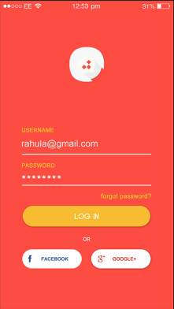

[`Kotlin Intermedio`](../../Readme.md) > [`Sesión 02`](../Readme.md) > `Proyecto`

## Proyecto: Agregando Views

<div style="text-align: justify;">

### 1. Objetivos :dart:

- Implementar Views al proyecto.
- Crear un formulario.

### 2. Requisitos :clipboard:

1. Android Studio Instalado en nuestra computadora.


### 3. Desarrollo :computer:

En este reto final, vamos a implementar un formulario de registro o de login en nuestra app, según la preferencia.

Por simplicidad podemos escoger un login con nombre de usuario/correo/teléfono y una contraseña.

### Login



Si lo que deseamos es implementar un login, los __Views__ básicos a implementar son:

- Un _ImageView_ para el logo de la app.
- Dos _EditText_: el primero para usuario/correo/teléfono, el segundo para la contraseña. Ambos con íconos de preferencia para darle personalidad.
- Un botón de Iniciar sesión
- Una etiqueta para "olvidé contraseña"

### Tips

Declarar el password con el atributo ___inputType___ como ___textPassword___ protege el texto que se va escribiendo como puntos, para que no sean visibles.

Para la validación del formato de un email, existe un utils en android que hace la validación automática (también valida números telefónicos o sitios web). Dichas herramientas en forma de clase se llama Patterns, y la propiedad que utilizaremos es EMAIL_ADDRESS, por lo que una función de validación podría quedar de la siguiente forma:

```kotlin
fun isEmailValid(email: String): Boolean { 
    return android.util.Patterns.EMAIL_ADDRESS.matcher(email).matches()
}
```
podríamos crear otro validador para Password utilizando directamente una función if y englobándola en otra función.

Para mostrar un error en un EditText podemos setear un error mediante:

```kotlin
editText.error = "Contraseña incorrecta"
```

cuando la validación sea exitosa, hay qué borrar el mensaje, por lo que agregar una extensión a EditText para hacer esto sería útil:

```kotlin
fun EditText.clearError() {
    error = null
}
```

### Lineamientos

1. La pantalla debe contener al menos un _ImageView_, dos _EditText_, dos _TextView_ y un _Button_.
2. El color de fondo debe ser asignado al fondo de la pantalla, asignar colores al texto.
3. Todo tipo de recursos debe ir en su respectivo archivo (strings en _strings.xml_, recursos gráficos en la carpeta _drawable_, etc).
4. Al menos un View debe implementar un callback con alguna funcionalidad.


[`Anterior`](../Ejemplo-03/Readme.md) | [`Siguiente`](../Postwork/Readme.md)

</div>
