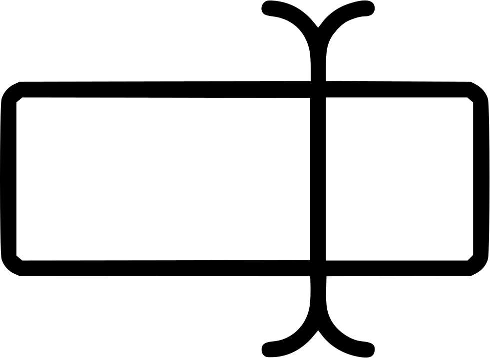

[`Kotlin-Intermedio`](../Readme.md) > `Sesión 2`


## Sesión 2: Views

<div style="text-align: justify;">

### Instrucciones de la sesión

Para esta sesión, modificaremos el layout inicial de un proyecto creado, de modo que el archivo generado en ___res/layout___ sea reemplazado por este código:

```xml
<?xml version="1.0" encoding="utf-8"?>
<LinearLayout xmlns:android="http://schemas.android.com/apk/res/android"
    xmlns:app="http://schemas.android.com/apk/res-auto"
    xmlns:tools="http://schemas.android.com/tools"
    android:layout_width="match_parent"
    android:gravity="center"
    android:layout_height="match_parent"
    android:orientation="vertical"
    tools:context=".MainActivity">
     {COLOCA AQUI EL CONTENIDO DEL LAYOUT}
</LinearLayout>
```

### Introducción

Un ___View___ es una clase que representa la base de todos los componentes para la interfaz gráfica y su representación gráfica está delimitada por un rectángulo. La descripción gráfica de un View así como su posición en la pantalla está determinado por un archivo layout en lenguaje XML, y se encuentran distribuidos jerárquicamente en un árbol de Vistas. Un tipo especial de View es el ___ViewGroup___, que es un contenedor de Views y otros ViewGroups con un formato de orden específico. 


<h5>Ejemplo de árbol de Views</h5>

### 1. Objetivos :dart: 

---


- Modificar el proyecto por defecto
- utilizar los controles esenciales para generar interfaces básicas.
- Utilizar herramientas básicas para debuggeo

### 2. Contenido :blue_book:

---

 

#### <ins>Botones y textos</ins>

Se crearán Vistas desde cero mediante código y las utilizaremos para detonar eventos sencillos como modificar un texto.

- [**`EJEMPLO 1`**](Ejemplo-01/Readme.md)
- [**`RETO 1`**](Reto-01/Readme.md)

---

 

#### <ins>Inputs e imágenes</ins>

Ampliaremos el dominio a ImageViews para la visualización de imágenes y EditTexts para ingresar un texto desde el teclado del móvil, y explorando los eventos que este detona. 

- [**`EJEMPLO 2`**](Ejemplo-02/Readme.md)
- [**`RETO 2`**](Reto-02/Readme.md)

---

 

#### <ins>Imágenes mediante URL</ins>

Mostrar imágenes en un ImageView por medio de URLS, utilizando la librería coil disponible en _mavenCentral()_. 

- [**`EJEMPLO 3`**](Ejemplo-03/Readme.md)

---


### 3. Proyecto :hammer:

Con los temas anteriores, construye una pantalla de login para la aplicación definida.

- [**`PROYECTO SESIÓN 2`**](Proyecto/Readme.md)

### 4. Postwork :memo:

Con lo aprendido en esta sesión, implementa Views adicionales a tu primera pantalla.

- [**`POSTWORK SESIÓN 2`**](Postwork/Readme.md)

<br/>

[`Anterior`](../Sesion-01/Readme.md) | [`Siguiente`](../Sesion-03/Readme.md)      

</div>

