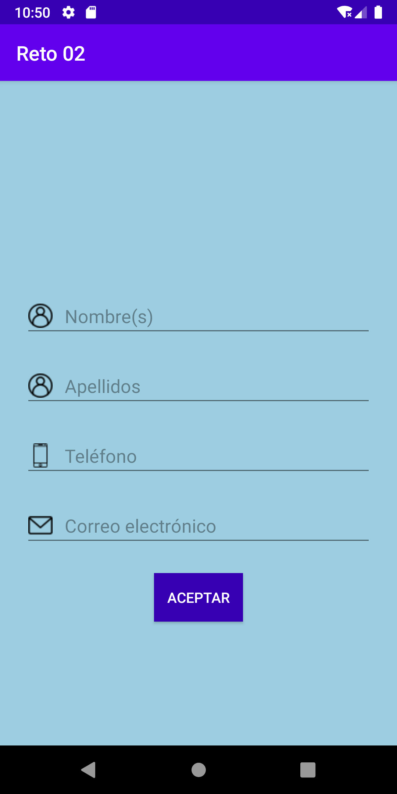
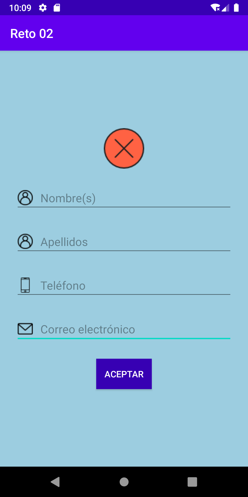
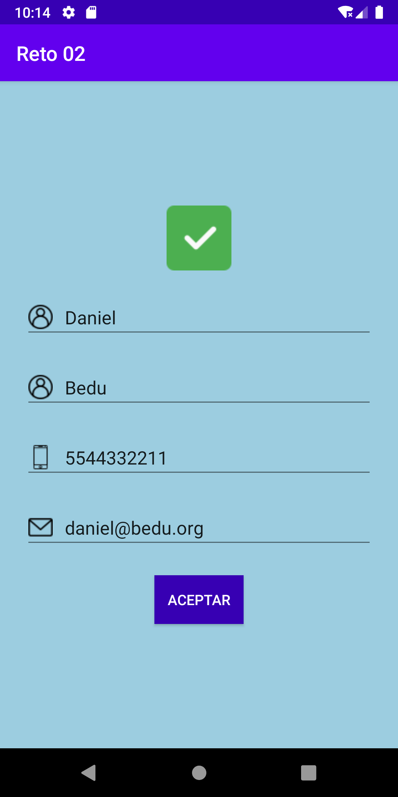

[`Kotlin Intermedio`](../../Readme.md) > [`Sesión 02`](../Readme.md) > `Reto 2`
	
## Reto 2

<div style="text-align: justify;">

### 1. Objetivos :dart:

- Crear EditTexts y extraer su valor
- Asignar imágenes a un ImageView de forma dinámica
- Validar contenido 
- (Op) utilizar styles

### 2. Requisitos :clipboard:

1. Android Studio instalado
2. Al menos un Emulador android configurado

### 3. Desarrollo :computer:

- Crear una aplicación cuya interfaz tenga el siguiente diseño:

	

- Cuando el usuario pulse __ACEPTAR__, existirán dos casos:
	a) Ningún campo está vacío: se mostrará una imagen con una palomita verde en señal de autenticación correcta
	
	
	
	b) Uno o todos los campos están vacíos: Se mostrará una imagen con una paloma roja en señal de error de autenticación
	
	


Contemplar lo siguiente:

1. Los recursos gráficos se encuentran en la carpeta (drawable)[./drawable], y se colocan en el directorio homónimo.
2. Los colores a utilizar son los siguientes:
	* ___#9CCDE0___ para el fondo de la pantalla
	* ___#3700B3___ para el background del botón
	* ___#FFFFFF___ para las letras del botón
3. El tamaño del ___ImageView___ debe de ser de __64x64__ dp
4. La asignación programática de una imagen en el ImageView se hace con su método ___setImageResource(R.drawable.<NOMBRE_DRAWABLE>)___ con el ID del Drawable
5. El texto del EditText tiene qué ser convertido a formato ___String___ mediante el método ___toString()___ . Ejemplo: _editName.text.toString()
6. Para evitar poner atributos repetitivos en cada _EditText_, podemos crear un estilo nuevo en ___res/values/styles.xml___, aquí ponemos los atributos en común.

```xml
<style name="editText">
        <item name="android:layout_width">match_parent</item>
        <item name="android:layout_height">wrap_content</item>
    </style>
```
	
este estilo se utiliza en un View como:

```xml
<EditText
	  ...otros_atributos
        style="@style/editText"
        />
```


<details><summary>Solución</summary>
<p>

El layout principal queda algo similar a esto:

```xml
<?xml version="1.0" encoding="utf-8"?>
<LinearLayout xmlns:android="http://schemas.android.com/apk/res/android"
    xmlns:app="http://schemas.android.com/apk/res-auto"
    xmlns:tools="http://schemas.android.com/tools"
    android:layout_width="match_parent"
    android:gravity="center"
    android:layout_height="match_parent"
    android:orientation="vertical"
    android:background="@color/background"
    tools:context=".MainActivity">
    <ImageView
        android:id="@+id/image"
        android:layout_width="64dp"
        android:layout_height="64dp"
        />
    <EditText
        android:id="@+id/editName"
        style="@style/editText"
        android:hint="@string/name"
        android:inputType="textPersonName"
        android:drawableLeft="@drawable/user"
        />
    <EditText
        android:id="@+id/editLName"
        style="@style/editText"
        android:hint="@string/last_name"
        android:inputType="textPersonName"
        android:drawableLeft="@drawable/user"
        />
    <EditText
        android:id="@+id/editPhone"
        style="@style/editText"
        android:hint="@string/phone"
        android:maxLength="10"
        android:inputType="phone"
        android:drawableLeft="@drawable/phone"
        />
    <EditText
        android:id="@+id/editEmail"
        style="@style/editText"
        android:hint="@string/email"
        android:inputType="textEmailAddress"
        android:drawableLeft="@drawable/email"
        />
    <Button
        android:id="@+id/buttonAccept"
        android:background="@color/button"
        android:textColor="@color/white"
        android:layout_width="wrap_content"
        android:layout_height="wrap_content"
        android:layout_marginTop="24dp"
        android:text="@string/accept"
        />
</LinearLayout>
```

Por supuesto, hay qué declarar los strings,colores y estilos en los archivos correspondientes.

en ___MainActivity.kt___, declaramos las variables. 

```kotlin
private lateinit var image: ImageView
private lateinit var editName: EditText
private lateinit var editLastName: EditText
private lateinit var editPhone: EditText
private lateinit var editEmail: EditText
private lateinit var buttonAccept: Button
```
Se asignan las referencias del layout a cada variable:

```kotlin
image = findViewById(R.id.image)
editName = findViewById(R.id.editName)
editLastName = findViewById(R.id.editLName)
editPhone = findViewById(R.id.editPhone)
editEmail = findViewById(R.id.editEmail)
buttonAccept = findViewById(R.id.buttonAccept)
```

Y finalmente hacemos la validación en el listener del botón:

```kotlin
buttonAccept.setOnClickListener {
            if(
                editName.text.toString() != "" &&
                editLastName.text.toString() != "" &&
                editPhone.text.toString() != "" &&
                editEmail.text.toString() != ""
                    ){
                image.setImageResource(R.drawable.correct)
            } else{
                image.setImageResource(R.drawable.wrong)
            }
        }
```
</p>
</details>
<br/>


[`Anterior`](../Ejemplo-02/Readme.md) | [`Siguiente`](../Ejemplo-03/Readme.md)

</div>
