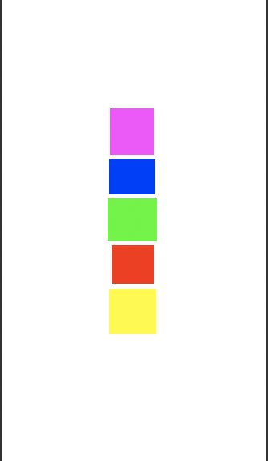
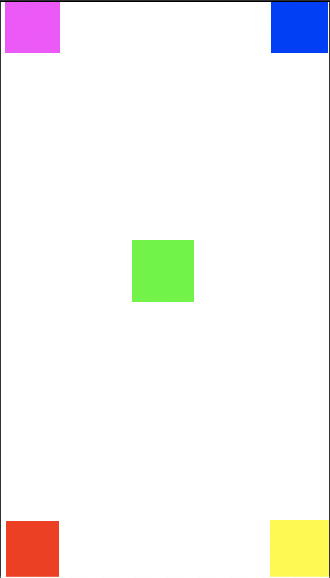
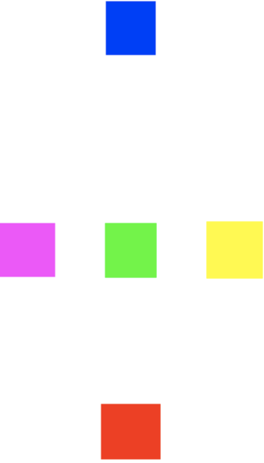

[`Kotlin Intermedio`](../../Readme.md) > [`Sesión 03`](../Readme.md) > `Ejemplo 1`

## Ejemplo 1: Layouts: RelativeLayout

<div style="text-align: justify;">

### 1. Objetivos :dart:

- Acomodar los elementos de acuerdo al patrón de RelativeLayout.

### 2. Requisitos :clipboard:

1. Android Studio Instalado en nuestra computadora.

### 3. Desarrollo :computer:

El Relative Layout es un ViewGroup que organiza su contenido de acuerdo a posiciones relativas a su área o a los otros miembros del layout. Para hacer el enlace con otros Views se requiere que declaren id's en el layout de abajo.

La siguiente tabla muestra los atributos que tienen relación con el posicionamiento de sus elementos:


ATRIBUTO | DESCRIPCIÓN
---------|------------
layout_above | posiciona el borde inferior al borde superiori de la vista con el id que se pase este atributo.
layout_below | posiciona el borde superior al borde inferior de la vista con el id que se le pase a este atributo
layout_toRightOf | posiciona el borde izquiero junto al derecho del View asignado
layout_toLeftOf | posiciona el borde derecho junto al izquierdo del View asignado
layout_alignParentBottom | si true, pone el borde inferior del View sobre el inferior del RelativeLayout 
layout_alignParentEnd | si true, pone el borde final del View sobre el final del RelativeLayout 
layout_alignParentLeft | si true, pone el borde izquierdo del View sobre el izquierdo del RelativeLayout 
ayout_alignParentRight | si true, pone el borde derecho del View sobre el derecho del RelativeLayout 
ayout_alignParentStart | si true, pone el borde inicial del View sobre el inicial del RelativeLayout 
layout_alignParentTop | si true, pone el borde superior del View sobre el superior del RelativeLayout
layout_centerVertical | si true, centra verticalmente el View con su padre
layout_centerHorizontal | si true, centra horizontalmente el View con su padre


El ejemplo de abajo ya tiene implementado el RelativeLayout y está ordenado de acuerdo al primer ejercicio: 

1. Abre __Android Studio__ y crea un nuevo proyecto con Activity Vacía (Empty Activity). Y cambia el código de ___activity_main.xml___ para utilizar un Relative Layout, el código queda como sigue

```kotlin

<?xml version="1.0" encoding="utf-8"?>
<RelativeLayout xmlns:android="http://schemas.android.com/apk/res/android"
    xmlns:tools="http://schemas.android.com/tools"
    android:layout_width="match_parent"
    android:layout_height="match_parent"
    tools:context=".MainActivity">


</RelativeLayout>

```

2. Vamos a agregar algunos  `View` con colores de fondo diferentes para ver como se organizan en el `layout`. Puedes usar los colores que gustes solo recuerda que cada uno debe ser diferente para poder reconocerlo y como `id` pondremos el nombre del color.

```xml
    <View
        android:id="@+id/red"
        android:layout_width="60dp"
        android:layout_height="60dp"
        android:background="#FF0000" />
```

3. Ordenamos nuestro layout tal y como está en la siguiente imagen:

   
   
   Para eso, vamos a centrar todos nuestros _Views_ horizontalmente con el atributo ___layout_centerHorizontal___ true. Para los demás utilizamos la siguiente lógica:
   
   - El cuadro rosa va arriba del azul  --> layout_above="@id/blue"
   - El cuadro azul va arriba del verde --> layout_above="@id/green"
   - El cuadro verde va en el centro vertical --> layout_centerInParent="true"
   - El cuadro rojo va abajo del verde --> layout_below="@id/green"
   - El cuadro amarillo va abajo del rojo --> layout_below="@id/red"
   
   Implementando esa lógica, queda el siguiente layout:
   
```xml
<?xml version="1.0" encoding="utf-8"?>
<RelativeLayout xmlns:android="http://schemas.android.com/apk/res/android"
    xmlns:tools="http://schemas.android.com/tools"
    android:layout_width="match_parent"
    android:layout_height="match_parent"
    tools:context=".MainActivity">
    <View
        android:layout_centerHorizontal="true"
        android:layout_above="@id/blue"
        android:id="@+id/pink"
        android:layout_width="60dp"
        android:layout_height="60dp"
        android:background="#FF00FF" />
    <View
        android:layout_centerHorizontal="true"
        android:layout_above="@id/green"
        android:id="@+id/blue"
        android:layout_width="60dp"
        android:layout_height="60dp"
        android:background="#0000FF" />
    <View
        android:layout_centerHorizontal="true"
        android:layout_centerInParent="true"
        android:id="@+id/green"
        android:layout_width="60dp"
        android:layout_height="60dp"
        android:background="#00FF00" />
    <View
        android:layout_centerHorizontal="true"
        android:layout_below="@id/green"
        android:id="@+id/red"
        android:layout_width="60dp"
        android:layout_height="60dp"
        android:background="#FF0000" />
    <View
        android:layout_centerHorizontal="true"
        android:layout_below="@id/red"
        android:id="@+id/yellow"
        android:layout_width="60dp"
        android:layout_height="60dp"
        android:background="#FFFF00" />
</RelativeLayout>
```
   
4. Ahora ordenamos según esta imagen:

   
   
   La lógica es la siguiente:
   
   - El cuadro rosa se alinea a la parte izquierda y superior del layout  --> layout_alignParentLeft="true", layout_alignParentTop="true"
   - El cuadro azul se alinea a la parte derecha y superior del layout  --> layout_alignParentRight="true", layout_alignParentTop="true"
   - El cuadro verde se mantiene en el centro --> android:layout_centerInParent="true"
   - El cuadro rojo se alinea a la parte izquierda e inferior del layout  --> layout_alignParentLeft="true", layout_alignParentBottom="true"
   - El cuadro amarillo se alinea a la parte derecha e inferior del layout  --> layout_alignParentRight="true", layout_alignParentBottom="true"
   
   
```xml
<?xml version="1.0" encoding="utf-8"?>
<RelativeLayout xmlns:android="http://schemas.android.com/apk/res/android"
    xmlns:tools="http://schemas.android.com/tools"
    android:layout_width="match_parent"
    android:layout_height="match_parent"
    tools:context=".MainActivity">
        <View
        android:layout_alignParentLeft="true"
        android:layout_alignParentTop="true"
        android:id="@+id/pink"
        android:layout_width="60dp"
        android:layout_height="60dp"
        android:background="#FF00FF" />
    <View
        android:layout_alignParentRight="true"
        android:layout_alignParentTop="true"
        android:id="@+id/blue"
        android:layout_width="60dp"
        android:layout_height="60dp"
        android:background="#0000FF" />
    <View
        android:layout_centerInParent="true"
        android:id="@+id/green"
        android:layout_width="60dp"
        android:layout_height="60dp"
        android:background="#00FF00" />
    <View
        android:layout_alignParentLeft="true"
        android:layout_alignParentBottom="true"
        android:id="@+id/red"
        android:layout_width="60dp"
        android:layout_height="60dp"
        android:background="#FF0000" />
    <View
        android:layout_alignParentRight="true"
        android:layout_alignParentBottom="true"
        android:id="@+id/yellow"
        android:layout_width="60dp"
        android:layout_height="60dp"
        android:background="#FFFF00" />
</RelativeLayout>
```

5. Por último, ordenaremos de acuerdo al siguiente patrón:
   
   
   
      - El cuadro rosa se alinea a la parte izquierda del layout y al centro vertical --> layout_alignParentLeft="true", layout_centerVertical="true"
   - El cuadro azul se alinea a la parte superior del layout y al centro horizontal  -->  layout_alignParentTop="true", layout_centerHorizontal="true"
   - El cuadro verde se mantiene en el centro --> android:layout_centerInParent="true"
   - El cuadro rojo se alinea a la parte inferior y al centro horizontal del layout  -->  layout_alignParentBottom="true", layout_centerHorizontal="true"
   - El cuadro amarillo se alinea a la parte derecha y al centro vertical del layout  --> layout_alignParentRight="true", layout_centerVertical="true"
   
   Por lo tanto, el layout queda de la siguiente forma:
   
```xml
<?xml version="1.0" encoding="utf-8"?>
<RelativeLayout xmlns:android="http://schemas.android.com/apk/res/android"
    xmlns:tools="http://schemas.android.com/tools"
    android:layout_width="match_parent"
    android:layout_height="match_parent"
    tools:context=".MainActivity">
    <View
        android:layout_alignParentLeft="true"
        android:layout_centerVertical="true"
        android:id="@+id/pink"
        android:layout_width="60dp"
        android:layout_height="60dp"
        android:background="#FF00FF" />
    <View
        android:layout_centerHorizontal="true"
        android:layout_alignParentTop="true"
        android:id="@+id/blue"
        android:layout_width="60dp"
        android:layout_height="60dp"
        android:background="#0000FF" />
    <View
        android:layout_centerInParent="true"
        android:id="@+id/green"
        android:layout_width="60dp"
        android:layout_height="60dp"
        android:background="#00FF00" />
    <View
        android:layout_centerHorizontal="true"
        android:layout_alignParentBottom="true"
        android:id="@+id/red"
        android:layout_width="60dp"
        android:layout_height="60dp"
        android:background="#FF0000" />
    <View
        android:layout_centerVertical="true"
        android:layout_alignParentRight="true"
        android:id="@+id/yellow"
        android:layout_width="60dp"
        android:layout_height="60dp"
        android:background="#FFFF00" />
</RelativeLayout>
```


[`Anterior`](../Readme.md) | [`Siguiente`](../Ejemplo-02/Readme.md)

</div>
