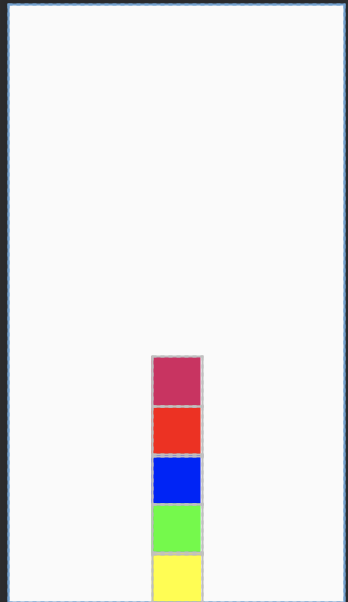
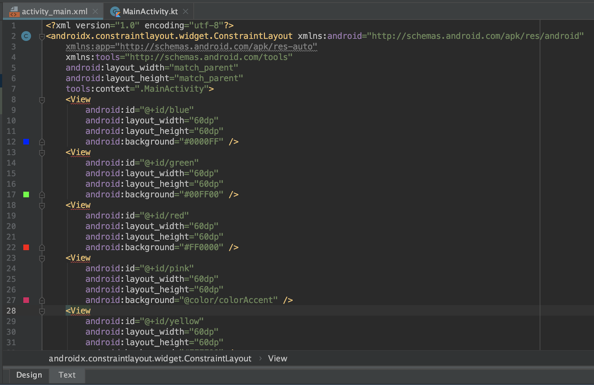
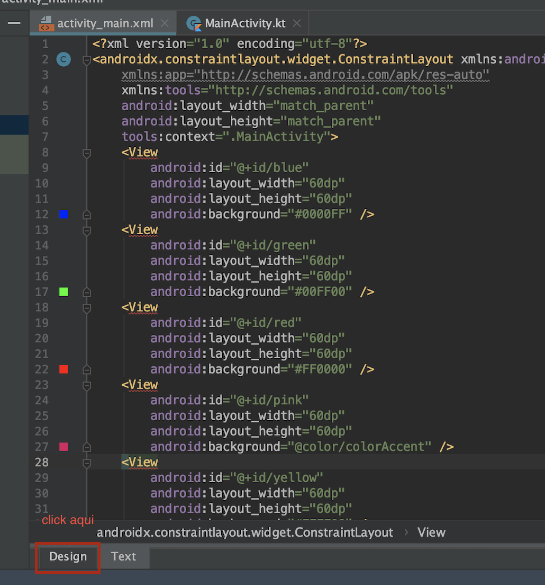
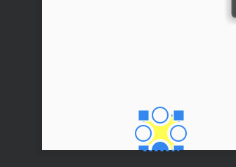
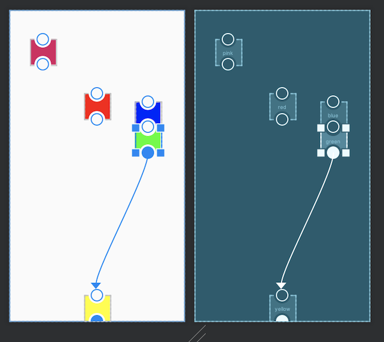

[`Kotlin Intermedio`](../../Readme.md) > [`Sesión 03`](../Readme.md) > `Ejemplo 2`

<div style="text-align: justify;">

## Ejemplo 2: Constraint Layout

### 1. Objetivos :dart: 

- Ordenar Componentes por medio de anclajes en un Constraint layout.

### 2. Requisitos :clipboard:

1. Android Studio Instalado en nuestra computadora.
2. Seguir la instrucción específica para esta sesión.

### 3. Desarrollo :computer:

El objetivo es apilar las Views como la siguiente imagen:





1.- Abrir un nuevo proyecto con Activity vacía

2.- El trabajo será únicamente con Layouts, así que ir directamente a activity_main.xml

3.- Los proyectos empiezan con Constraint Layout por defecto, así que sólo requerimos meter las vistas que teníamos en el reto anterior, por lo cual sólo hay qué borrar el Text y reemplazar por el siguiente fracción de XML


```xml
 <View
        android:id="@+id/green"
        android:layout_width="60dp"
        android:layout_height="60dp"
        android:background="#00FF00"
        />

    <View
        android:id="@+id/blue"
        android:layout_width="60dp"
        android:layout_height="60dp"
        android:background="#0000FF"
       />

    <View
        android:id="@+id/red"
        android:layout_width="60dp"
        android:layout_height="60dp"
        android:background="#FF0000"
         />

    <View
        android:id="@+id/pink"
        android:layout_width="60dp"
        android:layout_height="60dp"
        android:background="@color/colorAccent"
       />

    <View
        android:id="@+id/yellow"
        android:layout_width="60dp"
        android:layout_height="60dp"
        android:background="#FFFF00"
        />

```

El código debe quedar similar a la imagen: 



No hay que preocuparse por los errores, esto sucede porque dentro de un constraint layout, los hijos deben de anclarse a algún lugar.

4.- Selecciona la pestaña **Design**, con ella la interacción de Constraint Layout es mucho más interactiva y eficaz.



5.- Los Views aparecerán de forma desordenada, acércate a uno, verás cuatro puntos de anclaje, si arrastras desde ahí verás salir una flecha, esos son los puntos de anclaje y los puedes poner sobre otros puntos, sobre líneas de guía, barreras o sobre los límites del layout. Arrastra el View amarillo al límite inferior del layout.



6.- Ahora arrastra los puntos de anclaje laterales a los límites laterales del layout para que este quede centrado.

7.- Arrastra el punto de anclaje inferior del View verde al superior del amarillo para unirlos



8.- Termina de apilar todas las cajas ¡Felicidades!


Puedes estudiar el código generado para comprender un poco cómo funciona el xml generado.


Continúen experimentando con la UI y Constraint Layout para seguir enriqueciendo su conocimiento.

[`Anterior`](../Ejemplo-01/Readme.md) | [`Siguiente`](../Ejemplo-03/Readme.md)
</div>
