[`Kotlin Intermedio`](../../Readme.md) > [`Sesión 03`](../Readme.md) > `Ejemplo 3`

## Ejemplo 3: Constraint layout Pte 2

### 1. Objetivos :dart:

- Explotar el uso del _Layout Editor_.
- Utilizar las propiedades que nos brinda ConstraintLayout.
- Agrupar de forma inteligente nuestras _Views_.

### 2. Requisitos :clipboard:

1. Android Studio Instalado en nuestra computadora.
2. Seguir la instrucción específica para esta sesión.

### 3. Desarrollo :computer:

#### 

1. Abre __Android Studio__ y crea un nuevo proyecto con Activity Vacía (Empty Activity).

2. Abrir el archivo ___main_activity.xml___, por defecto tendremos un ___ConstraintLayout___ como _ViewGroup_ principal.

3. En el ejercicio pasado, aprendimos a hacer constraints entre _Views_, sin embargo, esta es apenas una de sus funcionalidades, puesto que este _layout_ es hasta el momento el más completo entre todos, eliminando _views anidados_, optimizando el _layout_ y dando mayor flexibilidad a nuestros diseños. Vamos a analizar el _layout editor_:

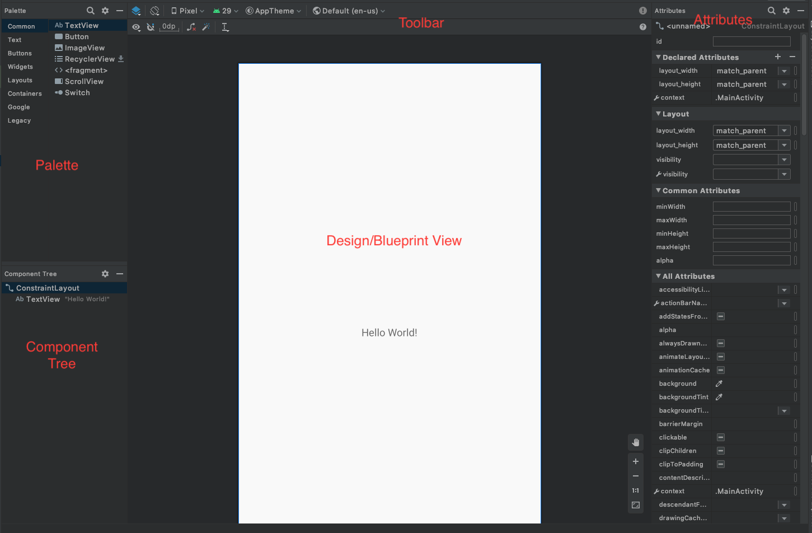

4. Eliminamos el _TextView_ "Hello World" que viene por defecto. click derecho sobre el _View_ >  _Delete_.

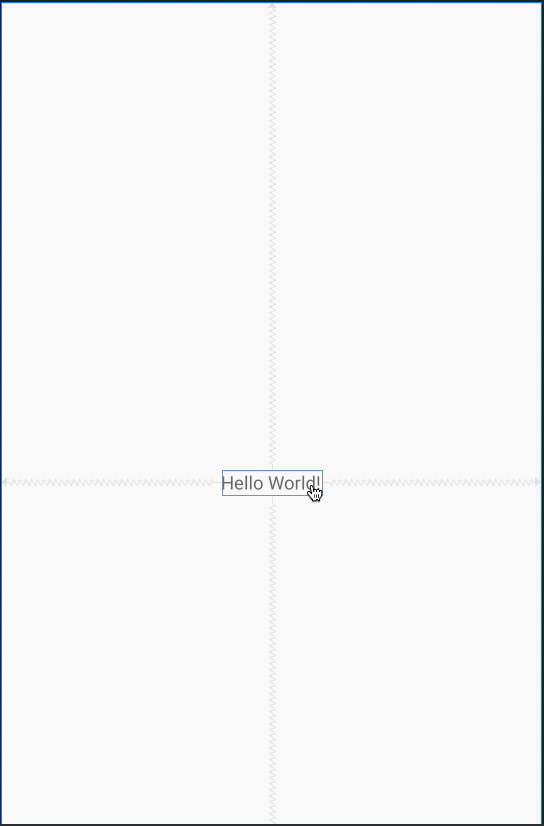 

5. Verificamos que este símbolo en el Toolbar esté habilitado, de lo contrario, dar click sobre él. Esto nos permitirá hacer autoconexiones con respecto a nuestro _ConstraintLayout_. Arrastraremos un nuevo _TextView_ hasta el centro, procurando que se muestre unas guías interlineadas en el centro; soltar y verificar lo que sucede.

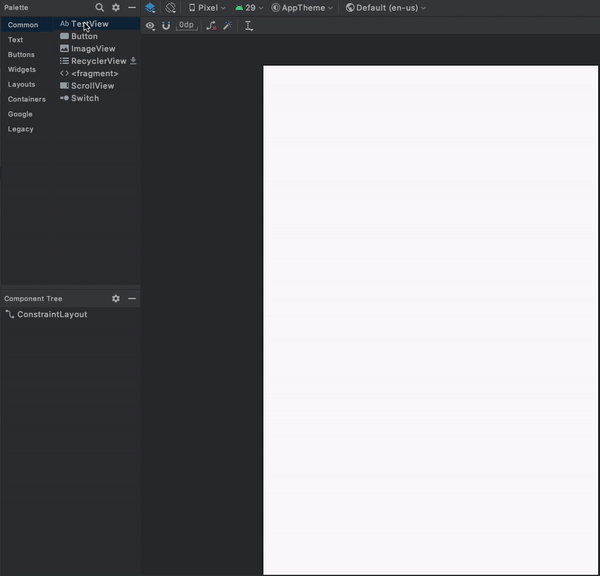 

Lo haremos de forma manual ahora, eliminamos los constraints dando click a los puntos del constraint y presionando _ctrl_ al mismo tiempo (_command_ en mac).
Ahora damos click derecho en el _TextView_ > center > Vertically y Horizontally respectivamente.

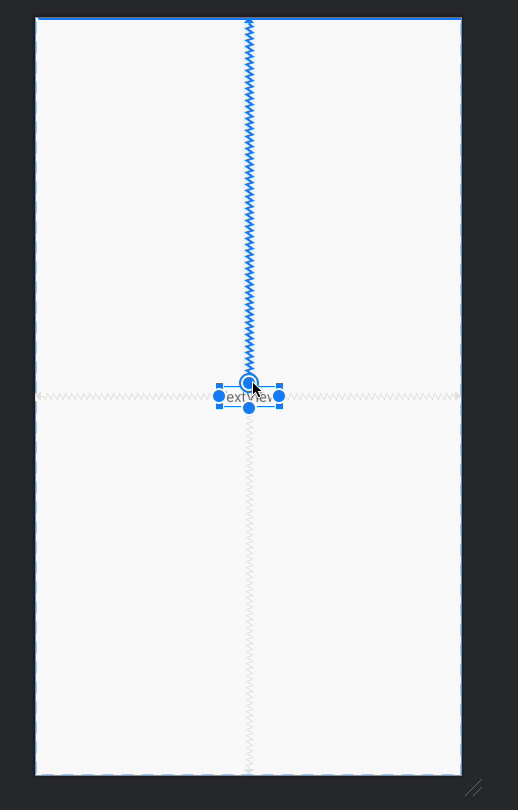 

Cuando tenemos dos extremos colineales, nos saldrá en la sección _Layout_ de la barra _Attributes_ un bias (horizontal o vertical), esta indica un porcentaje de posición relativo a los dos extremos.

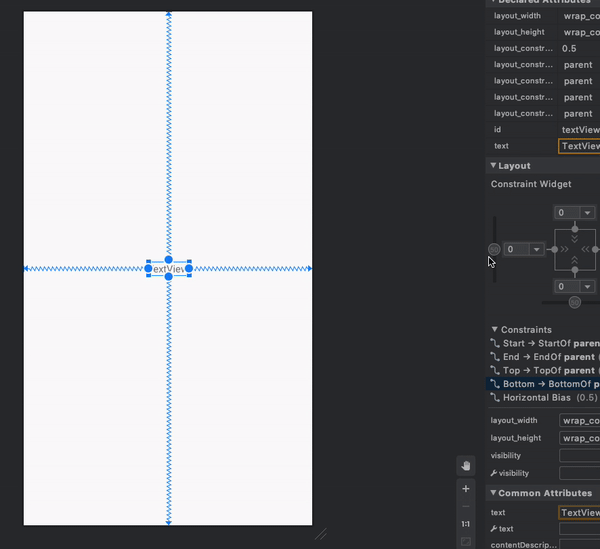 

6. En otros layouts, hemos abordado el uso de los atributos _layout_width_ y _layout_height_, con las opciones _match_parent_, _wrap_content_ y un tamaño fijo.
Para este caso, tenemos opciones similares:

- 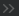 ___Wrap Content___, el tamaño se ajusta a la dimensión del contenido.
- 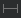 ___Fixed___, donde determinamos una medida fija.
- 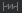 ___Match Constraints___, abarca el tamaño de extremo a extremo con la alineación de sus constraints. __Nota: match_parent nunca debe usarse en un ConstraintLayout__.

Daremos click en las distintas opciones:

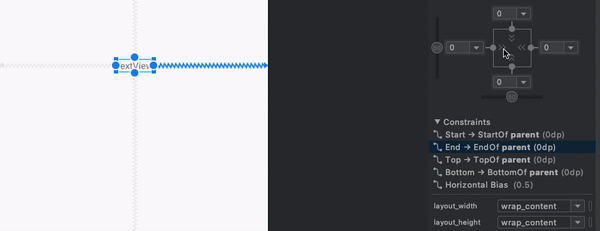 

Si observamos la propiedad _layout_width_ visible en la animación, veremos que conforme cambiemos la forma de dimensionares, cambiamos de _wrap_content_, luego a _58dp_ (tamaño fijo) y luego a _0dp_ (que realmente expresa que toma el tamaño de los límites).

7. Los _Views_ con texto pueden tener una propiedad llamada _baseline_, que es la línea del texto y permite también la posibilidad de alinearse mediante este constraint. Eliminaremos nuestro _TextView_ y arrastraremos otros dos, uno de ellos pegado a la esquina superior derecha del _parent_.Para el segundo, damos click derecho > _Show Baseline_; cuando el ícono del constraint aparezca, arrástralo hacia el baseline del texto pegado en la esquina.

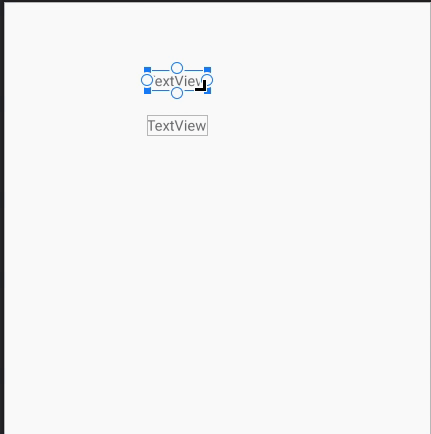 

8. Los chains son formas de agrupar vertical y horizontalmente elementos a una distancia dividida entre los views que lo componen. Estos tienen tres modos:

-  ___Spread___, se dividen en intervalos de espacio iguales.
-  ___Spread Inside___, Similar al anterior, pero no existe espaciamiento externo.
- 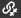 ___Packed___, Los elementos van juntos.

A continuación agrupamos tres _TextViews_ en cadena y variamos entre los 3 modos:

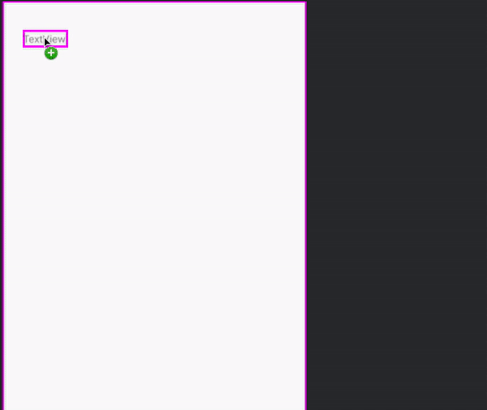 

[`Anterior`](../Readme.md) | [`Siguiente`](../Ejemplo-04)

9. Por último, agregaremos ___Guidelines___, que son altamente recomendadas para diseños flexibles. Podemos elegir entre una orientación vertical u horizontal y hay dos formas de agregarlos: Arrastrándolo desde la sección _Layouts_ del _Palette_ o dando _click derecho > Helpers > Add Vertical/Horizontal Guideline_.

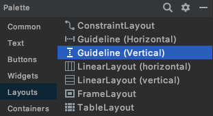 

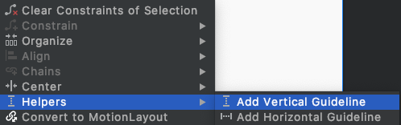 

Los _Guidelines_ pueden posicionarse con respecto a un lado inicial con un parámetro fijo o el porcentaje de la posición que ocupa en el parent, de acuerdo a la orientación escogida para la guía. Los _Views_ que se posicionen sobre la línea de guía, se moverán con ella.

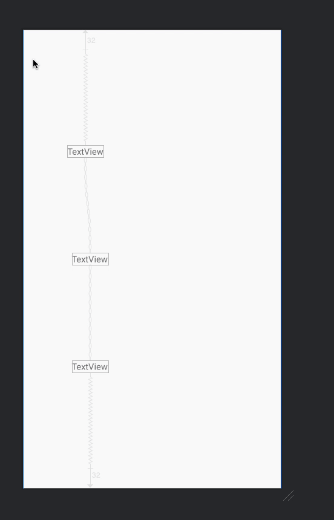 

[`Anterior`](../Ejemplo-02/Readme.md) | [`Siguiente`](../Ejemplo-04/Readme.md)

