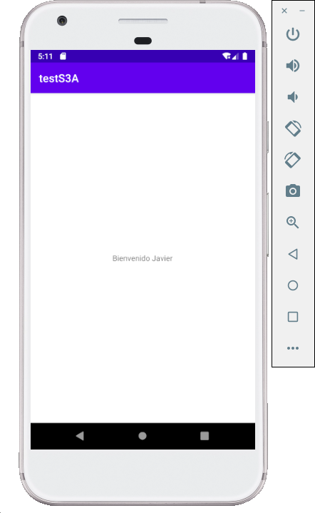

[`Kotlin Intermedio`](../../Readme.md) > [`Sesión 03`](../Readme.md) > `Ejemplo 5`

## Ejemplo 4: Activities

<div style="text-align: justify;">

### 1. Objetivos :dart:

- Establecer un código que transmita datos entre activities.
- Ejemplificar el uso de un Intent.
- Reconocer el comportamiento del ciclo entre activities al navegar hacia una nueva.

### 2. Requisitos :clipboard:

1. Android Studio Instalado en nuestra computadora.
2. Seguir la instrucción específica para esta sesión.

### 3. Desarrollo :computer:

Recordemos el ciclo de vida de un `Activity`

| Etapa     | Funcionalidad                                                                                                                                                                                                                                                                        |
|-----------|--------------------------------------------------------------------------------------------------------------------------------------------------------------------------------------------------------------------------------------------------------------------------------------|
| onCreate  | Es el primero que se va a llamar, se suelen hacer las inicializaciones, cargar el layout y configurar los componentes                                                                                                                                                                |
| onStart   | Cuando la activity se inicia. Se llama siempre que se llama a onCreate(), pero no al revés. onStart() se puede llamar cuando la activity pasa a un segundo plano y vuelve a estar visible                                                                                            |
| onResume  | Cuando la activity se reanuda. Se llama siempre que se llama a onStart(), pero no al revés. onResume() se puede llamar cuando algo se pone por encima de nuestra activity (por ejemplo un diálogo), pero la activity se sigue viendo. Al recuperar el control, se llama a onResume() |
| onPause   | El opuesto de onResume(). Se llama cuando algo se pone por encima de la activity, pero esta se sigue viendo.                                                                                                                                                                         |
| onStop    | El opuesto de onStart(). Se llama cuando la App se va a segundo plano, o se lanza otra activity por encima.                                                                                                                                                                          |
| onDestroy | El opuesto de onCreate(). Se llama cuando la Activity se destruye. Es lo último que se llamará antes de que la activity desaparezca. 

---

Para navegar entre una _Activity y otra_, se utiliza un objeto de la clase ___Intent___. Un _Intent_ es una descripción de una operación a realizar, entre estas operaciones se encuentran la posibilidad de:

- Navegar hacia una _Activity_ nueva.
- Comunicarse con un ___Service___ en segundo plano o iniciarlo mediante ___startService___.
- Mediante broadcastIntent, enviar información que reciba un ___BroadcastReceiver___.

Las intents pueden ser explícitas, declarando qué aplicación o componente las utilizará; o implícitas cuando declaran una acción a realizar, no definiendo quién lo utiliza y por tanto, se puede comunicar con otra app.

En este ejercicio, crearemos un flujo entre una pantalla de _Login_ y otra de datos de perfil (sesión iniciada). Para navegar entre estas dos _Activities_, utilizaremos un _Intent_ y esta llevará los datos que necesitemos comunicar.


1. Abre __AndroidStudio__ y crea un nuevo proyecto vacío. Vamos a construir una aplicación que nos de la bienvenida al escribir nuestro nombre.

2. En la ___Activity___ principal vamos a agregar un input de texto

```xml
    <EditText
        android:id="@+id/editText"
        android:layout_width="match_parent"
        android:layout_height="wrap_content"
        android:layout_marginHorizontal="24dp"
        android:hint="Escribe tu nombre"
        android:inputType="text"
        tools:layout_editor_absoluteX="24dp"
        tools:layout_editor_absoluteY="316dp" />
```

Y un botón 

```xml 
<Button
        android:id="@+id/buttonAccept"
        android:layout_width="wrap_content"
        android:layout_height="wrap_content"
        android:text="Aceptar"
        android:textColor="@color/white"
        tools:layout_editor_absoluteX="154dp"
        tools:layout_editor_absoluteY="393dp" />
```

3. El objetivo es que al presionar el botón cambie la ___Activity___ y nos lleve a una nueva pantalla en donde nos dé la bienvenida. Para esto vamos a crear una nueva ___Activity___ en la barra de herramientas iremos a 

__File > New > Activity > Empty Activity__

Le pondremos el nombre `WelcomeActivity`

Esto nos creará automáticamente el layout y el controlador de la nueva ___Activity___, también agregará la definición de este al AndroidManifest para que el proyecto sepa de su existencia y lo podamos utilizar.

4. En el layout de la nueva ___Activity___ (`activity_welcome.xml`) agregamos simplemente un `TextView` que posteriormente contendrá el mensaje de bienvenida.

```xml
<TextView
        android:id="@+id/textView"
        android:layout_width="wrap_content"
        android:layout_height="wrap_content"
        android:text="TextView"/>
```

5. Ahora que ya tenemos nuestros dos __layouts__ completos llego la hora de conectarlos, haciendo que uno nos lleve a otro e intercambien información entre ellos. Para esto usaremos ___Intent___. Declaramos nuestros elementos en la clase de la ___Activity___ principal.

```kotlin
private lateinit var boton: Button
private lateinit var input: EditText
```

y los inicializamos dentro del método `onCreate`

```kotlin
boton = findViewById(R.id.buttonAccept)
input = findViewById(R.id.editText)
```

6. Ahora definimos un __listener__ para el click en el boton del ___Activity___ principal. 

```kotlin
boton.setOnClickListener {
    val bundle = Bundle()

    bundle.putString(USER_NAME, input.text.toString())

    val intent = Intent(this, NameActivity::class.java ).apply{
        putExtras(bundle)
    }

    startActivity(intent)
}
```
 La funcionalidad del listener es la siguiente:

 - Primero se crea un `Bundle` en el cual servirá como transportador de datos entre ___Activities___
 - Guardamos la cadena de texto del `EditText` en el bundle. 
 - Creamos un objeto de la clase `Intent`, esta clase en Kotlin nos sirve representar una intención en el flujo de ejecución de la aplicación, en este caso cargar una nueva ___Activity___. Utilizamos `putExtras` para pasar nuestro bundle entre las ___Activities___.
 - Por último inicializamos la ___Activity___ definida en el ___Intent___.

 La variable USER_PHONE es un identificador definido afuera de la clase, que actúa como un label único relacionado a la información guardada en el Intent.

 ```kotlin
 const val USER_NAME = "org.bedu.tests3a.USER_NAME"
 ```

7. En este momento ya enviamos la información desde la ___Activity___ principal, ahora vamos a definir como va a reaccionar a esto `NameActivity`. Primero en la clase de la ___Activity___ definimos e inicializamos el `TextView` de nuestro Layout.

```kotlin
private lateinit var text: TextView
...
text = findViewById(R.id.textView)
```

Definimos una variable `bundle` en la cual vamos a recuperar el contenido del ___Intent___ que activo esta ___Activity___.

```kotlin
val bundle = intent.extras
```

Recuperamos el nombre directo del bundle que se recibió
```kotlin
val name = bundle?.getString(USER_NAME)
```

Cambiamos el texto que muestra la etiqueta para que dé la bienvenida al usuario.

```kotlin
text.text = "Bienvenido ${name}"
```

Obtendremos lo siguiente:




[`Anterior`](../Ejemplo-03/Readme.md) | [`Siguiente`](../Proyecto/Readme.md)


</div>


