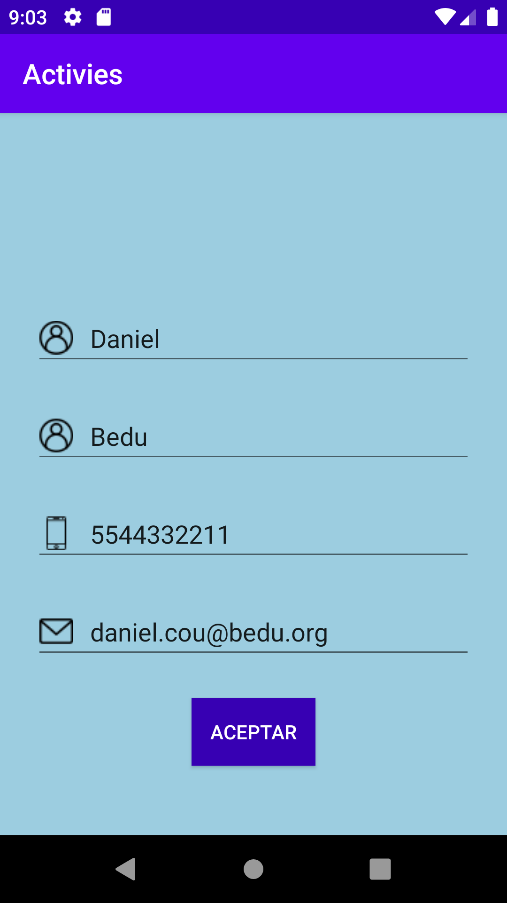

[`Kotlin Intermedio`](../../Readme.md) > [`Sesión 03`](../Readme.md) > `Ejemplo 5`

## Ejemplo 5: Comunicación entre Activities

<div style="text-align: justify;">

### 1. Objetivos :dart:

- Transmitir datos entre activities.
- Ejemplificar el uso de un Intent.
- Estudiar el comportamiento del ciclo entre activities al navegar hacia una nueva.

### 2. Requisitos :clipboard:

1. Android Studio Instalado en nuestra computadora.
2. Seguir la instrucción específica para esta sesión.

### 3. Desarrollo :computer:

Para navegar entre una _Activity y otra_, se utiliza un objeto de la clase ___Intent___. Un _Intent_ es una descripción de una operación a realizar, entre estas operaciones se encuentran la posibilidad de:

- Navegar hacia una _Activity_ nueva.
- Comunicarse con un ___Service___ en segundo plano o iniciarlo mediante ___startService___.
- Mediante broadcastIntent, enviar información que reciba un ___BroadcastReceiver___.

Las intents pueden ser explícitas, declarando qué aplicación o componente las utilizará; o implícitas cuando declaran una acción a realizar, no definiendo quién lo utiliza y por tanto, se puede comunicar con otra app.

En este ejercicio, crearemos un flujo entre una pantalla de _Login_ y otra de datos de perfil (sesión iniciada). Para navegar entre estas dos _Activities_, utilizaremos un _Intent_ y esta llevará los datos que necesitemos comunicar.

Como base, utilizaremos el proyecto desarrollado en el [Reto 2](../Sesion-02/Reto-02) de la [Sesión 2](../Sesion-02).

1. En el _MainActivity_, sobreescribimos todas los callbacks del ciclo de vida para ver cómo se comporta

```kotlin
    override fun onStart() {
        super.onStart()
        Log.d("activities","onStart Login")
    }

    override fun onResume() {
        super.onResume()
        Log.d("activities","onResume Login")
    }

    override fun onPause() {
        Log.d("activities","onPause Login")
        super.onPause()
    }

    override fun onStop() {
        Log.d("activities","onStop Login")
        super.onStop()
    }

    override fun onRestart() {
        super.onRestart()
        Log.d("activities","onRestart Login")
    }

    override fun onDestroy() {
        Log.d("activities","onDestroy Login")
        super.onDestroy()
    }
```

Esta línea va en el _onCreate_.

```kotlin
Log.d("activities","onCreate Login")
```

2. Al hacer click en el botón aceptar con los campos llenos, navegaremos a nuestra siguiente _Activity_. En el listener de _buttonAccept_, vamos a crear el código necesario para navegar y transmitir la información. Enviaremos el número telefónico como parámetro mediante el método ___putExtra___ (aquí podemos poner datos como Int, String, Float, Boolean, Parcelable así que vale la pena comentarlos).

```kotlin
val intent = Intent(this, LoggedActivity::class.java).apply {
        putExtra(USER_PHONE,editPhone.text.toString())
}

startActivity(intent)
}
```

la variable ___USER_PHONE___ es un identificador definido afuera de la clase, que actúa como un label único relacionado a la información guardada en el _Intent_.

```kotlin
const val USER_PHONE = "org.bedu.activities.USER_PHONE"
```

6. Debemos crear la siguiente pantalla, que será una pantalla de bienvenida desplegando nuestra información.

```xml
<androidx.constraintlayout.widget.ConstraintLayout
    xmlns:android="http://schemas.android.com/apk/res/android"
    xmlns:app="http://schemas.android.com/apk/res-auto"
    xmlns:tools="http://schemas.android.com/tools"
    android:background="@color/background"
    android:layout_width="match_parent"
    android:layout_height="match_parent">

    <ImageView
        android:id="@+id/imageView2"
        android:layout_width="wrap_content"
        android:layout_height="wrap_content"
        android:layout_marginTop="32dp"
        app:layout_constraintEnd_toEndOf="parent"
        app:layout_constraintStart_toStartOf="parent"
        app:layout_constraintTop_toTopOf="parent"
        tools:srcCompat="@tools:sample/avatars" />

    <TextView
        android:id="@+id/Hello"
        android:layout_width="wrap_content"
        android:layout_height="wrap_content"
        android:layout_marginTop="32dp"
        android:text="@string/welcome"
        android:textAppearance="@style/TextAppearance.AppCompat.Large"
        app:layout_constraintEnd_toEndOf="parent"
        app:layout_constraintStart_toStartOf="parent"
        app:layout_constraintTop_toBottomOf="@+id/imageView2" />

    <TextView
        android:id="@+id/name"
        android:textColor="@color/white"
        android:textSize="24sp"
        android:layout_width="wrap_content"
        android:layout_height="wrap_content"
        android:layout_marginTop="24dp"
        app:layout_constraintEnd_toEndOf="parent"
        app:layout_constraintStart_toStartOf="parent"
        app:layout_constraintTop_toBottomOf="@+id/Hello" />
    <TextView
        android:id="@+id/email"
        android:textColor="@color/white"
        android:textSize="24sp"
        android:layout_width="wrap_content"
        android:layout_height="wrap_content"
        android:layout_marginTop="24dp"
        app:layout_constraintEnd_toEndOf="parent"
        app:layout_constraintStart_toStartOf="parent"
        app:layout_constraintTop_toBottomOf="@+id/name" />
</androidx.constraintlayout.widget.ConstraintLayout>
```

Nótese que existen dos _textViews_ que no tienen ningún texto predefinido. Eso lo abordaremos después.

la Activity _LoggedActivity_ tiene qué tener los callbacks de su ciclo de vida implementados como en el _MainActivity_, pero con un identificador propio para poder diferenciarlos y saber cómo se comporta su flujo. 

en el método ___onCreate___, vamos a recuperar la información de nuestro teléfono y mostrarlo mediante un _Toast_. como la información que recuperaremos es un _String_, la obtendremos por medio del método ___getStringExtra___.

```kotlin
val phone = intent.getStringExtra(USER_PHONE)
...
Log.d("activities","El telefono es $phone")
```

Corremos la aplicación...


y obtenemos el siguiente error: 


Esto se debe a que la segunda _Activity_ no está declarada en el ___AndroidManifest.xml___, así que abrimos el archivo, y dentro del tag ___application___, la declaramos:

```xml
<activity android:name=".LoggedActivity"/>
```

Ahora sí, corremos la aplicación y obtenemos lo siguiente: 



Al dar clic a __Aceptar__, navegaremos a la siguiente pantalla, obteniendo:


__Comentar el flujo del ciclo de vida al momento de la navegación y cuando se presiona el botón de__ ___Atrás___.


[`Anterior`](../Ejemplo-04/Readme.md) | [`Siguiente`](../Proyecto/Readme.md)

7. Recuerdas esos _textViews_ vacíos? los vamos a utilizar para mostrar el nombre y email del usuario. Existe otra forma de pasar un arreglo de  valores a través del _Intent_: el ___Bundle___. Esta clase representa un map de keys ligadas a valores ___Parcelables___ (objetos que para transmitirse, son serializados).

Enviaremos tanto el nombre completo del usuario como su correo mediante un bundle, por tanto agregaremos estas líneas de código:

```kotlin
val bundle = Bundle()
// todas las variables que no son String llaman al método toString()
val fullName = "${editName.text} ${editLastName.text}"

bundle.putString(USER_NAME, editName.text.toString())
bundle.putString(USER_EMAIL, fullName)
```

recordemos que _USER_NAME_ y _USER_MAIL_ también son constantes

```kotlin
const val USER_NAME = "org.bedu.activities.USER_NAME"
const val USER_EMAIL = "org.bedu.activities.USER_EMAIL"
```

dentro del ___apply___ de nuestro _Intent_, agregamos nuestro bundle mediante:

```kotlin 
putExtra(USER_PHONE,editPhone.text.toString())
```

8. Recuperaremos la información y la mostraremos en los _TextViews_, entonces buscamos por id estas views.

Debemos recuperar el bundle, y extraer tanto el nombre como el email y ponerlos en los _TextViews_, por lo tanto agregamos lo siguiente:

```kotlin
val bundle = intent.extras

        val name = bundle?.getString(USER_NAME)
        val email = bundle?.getString(USER_EMAIL)

        textName.text = name
        textEmail.text = email

```

Obtendremos lo siguiente:


[`Anterior`](../Ejemplo-04/Readme.md) | [`Siguiente`](../Proyecto/Readme.md)


</div>


