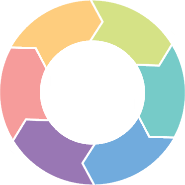
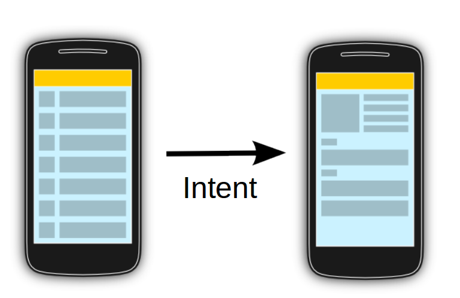

[`Kotlin-Intermedio`](../Readme.md) > `Sesión 3`

## Sesión 3: Activities y Layouts

### 1. Objetivos :dart: 

---

- Diseñar layouts avanzados
- Explorar el flujo de un Activity
- Crear interacción entre Activities

### 2. Contenido :blue_book:

---

Un *activity* es una acción simple y especifica que puede realizar el usuario en nuestra aplicación. **Casi todas** las *activities* dependen de la interacción con el usuario. Algunos ejemplos serían: mandarle un mensaje, pedirle una confirmación, mostrarle mas contenido, entre otros.

El **Layout** de una aplicación define la estructura y el orden de los elementos que la conforman. Nos define cómo y en dónde se deben mostrar los elementos.

---
 

#### <ins>Layouts: RelativeLayout</ins>

Crearemos la interfaz de nuestro _Activity_ con un nuevo _ViewGroup_ que describe la posición de sus elementos de forma relativa a su anatomía.

- [**`EJEMPLO 1`**](Ejemplo-01/Readme.md)

---

 

#### <ins>Layouts: ConstraintLayout</ins>

Utilizaremos el último layout integrado a android, que integra patrones de otros ViewGroups con un nuevo concepto de descripción por restricciones, anclajes y referencias de posiciones entre sus elementos y el contenedor.

- [**`EJEMPLO 2`**](Ejemplo-02/Readme.md)
- [**`EJEMPLO 3`**](Ejemplo-03/Readme.md)

---

 

#### <ins>Activity</ins>

Repasaremos el concepto de _Activity_ en Android, su ciclo de vida y las acciones que podemos hacer en cada una de sus etapas. Es importante entender el ciclo de vida de las *activities* para saber que esperar de ellas.

- [**`EJEMPLO 4`**](Ejemplo-04/Readme.md)

---

 

#### <ins>Comunicación entre Activities</ins>

Crearemos dos activities y haremos que se comuniquen entre ellas transfiriendo datos de una a otraß.

- [**`EJEMPLO 5`**](Ejemplo-05/Readme.md)

---

### 3. Proyecto :hammer:

Con los temas anteriores, haz una transición entre tu formulario y tu pantalla principal empleando _constraint layouts_.

- [**`PROYECTO SESIÓN 3`**](Proyecto/Readme.md)

### 4. Postwork :memo:

Con lo aprendido en esta sesión, actualiza las pantallas previamente creadas y continúa el desarrollo de tu proyecto.

- [**`POSTWORK SESIÓN 3`**](Postwork/Readme.md)

 

[`Anterior`](../Sesion-02/Readme.md) | [`Siguiente`](../Sesion-04/Readme.md)      

