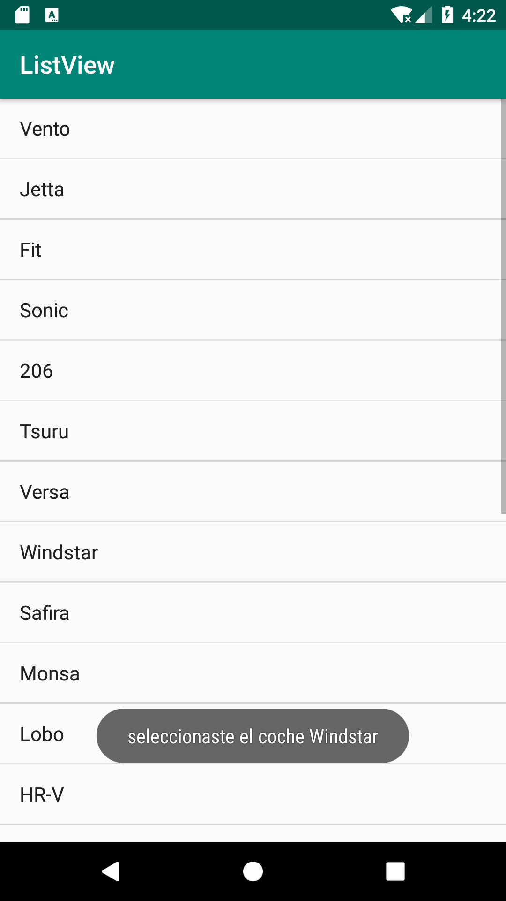

[`Kotlin Intermedio`](../../Readme.md) > [`Sesión 04`](../Readme.md) > `Ejemplo 1`

## Ejemplo 1: ListView

<div style="text-align: justify;">

### 1. Objetivos :dart:

- Implementar a nivel básico un ListView, con elementos predefinidos.

### 2. Requisitos :clipboard:

1. Haber leído el tema de patrón Adapter en el Prework.
2.- Haber comprendido el tema de ListView enseñado durante la presentación de la sesión 1.

### 3. Desarrollo :computer:

1.- Abrir un proyecto con una Actividad vacía.

2.- En el Layout del *activity_main.xml*, agregar un ListView que se ajuste al tamaño del Parent (para mayor facilidad de manejor, reemplazar el ConstraintLayout predefinido por un LinearLayout o RelativeLayout). El ListView se debe ver de la siguiente forma:

```xml
<ListView
        android:id="@+id/listView"
        android:smoothScrollbar="true"
        android:layout_width="match_parent"
        android:layout_height="match_parent"
        />
```

3.- Crear un arreglo con una lista de cualquier clasificación de tu preferencia. En este  ejemplo se optó por modelos de coches.

```kotlin
val modeloCoches = arrayOf(
            "Vento",
            "Jetta",
            "Fit",
            "Sonic",
            "206",
            "Tsuru",
            "Versa",
            "Windstar",
            "Safira",
            "Monsa",
            "Lobo",
            "HR-V",
            "Gol",
            "Bora",
            "Rav4",
            "Astra",
            "Mustang",
            "Corsa",
            "Pointer",
            "Aveo",
            "Beetle",
            "Mini cooper"
        )
```

4.- En el método onCreate, inicializar el adaptador, por practicidad se opta por un ArrayAdapter (para tomar como modelo un simple array de strings).

```kotlin
 val itemsAdapter =
            ArrayAdapter<String>(this, android.R.layout.simple_list_item_1, modeloCoches)
```

5.- Setear el adaptador en el listView por medio de el método setAdapter (mediante su *property access syntax*)


```kotlin
listView.adapter = itemsAdapter
```

6.- Agregar un listener al listView que reaccione al click de alguno de sus elementos (*onClickItemListener*):
```kotlin
listView.onItemClickListener =
            OnItemClickListener { parent, view, position, id ->
                //Poner código aquí
            }
```

7.- Agregamos un Toast para visualizar el valor seleccionado, el listener nos provee con la posición del item en el array, por lo que podemos obtener el string seleccionado poniendo el index en el array. 

```kotlin
Toast.makeText(
                    applicationContext,
                    "seleccionaste el coche ${modeloCoches[position]}", Toast.LENGTH_SHORT
                )
                    .show()
```

la pantalla debe tener esta forma: 




[`Anterior`](../Readme.md) | [`Siguiente`](../Ejemplo-01a/Readme.md)


</div>
