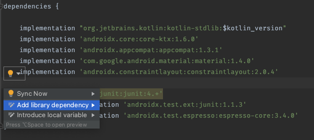
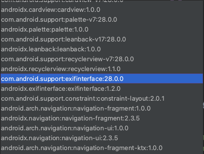
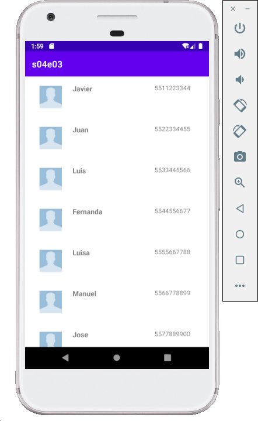

[`Kotlin Intermedio`](../../Readme.md) > [`Sesión 04`](../Readme.md) > `Ejemplo 3`

## Ejemplo 3: RecyclerView

<div style="text-align: justify;">

### 1. Objetivos :dart:

- Reconocer el concepto, el funcionamiento, las ventajas y desventajas de un RecyclerView, mediante su utilización, y el núcleo de su diferencia con una ListView.


### 2. Requisitos :clipboard:

1. Android Studio Instalado en nuestra computadora.
2. Seguir la instrucción específica para esta sesión.

### 3. Desarrollo :computer:

En este proyecto, crearemos una lista de contactos de teléfono sencilla con un `RecyclerView`.

1.- Creamos un nuevo proyecto en Android Studio.

2.- Para poder utilizar `RecyclerView` es necesario importarlo, esto se hace en el archivo **build.gradle**, hasta abajo, en la sección de `dependencies`.



Seleccionamos la correspondiente a `RecyclerView`



Y sincronizamos.

`RecyclerView` sirve el mismo propósito que `ListView` sin embargo se trata de un componente mucho mas genérico y versátil que nos permite adaptar la estructura de un listado de elementos de la forma en la que queramos. La flexibilidad de este componente hace que este compuesto de pequeñas piezas, las cuales tenemos que comprender para poder utilizarlo correctamente.

`RecyclerView` es un **ViewGroup** que va a organizar sus elementos según los parámetros con los que lo definamos.

3.- Comencemos definiendo nuestros *layouts*, vamos a crear un nuevo layout en el cual definiremos la vista de cada elemento de mi lista de contactos y tendrá el nombre **item_contact**.

```xml
<?xml version="1.0" encoding="utf-8"?>
<androidx.constraintlayout.widget.ConstraintLayout
    xmlns:android="http://schemas.android.com/apk/res/android"
    xmlns:app="http://schemas.android.com/apk/res-auto"
    xmlns:tools="http://schemas.android.com/tools"
    android:layout_width="match_parent"
    android:layout_height="wrap_content"
    android:paddingVertical="16dp">

    <ImageView
        android:id="@+id/userImage"
        android:layout_width="50dp"
        android:layout_height="50dp"
        android:src="@drawable/unknown"
        app:layout_constraintBottom_toTopOf="@+id/guideline"
        app:layout_constraintStart_toStartOf="@+id/guideline2"
        app:layout_constraintTop_toTopOf="@+id/guideline" />

    <androidx.constraintlayout.widget.Guideline
        android:id="@+id/guideline"
        android:layout_width="wrap_content"
        android:layout_height="wrap_content"
        android:orientation="horizontal"
        app:layout_constraintGuide_percent=".5" />

    <androidx.constraintlayout.widget.Guideline
        android:id="@+id/guideline2"
        android:layout_width="wrap_content"
        android:layout_height="wrap_content"
        android:orientation="vertical"
        app:layout_constraintGuide_percent="0.08" />

    <androidx.constraintlayout.widget.Guideline
        android:id="@+id/guideline3"
        android:layout_width="wrap_content"
        android:layout_height="wrap_content"
        android:orientation="vertical"
        app:layout_constraintGuide_percent="0.9" />

    <androidx.constraintlayout.widget.Guideline
        android:id="@+id/guideline4"
        android:layout_width="wrap_content"
        android:layout_height="wrap_content"
        android:orientation="vertical"
        app:layout_constraintGuide_percent="0.26" />

    <TextView
        android:id="@+id/tvNombre"
        android:layout_width="wrap_content"
        android:layout_height="wrap_content"
        android:layout_marginBottom="8dp"
        android:text="Nombre bato"
        android:textSize="16sp"
        android:textStyle="bold"
        app:layout_constraintBottom_toTopOf="@+id/guideline"
        app:layout_constraintStart_toStartOf="@+id/guideline4" />


    <TextView
        android:id="@+id/tvPhone"
        android:layout_width="wrap_content"
        android:layout_height="19dp"
        android:text="Ya fue"
        app:layout_constraintEnd_toStartOf="@+id/guideline3"
        app:layout_constraintTop_toTopOf="@+id/tvNombre" />


</androidx.constraintlayout.widget.ConstraintLayout>
```

Este layout simplemente tiene una imagen de contacto que se puede encontrar en este [enlace](./unknow.jpg) y las etiquetas de texto para el nombre y teléfono.


En **activity_main** simplemente definimos un `LinearLayout` y dentro agregamos un componente `RecyclerView`, esto se puede hacer directamente en el código xml o desde la vista de diseño.

```xml
<?xml version="1.0" encoding="utf-8"?>
<LinearLayout xmlns:android="http://schemas.android.com/apk/res/android"
    xmlns:app="http://schemas.android.com/apk/res-auto"
    xmlns:tools="http://schemas.android.com/tools"
    android:layout_width="match_parent"
    android:layout_height="match_parent"
    tools:context=".MainActivity">

    <androidx.recyclerview.widget.RecyclerView
        android:id="@+id/recycler"
        android:layout_width="match_parent"
        android:layout_height="match_parent"
        app:layoutManager="androidx.recyclerview.widget.LinearLayoutManager"
        tools:listitem="@layout/item_contact" />
</LinearLayout>
```

vamos a agregar los atributos:
- `layoutManager` que le indica al componente como estructurar la información.
- `listitem` que le dice que es lo que debe de mostrar en cada elemento de la lista, en este caso usaremos `item_contact` que definimos anteriormente.

4.- Definimos también una clase que modele los contactos de nuestra agenda telefónica en un nuevo archivo de clase llamado **Contact**

```kotlin
data class Contact (
    var name: String,
    var phone: String
)
```
Como la imagen es la misma para todos los contactos simplemente guardamos el nombre y el teléfono.

5.- Para que `RecyclerView` funcione necesita un adaptador que le diga de donde obtener la información que va a mostrar y como estructurarla. en este caso definiremos nuestro propio `Adapter`, en un nuevo archivo de clase de Kotlin al cual llamaremos **RecyclerAdapter**.

```kotlin
class RecyclerAdapter(val contacts : List<Contact>) :
    RecyclerView.Adapter<RecyclerAdapter.ViewHolder>(){


}
```
- La clase `RecyclerAdapter` debe extender la clase `Adapter` de `RecyclerView`.
- A su vez `Adapter` depende de un tipo genérico que extiende a `ViewHolder`. `ViewHolder` Es un componente que almacena una vista y la adapta al `RecyclerView` definiendo que elementos son nuevos, cuales son reciclados, etc. Nosotros vamos a definir este `ViewHolder` dentro de `RecyclerAdapter`.
- Por último, el constructor de `RecyclerAdapter` va a recibir una lista de contactos que es la que mostrará en la pantalla.

`Adapter` es una clase abstracta, lo que quiere decir que no la podemos extender sin definir unos métodos específicos que son: `onCreateViewHolder`, `onBindViewHolder` y `getItemCount`.

Hasta ahora tenemos dos cosas pendientes, la definición del `ViewHolder` y la de los métodos de la clase `Adapter`.

6.- Comencemos con el `ViewHolder`, para esto definimos dentro de `RecyclerAdapter` una clase

```kotlin
    class ViewHolder(view : View) : RecyclerView.ViewHolder(view){
        private val name = view.findViewById<TextView>(R.id.tvNombre)
        private val phone = view.findViewById<TextView>(R.id.tvPhone)

        fun bind(contact: Contact){
            name.text = contact.name
            phone.text = contact.phone
        }
    }
```

Dentro de esta clase solo traemos los views de la interfaz de usuario y definimos una función `bind` que recibe un objeto `Contact` y a partir de el genera un `contact_item` colocando la información en le layout.

7.- Ahora definamos los métodos faltantes dentro de la clase `RecyclerAdpater`

- `onCreateViewHolder` Se llama cuando el `RecyclerView` requiere una nueva vista para mostrarla en pantalla porque no se puede reciclar.

```kotlin
    override fun onCreateViewHolder(parent: ViewGroup, viewType: Int): ViewHolder {
        val view = LayoutInflater
            .from(parent.context)
            .inflate(R.layout.item_contact, parent, false)
        return ViewHolder(view)
    }
```

Requiere un contexto, el cual obtenemos directo del padre y se infla la vista.

- `onBindViewHolder` Se llama siempre que necesitemos mostrar una vista independientemente de si es reciclada o no.

```kotlin
    override fun onBindViewHolder(holder: ViewHolder, position: Int) {
        val contact = contacts[position]
        holder.bind(contact)
    }
```

Usamos la función `bind` que definimos en el `ViewHolder` para crear una vista a partir de un contacto.

- `getItemCount` que regresa el número de elementos que tiene que mostrar el `RecyclerView`

```kotlin
    override fun getItemCount(): Int {
        return contacts.size
    }
```

<details><summary> Archivo completo (RecyclerAdapter.kt)</summary>
 
```kotlin
import android.view.LayoutInflater
import android.view.View
import android.view.ViewGroup
import android.widget.ImageView
import android.widget.TextView
import androidx.recyclerview.widget.RecyclerView

class RecyclerAdapter(val contacts : List<Contact>) :
    RecyclerView.Adapter<RecyclerAdapter.ViewHolder>(){

    class ViewHolder(view : View) : RecyclerView.ViewHolder(view){
        private val name = view.findViewById<TextView>(R.id.tvNombre)
        private val phone = view.findViewById<TextView>(R.id.tvPhone)

        fun bind(contact: Contact){
            name.text = contact.name
            phone.text = contact.phone
        }
    }

    override fun onCreateViewHolder(parent: ViewGroup, viewType: Int): ViewHolder {
        val view = LayoutInflater
            .from(parent.context)
            .inflate(R.layout.item_contact, parent, false)
        return ViewHolder(view)
    }

    override fun onBindViewHolder(holder: ViewHolder, position: Int) {
        val contact = contacts[position]
        holder.bind(contact)
    }

    override fun getItemCount(): Int {
        return contacts.size
    }
}
```
</details>

8.- Para finalizar, en **MainActivity** le decimos al `ReciclerView` que adaptador debe usar. Primero traemos el `RecyclerView` que definimos en el layout.

```kotlin
val recycler = findViewById<RecyclerView>(R.id.recycler)
```

y le indicamos que use el `Adapter` que acabamos de definir.

```kotlin
recycled.adapter = RecyclerAdapter(listOf(
            Contact("Javier", "5511223344"),
            Contact("Juan", "5522334455"),
            Contact("Luis", "5533445566"),
            Contact("Fernanda", "5544556677"),
            Contact("Luisa", "5555667788"),
            Contact("Manuel", "5566778899"),
            Contact("Jose", "5577889900"),
            Contact("Maria", "5588990011"),
            Contact("Ana", "5599001122"),
        ))
```

Recordemos que el constructor de `RecyclerAdaopter` recibe una lista de contactos.

9.- el resultado debe ser el siguiente




[`Anterior`](../Reto-01/Readme.md) | [`Siguiente`](../Reto-02/Readme.md)


</div>
