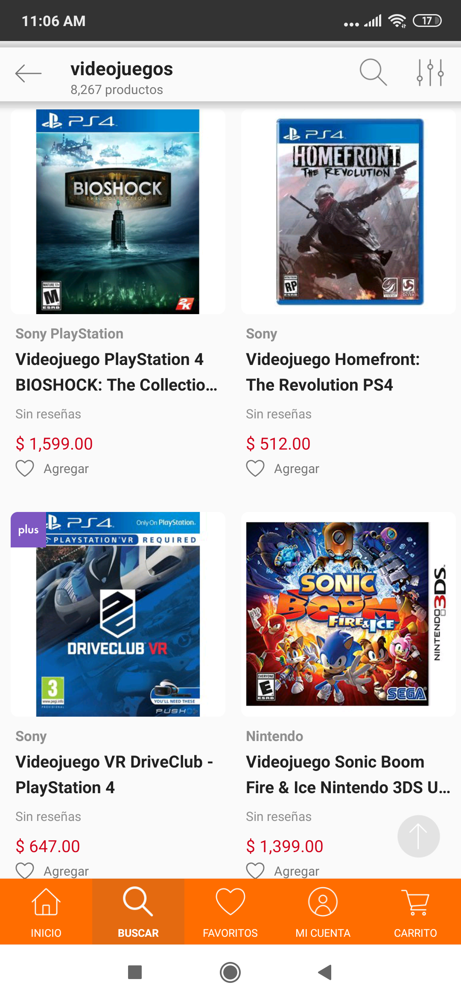
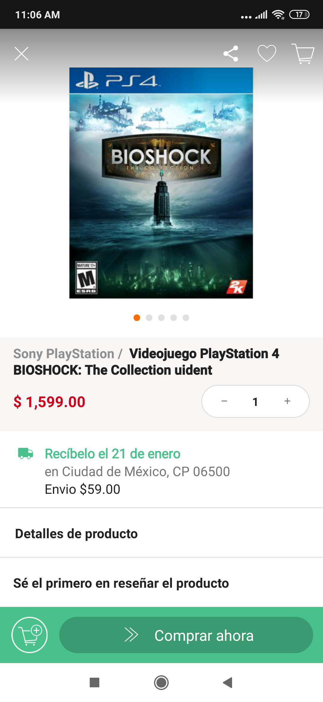

[`Kotlin Intermedio`](../../Readme.md) > [`Sesión 04`](../Readme.md) > `Postwork`

## Postwork

### 1. Objetivos :dart:

- Aplicar el conocimiento de Listas a la tienda en línea

### 2. Requisitos :clipboard:

1. Android Studio Instalado en nuestra computadora.
2. Seguir la instrucción específica para esta sesión.

### 3. Desarrollo :computer:

1. Para la tienda, hay qué crear visualmente una lista similar a la del [Reto 1](../Reto-01) 

pero con un RecyclerView, tal como se vió en el [Ejemplo 3](../Ejemplo-03) y el [Reto 3](../Reto-03)

Se puede basar uno en la tienda **linio** para android

la lista puede ser en una matriz como en la imagen o lineal vertical como la primera imagen

2. Al seleccionar un elemento, direccionar a una pantalla de detalles del producto, donde posteriormente se podrá enviar al carrito

[`Anterior`](../Proyecto/Readme.md) | [`Siguiente`](../../Sesion-05/Readme.md)

