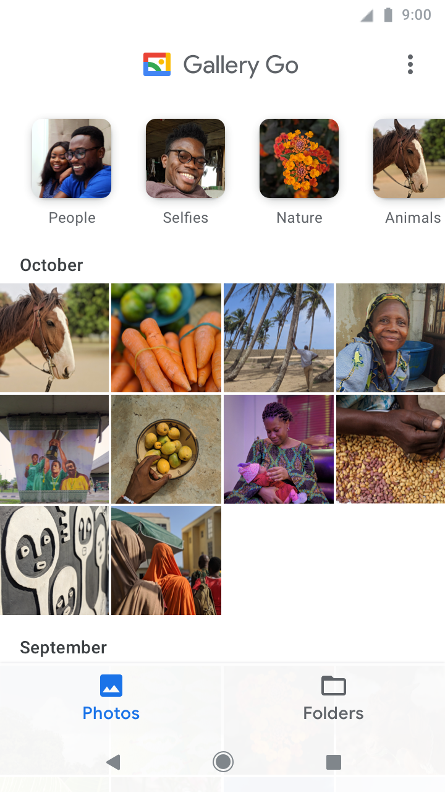

[`Kotlin Intermedio`](../../Readme.md) > [`Sesión 04`](../Readme.md) > `Proyecto`

## Proyecto

### 1. Objetivos :dart:

- Aplicar el conocimiento de Listas a nuestro proyecto.

### 2. Requisitos :clipboard:

1. Android Studio Instalado en nuestra computadora.
2. Seguir la instrucción específica para esta sesión.

### 3. Desarrollo :computer:

Las listas son elementos recurrentes en las aplicaciones. En nuestra aplicación de galeria, tenemos un grid de fotos que al pulsar sobre un elemento, se despliega la imagen para abarcar toda la pantalla. En una app bancaria, el historial de transacciones se muestran en lista. Para una app de cine, las pelí
culas están listadas de forma vertical. 

Ejemplo de la app gallery go, donde tenemos un listado de nuestras imágenes y videos. 

En general, la implementación de una lista en el proyeto es esencial y prácticamente para cualquier ejemplo de aplicación tendremos una forma de utilizarla.

### Lineamientos

1. El proyecto debe utilizar al menos un _RecyclerView_.
2. Al pulsar sobre cualquier elemento del _RecyclerView_, debemos navegar a una nueva pantalla para los detalles del elemento (las acciones a realizar en ella son libres).
3. Cada elemento debe tener en su _layout_ al menos dos textos y una imagen.
4. La distribución del _layout_ preferentemente no debe ser lineal.

[`Anterior`](../Reto-03/Readme.md) | [`Siguiente`](../Postwork/Readme.md)

