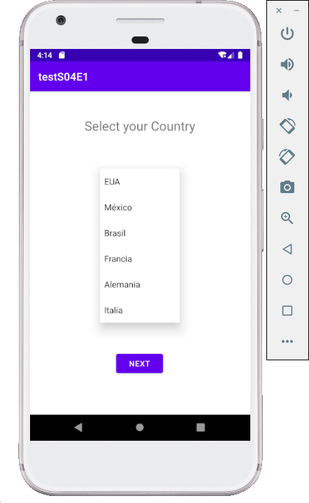
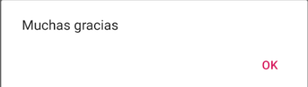

[`Kotlin Intermedio`](../../Readme.md) > [`Sesión 04`](../Readme.md) > `Reto 1`

## Reto 1: Spinners

<div style="text-align: justify;">

### 1. Objetivos :dart:

- Continuar el proceso de aprendizaje de los spinners, desarrollando vistas y acciones personalizadas similares a los vistos en el [EJEMPLO 01-A](../Ejemplo-01a)

### 2. Requisitos :clipboard:

1. Android Studio Instalado en nuestra computadora.
2. Seguir la instrucción específica para esta sesión.

### 3. Desarrollo :computer:

1.- Tomar el [Ejemplo 02](../Ejemplo-02) como base del siguiente ejercicio.


Se requiere crear una pantalla con selección de país, pero que al seleccionarse, cambie el idioma de los textos en pantalla.

La pantalla final tiene que quedar así



y al dar click al botón continuar, salga un diálgo con el saludo en su idioma: 




- Los recursos se encuentran en la carpeta [Resources](Resources/)
- La construcción del adapter, del modelo y la lógica en general es casi idéntica a la del [Reto 01](../Reto-01), así que se puede tomar de guía


Se facilitan estas dos funciones, que sirven para generar los datos del país y para mostrar un diálogo de alerta.

```kotlin
private fun getCountries(): ArrayList<CountryModel>{
        val countryModels = arrayListOf(
            CountryModel("Mexico",R.drawable.mexico, "Continuar", "Muchas gracias","Selecciona tu país"),
            CountryModel("Brasil",R.drawable.brazil, "Continuar", "Muito obrigado"," Selecione seu país"),
            CountryModel("Francia",R.drawable.france, "Continuez", "Merci beaucoup", "Sélectionnez votre pays"),
            CountryModel("Alemania",R.drawable.germany, "FortFühren", "Danke sehr", "Wählen Sie Ihr Land aus"),
            CountryModel("Italia",R.drawable.italy, "Continuare", "Molto grazie", "Seleziona il tuo paese"),
            CountryModel("United states",R.drawable.united_states, "Next", "Thank you", "Select your country")
        )

        return countryModels
    }

    private fun showDialog(title:String,message:String){
        val builder = AlertDialog.Builder(this)
            .setTitle(title)
            .setMessage(message)
            .setPositiveButton("OK"){_, _->  }

        val alertDialog = builder.create()
            alertDialog.show()
    }
```

también el xml de MainActivity

```xml
<?xml version="1.0" encoding="utf-8"?>
<androidx.constraintlayout.widget.ConstraintLayout xmlns:android="http://schemas.android.com/apk/res/android"
    xmlns:app="http://schemas.android.com/apk/res-auto"
    xmlns:tools="http://schemas.android.com/tools"
    android:layout_width="match_parent"
    android:layout_height="match_parent"
    tools:context=".MainActivity">

    <Spinner
        android:id="@+id/spinner"
        android:layout_width="180dp"
        android:layout_height="40dp"
        android:layout_marginStart="8dp"
        android:layout_marginTop="64dp"
        android:layout_marginEnd="8dp"
        android:background="#EDEDED"
        app:layout_constraintEnd_toEndOf="parent"
        app:layout_constraintStart_toStartOf="parent"
        app:layout_constraintTop_toBottomOf="@+id/tvTitle" />

    <TextView
        android:id="@+id/tvTitle"
        android:layout_width="wrap_content"
        android:layout_height="wrap_content"
        android:layout_marginTop="48dp"
        android:textSize="24sp"
        android:text="Selecciona tu País"
        app:layout_constraintEnd_toEndOf="parent"
        app:layout_constraintStart_toStartOf="parent"
        app:layout_constraintTop_toTopOf="parent" />

    <Button
        android:id="@+id/button"
        android:layout_width="wrap_content"
        android:layout_height="wrap_content"
        android:visibility="gone"
        android:layout_marginBottom="48dp"
        android:text="Continuar"
        app:layout_constraintBottom_toBottomOf="parent"
        app:layout_constraintEnd_toEndOf="parent"
        app:layout_constraintStart_toStartOf="parent" />

</androidx.constraintlayout.widget.ConstraintLayout>
```


[`Anterior`](../Ejemplo-02/Readme.md) | [`Siguiente`](../Ejemplo-03/Readme.md)


</div>
