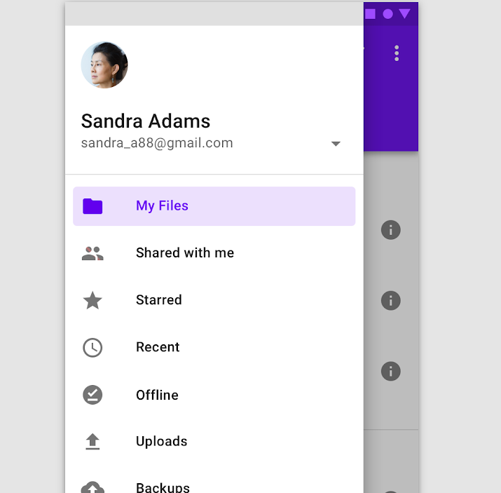

[`Kotlin-Intermedio`](../Readme.md) > `Sesión 5 y 6`

## Sesión 5: Fragments

  
### Introducción: Qué es un Fragment 

Como el nombre lo indica, es un fragmento de la UI que implementa tanto un ciclo de vida como eventos propios. 
  
Utilizaremos Fragments cuando:
- Requiramos una interfaz de usuario dinámica. 
- Necesitemos reutilizar un pedazo de interfaz con funcionalidad en diversos puntos de nuestra app.
- La navegación en una parte del flujo de la app sea mejor manejable al usar Fragments.

Puedes pensar en un fragmento como una sección modular de una actividad que tiene un ciclo de vida propio, que recibe sus propios eventos de entrada, y el cual puedes agregar o quitar mientras la actividad se esté ejecutando (algo así como una "subactividad" que puedes volver a usar en diferentes actividades). 
  
El ciclo de vida de un `Fragment` se observa en el siguiente esquema:

### 1. Objetivos :dart: 

---

- Diseñar interfaces flexibles y gestionables.
- Manejar el ciclo de vida de un Fragment.
- Conducir el flujo de distintos Fragments y su comunicación.
- Utilizar los distintos tipos de Fragments que el SDK proporciona.

### 2. Contenido :blue_book:

---

 

#### <ins>Agregar un Fragment</ins>

Para este ejemplo agregaremos un fragmento al layout del _Activity_ principal y se implementará la funcionalidad correspondiente.

- [**`EJEMPLO 1`**](Ejemplo-01/Readme.md)
- [**`RETO 1`**](Reto-01/Readme.md)

---

### 3. Postwork :memo:

Con lo aprendido en esta sesión continuarás con la implementación de Fragments en tu proyecto, asi como la comunicación entre ellos, y el uso de Material Design.

- [**`POSTWORK SESIÓN 5`**](Postwork5/Readme.md)

## Sesión 6: Material Design

  
### Introducción: Qué es Material Design 

### Introducción

Material Design es un sistema que envuelve a una guia de estilo de diseño, herramientas y componentes para aplicaciones móviles y web. La base del concepto de este es que toda la interfaz debe ser representado por materiales, (específicamente papel y tinta) y añade conceptos visuales como textura, representación de luces y sombras o altura.

**¿En qué se basa Material Design?**

Material Design recibe su nombre por estar basado en objetos materiales. Piezas colocadas en un espacio (lugar) y con un tiempo (movimiento) determinado.

Es un diseño donde la profundidad, las superficies, los bordes, las sombras y los colores juegan un papel principal.

Precisamente este diseño basado en objetos es una manera de intentar aproximarse a la realidad, algo que en un mundo donde todo es táctil y virtual es difícil. Material Design quiere guiarse por las leyes de la física, donde las animaciones sean lógicas, los objetos se superpongan pero no puedan atravesarse el uno al otro y demás.

**No es exclusivo**

No debemos pensar en Material Design como ese diseño destinado para las aplicaciones móviles de Android. De hecho, es multiplataforma. Tantos los smartphones, tablets, smartwatches o televisores pueden hacer uso de este diseño. También las páginas webs. Material Design ha sido creado pensando en todos los sistemas, no solo Android.

### 1. Objetivos :dart: 
---

- Utilizar los componentes de la biblioteca  _com.google.android.material_.
- Adaptar viejas interfaces a este nuevo modelo.

### 2. Contenido :blue_book:

---

 

#### <ins>Appbar y Navigation drawer</ins>

Crearemos y personalizaremos la barra superior de nuestra aplicación y añadiremos `items` con funcionalidades. Agregaremos también un `Navigation drawer` con distintas opciones de navegación y datos de perfil.

- [**`EJEMPLO 2`**](Ejemplo-02/Readme.md)
- [**`RETO 2`**](Reto-02/Readme.md)

---

### 3. Postwork :memo:

Con lo aprendido en esta sesión, continúa con la implementación de ___Material Design___ en tu proyecto.

- [**`POSTWORK SESIÓN 6`**](Postwork6/Readme.md)