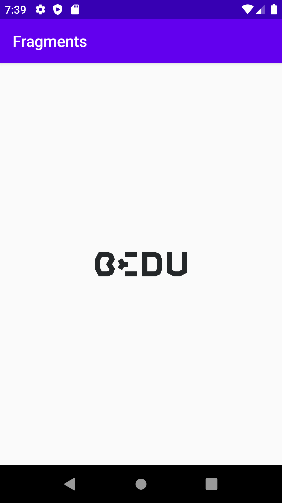
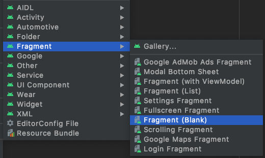

[`Kotlin Intermedio`](../../Readme.md) > [`Sesión 05`](../Readme.md) > `Ejemplo 1`

## Ejemplo 1: Fragments

<div style="text-align: justify;">

### 1. Objetivos :dart:

- Crear un Fragment dentro de un View.

### 2. Requisitos :clipboard:

1. Android Studio Instalado en nuestra computadora.
2. Seguir la instrucción específica para esta sesión.

### 3. Desarrollo :computer:

1. Abre __Android Studio__ y crea un nuevo proyecto con Activity Vacía (Empty Activity).

2. En el directorio _layout_ crearemos un nuevo archivo _xml_ para nuestro ___Fragment___. Este layout representa la interfaz de nuestro Fragmento, que en este caso será una simple imagen contenida en un _ImageView_.

```xml
<androidx.constraintlayout.widget.ConstraintLayout
    xmlns:android="http://schemas.android.com/apk/res/android"
    xmlns:app="http://schemas.android.com/apk/res-auto"
    xmlns:tools="http://schemas.android.com/tools"
    android:layout_width="match_parent"
    android:layout_height="match_parent">

    <ImageView
        android:id="@+id/imageView"
        android:layout_width="120dp"
        android:layout_height="120dp"
        app:layout_constraintBottom_toBottomOf="parent"
        app:layout_constraintEnd_toEndOf="parent"
        app:layout_constraintStart_toStartOf="parent"
        app:layout_constraintTop_toTopOf="parent"
        android:src="@drawable/bedu" />

</androidx.constraintlayout.widget.ConstraintLayout>
```

3. Dentro del _activity_main.xml_, incluiremos un _fragment_ que contendrá el _layout_ generado previamente.

```xml 
<fragment
        xmlns:android="http://schemas.android.com/apk/res/android"
        class="com.example.fragments.ExampleFragment"
        android:id="@+id/frgDetalle"
        android:layout_width="match_parent"
        android:layout_height="match_parent" />
```

4. Muy bien! Ahora toca asociar el view nuestro ___Fragment___ a su respectiva clase, por lo tanto creamos un nuevo archivo .kt y creamos nuestra clase que extenderá de la Superclase __Fragment__ .

```kotlin
class ExampleFragment : Fragment() {
 
}
```

Para asociar nuestro layout a la clase, utilizamos el método ___inflate___ dentro de la función ___onCreateView___ y en el primer argumento pasamos el ID de nuestro layout con ___R.layout.fragment_layout___.

```kotlin
 override fun onCreateView(
        inflater: LayoutInflater,
        container: ViewGroup?,
        savedInstanceState: Bundle?
    ): View {
        // Inflate the layout for this fragment
        return inflater.inflate(R.layout.fragment_layout, container, false)
    }
```

El resultado es la siguiente pantalla!


      
      
Una forma Automática de crear una clase _Fragment___ junto a su ___layout___ es yendo a nuestro directorio principal y creando ahí un ___Blank Fragment___. Este creará automáticamente nuestra clase con varios callbacks implementados, su _layout_ en el respectivo directorio, y el método ___onCreateView___ con el id del layout como parámetro.



El _layout_ se creará con la siguiente estructura:

```xml
<?xml version="1.0" encoding="utf-8"?>
<FrameLayout xmlns:android="http://schemas.android.com/apk/res/android"
    xmlns:tools="http://schemas.android.com/tools"
    android:layout_width="match_parent"
    android:layout_height="match_parent"
    tools:context=".BlankFragment">

    <!-- TODO: Update blank fragment layout -->
    <TextView
        android:layout_width="match_parent"
        android:layout_height="match_parent"
        android:text="@string/hello_blank_fragment" />

</FrameLayout>
```

Podemos reemplazar los elementos para que concuerden con lo requerido (en este caso, basta reemplazar el _TextView_ por un _ImageView_).

[`Anterior`](../Readme.md) | [`Siguiente`](../Reto-01/Readme.md)


</div>
