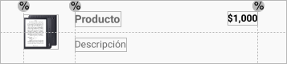
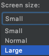
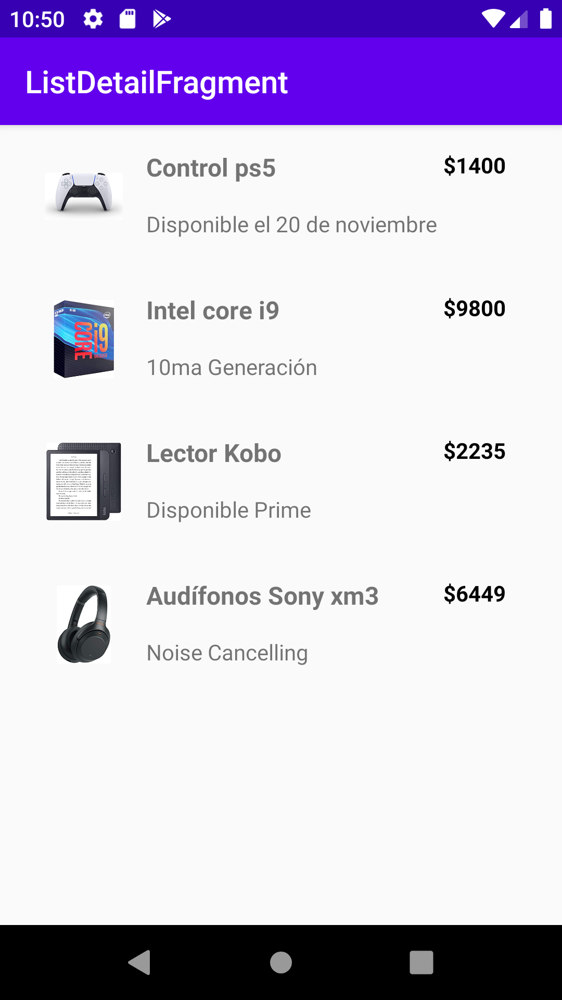
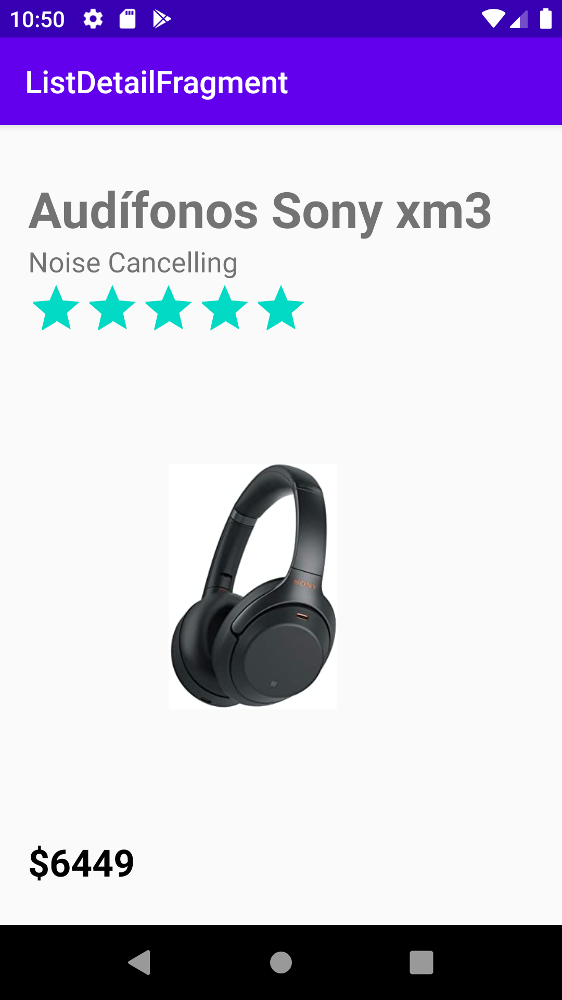

[`Kotlin Intermedio`](../../Readme.md) > [`Sesión 05`](../Readme.md) > `Ejemplo 2`

## Ejemplo 2: Fragments Lista-Detalle

<div style="text-align: justify;">

### 1. Objetivos :dart:

- Adaptar un diseño de acuerdo al tamaño de una pantalla.

### 2. Requisitos :clipboard:

1. Android Studio Instalado en nuestra computadora.
2. Seguir la instrucción específica para esta sesión.

### 3. Desarrollo :computer:

En este ejemplo abordaremos una aplicación que sigue el patrón _lista-detalle_, en el cual tendremos una lista de productos y al seleccionar uno, visualizaremos sus detalles. En este ejercicio ejemplificamos el uso de _Fragments_ para un diseño de interfaz flexible, ya que para un teléfono móvil convencional, la lista se mostrará en una pantalla y el detalle en otra. En el caso de una tablet, que consta de una pantalla grande, pondremos la vista y el detalle en la misma pantalla. El siguiente diagrama nos ayudará a visualizar la idea.


La diferencia es que las dos pantallas irán en orden vertical para el caso de la tablet.


1. Abre __Android Studio__ y crea un nuevo proyecto con Activity Vacía (Empty Activity).

2. Copiaremos las imágenes que se encuentran en [Esta carpeta](ListDetailFragment/app/src/main/res/drawable-v24) y las pegamos en nuestro directorio de recursos ___drawable___ para poder utilizarlos en nuestros productos.

3. En el directorio _layout_, diseñaremos el template de un elemento de nuestra lista de productos y lo llamaremos _item_contact.xml_, y tendrá el siguiente código:

```xml
<androidx.constraintlayout.widget.ConstraintLayout
    xmlns:android="http://schemas.android.com/apk/res/android"
    xmlns:app="http://schemas.android.com/apk/res-auto"
    xmlns:tools="http://schemas.android.com/tools"
    android:layout_width="match_parent"
    android:layout_height="wrap_content"
    android:paddingVertical="16dp">

    <ImageView
        android:id="@+id/imgProduct"
        android:layout_width="50dp"
        android:layout_height="50dp"
        android:src="@drawable/kobo"
        app:layout_constraintBottom_toTopOf="@+id/guideline"
        app:layout_constraintStart_toStartOf="@+id/guideline2"
        app:layout_constraintTop_toTopOf="@+id/guideline" />

    <androidx.constraintlayout.widget.Guideline
        android:id="@+id/guideline"
        android:layout_width="wrap_content"
        android:layout_height="wrap_content"
        android:orientation="horizontal"
        app:layout_constraintGuide_percent=".5" />

    <androidx.constraintlayout.widget.Guideline
        android:id="@+id/guideline2"
        android:layout_width="wrap_content"
        android:layout_height="wrap_content"
        android:orientation="vertical"
        app:layout_constraintGuide_percent="0.08" />

    <androidx.constraintlayout.widget.Guideline
        android:id="@+id/guideline3"
        android:layout_width="wrap_content"
        android:layout_height="wrap_content"
        android:orientation="vertical"
        app:layout_constraintGuide_percent="0.9" />

    <androidx.constraintlayout.widget.Guideline
        android:id="@+id/guideline4"
        android:layout_width="wrap_content"
        android:layout_height="wrap_content"
        android:orientation="vertical"
        app:layout_constraintGuide_percent="0.26" />

    <TextView
        android:id="@+id/tvProduct"
        android:layout_width="wrap_content"
        android:layout_height="wrap_content"
        android:layout_marginBottom="8dp"
        android:text="Producto"
        android:textSize="16sp"
        android:textStyle="bold"
        app:layout_constraintBottom_toTopOf="@+id/guideline"
        app:layout_constraintStart_toStartOf="@+id/guideline4" />

    <TextView
        android:id="@+id/tvDescription"
        android:layout_width="wrap_content"
        android:layout_height="19dp"
        android:layout_marginTop="8dp"
        android:text="Descripción"
        app:layout_constraintStart_toStartOf="@+id/guideline4"
        app:layout_constraintTop_toTopOf="@+id/guideline" />

    <TextView
        android:id="@+id/tvPrice"
        android:layout_width="wrap_content"
        android:layout_height="19dp"
        android:textStyle="bold"
        android:textColor="#000"
        android:text="$1,000"
        app:layout_constraintEnd_toStartOf="@+id/guideline3"
        app:layout_constraintTop_toTopOf="@+id/tvProduct" />


</androidx.constraintlayout.widget.ConstraintLayout>
```

Los textos introducidos por default se reemplazarán por los del producto. El _layout_ debe quedar de la siguiente forma:



4. De forma similar, vamos a crear un layout ___fragment_detail.xml___ donde irá el detalle de nuestro producto seleccionado.

```xml
<androidx.constraintlayout.widget.ConstraintLayout
    xmlns:android="http://schemas.android.com/apk/res/android"
    xmlns:app="http://schemas.android.com/apk/res-auto"
    android:id="@+id/detailView"
    android:visibility="visible"
    android:layout_width="match_parent"
    android:layout_height="match_parent"
    android:paddingVertical="16dp">

    <TextView
        android:id="@+id/tvProduct"
        android:layout_width="wrap_content"
        android:layout_height="wrap_content"
        android:text="Producto"
        android:textSize="32sp"
        android:textStyle="bold"
        android:layout_marginTop="16dp"
        app:layout_constraintTop_toTopOf="parent"
        app:layout_constraintStart_toStartOf="@+id/guideline4" />
    <TextView
        android:id="@+id/tvDescription"
        android:layout_width="wrap_content"
        android:layout_height="wrap_content"
        android:text="Descripción"
        android:textSize="18sp"
        app:layout_constraintTop_toBottomOf="@id/tvProduct"
        app:layout_constraintStart_toStartOf="@+id/guideline4" />
    <RatingBar
        android:id="@+id/rbRate"
        style="@style/Widget.AppCompat.RatingBar.Indicator"
        android:layout_width="wrap_content"
        android:layout_height="wrap_content"
        app:layout_constraintTop_toBottomOf="@+id/tvDescription"
        app:layout_constraintStart_toStartOf="@+id/guideline4"
        />
    <ImageView
        android:id="@+id/imgProduct"
        android:layout_width="0dp"
        android:layout_height="wrap_content"
        android:src="@drawable/kobo"
        app:layout_constraintTop_toBottomOf="@id/rbRate"
        app:layout_constraintStart_toStartOf="@id/guideline5"
        app:layout_constraintEnd_toEndOf="@id/guideline6"/>

    <TextView
        android:id="@+id/tvPrice"
        android:layout_width="wrap_content"
        android:layout_height="wrap_content"
        android:textStyle="bold"
        android:textColor="#000"
        android:textSize="24sp"
        android:text="$1,000"
        app:layout_constraintTop_toBottomOf="@id/imgProduct"
        app:layout_constraintStart_toStartOf="@id/guideline4"/>

    <androidx.constraintlayout.widget.Guideline
        android:id="@+id/guideline4"
        android:layout_width="wrap_content"
        android:layout_height="wrap_content"
        android:orientation="vertical"
        app:layout_constraintGuide_percent=".05" />
    <androidx.constraintlayout.widget.Guideline
        android:id="@+id/guideline5"
        android:layout_width="wrap_content"
        android:layout_height="wrap_content"
        android:orientation="vertical"
        app:layout_constraintGuide_percent=".3" />
    <androidx.constraintlayout.widget.Guideline
        android:id="@+id/guideline6"
        android:layout_width="wrap_content"
        android:layout_height="wrap_content"
        android:orientation="vertical"
        app:layout_constraintGuide_percent=".6" />


</androidx.constraintlayout.widget.ConstraintLayout>
```

El layout debe verse de esta forma:


Ahora, vamos a ocultar el layout, posteriormente veremos por qué lo haremos, modificaremos la propiedad de visibilidad del ___ConstraintLayout___.

```xml
android:visibility="invisible"
```

5. Ahora crearemos un nuevo archivo _xml_ llamado ___fragment_list___ para nuestro ___Fragment___. Este layout representará la lista de productos en venta, por lo tanto, utilizaremos un _RecyclerView_ Dentro del layout.

```xml
<FrameLayout xmlns:android="http://schemas.android.com/apk/res/android"
    xmlns:tools="http://schemas.android.com/tools"
    android:layout_width="match_parent"
    android:layout_height="match_parent"
    tools:context=".ListFragment">
    <androidx.recyclerview.widget.RecyclerView
        android:id="@+id/recyclerProducts"
        android:layout_width="match_parent"
        android:layout_height="match_parent" />

</FrameLayout>
```

6. Perfecto! Ahora modificaremos nuestro _activity_main.xml_ para que muestre únicamente la lista de productos (teléfono móvil), por lo tanto únicamente agregaremos nuestro ___fragment___ al layout.

```xml
<LinearLayout
    xmlns:android="http://schemas.android.com/apk/res/android"
    xmlns:app="http://schemas.android.com/apk/res-auto"
    xmlns:tools="http://schemas.android.com/tools"
    android:layout_width="match_parent"
    android:layout_height="match_parent"
    tools:context=".MainActivity">
    <fragment
        android:id="@+id/fragmentList"
        class="org.bedu.listdetailfragment.ListFragment"
        android:layout_width="match_parent"
        android:layout_height="match_parent" />
</LinearLayout>
```

7. Debido a que la versión de móvil requiere una pantalla para la lista y otra para el detalle, crearemos un ___detail_activity.xml___ donde contendremos únicamente a nuestro ___fragment___.

```xml
<LinearLayout
    xmlns:android="http://schemas.android.com/apk/res/android"
    xmlns:app="http://schemas.android.com/apk/res-auto"
    xmlns:tools="http://schemas.android.com/tools"
    android:layout_width="match_parent"
    android:layout_height="match_parent"
    tools:context=".MainActivity">
    <fragment
        android:id="@+id/fragmentDetail"
        class="org.bedu.listdetailfragment.DetailFragment"
        android:layout_width="match_parent"
        android:layout_height="match_parent" />

</LinearLayout>
```


8. Al parecer tenemos todo listo... 

Pero, En qué momento creamos la pantalla para la versión tablet? Para este caso, debemos crear un _layout_ específico que reemplace al ___activity_main___ original cuando la pantalla sea grande. Para esto, damos click derecho en ___res___ y nos vamos a _New > Android Resource Directory_.


En este menú, seleccionamos las siguientes opciones:


El qualifier nos servirá para saber qué layouts debe elegir la app, en este caso el parámetro será el tamaño de la pantalla, por lo que seleccionaremos ___size___ y utilizaremos la opción ___large___.



Listo! ahí guardaremos el _layout_ de la versión tablet. Nos podemos ahorrar estos pasos simplemente creando un directorio con el nombre ___layout-large___.

9. Dentro de ___layout-large___, creamos otro archivo ___activity_main.xml___, que contendrá nuestros fragmentos en vertical.

```xml
<androidx.constraintlayout.widget.ConstraintLayout
    xmlns:android="http://schemas.android.com/apk/res/android"
    xmlns:app="http://schemas.android.com/apk/res-auto"
    xmlns:tools="http://schemas.android.com/tools"
    android:layout_width="match_parent"
    android:layout_height="match_parent"
    tools:context=".MainActivity">
    <fragment
        android:id="@+id/fragmentList"
        class="org.bedu.listdetailfragment.ListFragment"
        android:layout_width="0dp"
        android:layout_height="0dp"
        app:layout_constraintTop_toTopOf="parent"
        app:layout_constraintBottom_toTopOf="@id/half"
        app:layout_constraintStart_toStartOf="parent"
        app:layout_constraintEnd_toEndOf="parent"/>
    <fragment
        android:id="@+id/fragmentDetail"
        class="org.bedu.listdetailfragment.DetailFragment"
        android:layout_width="0dp"
        android:layout_height="0dp"
        app:layout_constraintTop_toTopOf="@id/half"
        app:layout_constraintBottom_toBottomOf="parent"
        app:layout_constraintStart_toStartOf="parent"
        app:layout_constraintEnd_toEndOf="parent"/>

    <androidx.constraintlayout.widget.Guideline
        android:id="@+id/half"
        android:layout_width="wrap_content"
        android:layout_height="wrap_content"
        android:orientation="horizontal"
        app:layout_constraintGuide_percent=".5" />
</androidx.constraintlayout.widget.ConstraintLayout>
```

10. Suficiente del apartado gráfico! Enfoquémonos en Kotlin. Vamos a requerir un ___Adapter___ para nuestro _RecyclerView_, por lo que utilizaremos este código para nuestra clase _RecyclerAdapter_.
```kotlin
//Declaración con constructor
class RecyclerAdapter(
    private val context:Context,
    private val products: MutableList<Product>,
    private val clickListener: (Product) -> Unit): RecyclerView.Adapter<RecyclerAdapter.ViewHolder>() {

    //Aquí atamos el ViewHolder
    override fun onBindViewHolder(holder: ViewHolder, position: Int) {
        val product = products.get(position)
        holder.bind(product, context)

        holder.view.setOnClickListener{clickListener(product)}

    }


    override fun onCreateViewHolder(parent: ViewGroup, viewType: Int): ViewHolder {
        val layoutInflater = LayoutInflater.from(parent.context)
        return ViewHolder(layoutInflater.inflate(R.layout.item_contact, parent, false))
    }

    override fun getItemCount(): Int {
        return products.size
    }

    //El ViewHolder ata los datos del RecyclerView a la Vista para desplegar la información
    //También se encarga de gestionar los eventos de la View, como los clickListeners
    class ViewHolder(val view: View) : RecyclerView.ViewHolder(view) {
        //obteniendo las referencias a las Views
        val productName = view.findViewById(R.id.tvProduct) as TextView
        val description = view.findViewById(R.id.tvDescription) as TextView
        val price = view.findViewById(R.id.tvPrice) as TextView
        val image = view.findViewById(R.id.imgProduct) as ImageView

        //"atando" los datos a las Views
        fun bind(product: Product, context: Context){
            productName.text = product.name
            description.text = product.description
            price.text = product.price
            image.setImageResource(product.idImage)
        }
    }

}
```

11. También requerimos el modelo de nuestro producto.

```kotlin
data class Product (
    val name: String,
    val description: String,
    val price: String,
    val rating: Float,
    val idImage: Int
):
```
Para teléfonos móviles, requeriremos en un punto pasar un producto de un _Activity_ a otro, por lo que requeriremos que nuestro Producto sea ___Parcelable___ (una implementación del SDK de andriod similar al Serializer clásico de Java), por lo cual nuestra clase queda así:

```kotlin
import android.os.Parcel
import android.os.Parcelable

class Product (
    val name: String,
    val description: String,
    val price: String,
    val rating: Float,
    val idImage: Int
): Parcelable {
    constructor(parcel: Parcel) : this(
        parcel.readString()!!,
        parcel.readString()!!,
        parcel.readString()!!,
        parcel.readFloat(),
        parcel.readInt()
    ) {
    }

    override fun writeToParcel(parcel: Parcel, flags: Int) {
        parcel.writeString(name)
        parcel.writeString(description)
        parcel.writeString(price)
        parcel.writeFloat(rating)
        parcel.writeInt(idImage)
    }

    override fun describeContents(): Int {
        return 0
    }

    companion object CREATOR : Parcelable.Creator<Product> {
        override fun createFromParcel(parcel: Parcel): Product {
            return Product(parcel)
        }

        override fun newArray(size: Int): Array<Product?> {
            return arrayOfNulls(size)
        }
    }
}
```

12. Creamos la clase para nuestra lista ___FragmentList___. Este es el esqueleto:

```kotlin
class ListFragment : Fragment() {

    override fun onCreateView(
        inflater: LayoutInflater, container: ViewGroup?,
        savedInstanceState: Bundle?
    ): View? {
        // Inflate the layout for this fragment
        return inflater.inflate(R.layout.fragment_list, container, false)
    }
}
```

Crearemos dos atributos en nuestra clase para setear el adaptador, y la otra será un método que nos indicará qué ejecutar cuando demos click a un elemento de la lista.

```kotlin
 private lateinit var mAdapter : RecyclerAdapter
    private var listener : (Product) ->Unit = {}
```

Generamos los métodos para configurar la lista de productos...

```kotlin
    //generamos datos dummy con este método
    private fun getProducts(): MutableList<Product>{
        var products:MutableList<Product> = ArrayList()

        products.add(Product("Control ps5", "Disponible el 20 de noviembre", "$1400",4.6f,R.drawable.control))
        products.add(Product("Intel core i9", "10ma Generación", "$9800",4.4f,R.drawable.corei9))
        products.add(Product("Lector Kobo", "Disponible Prime", "$2235",3.8f,R.drawable.kobo))
        products.add(Product("Audífonos Sony xm3", "Noise Cancelling", "$6449",4.8f,R.drawable.xm3))

        return products
    }

    //configuramos lo necesario para desplegar el RecyclerView
    private fun setUpRecyclerView(){
        recyclerProducts.setHasFixedSize(true)
        recyclerProducts.layoutManager = LinearLayoutManager(activity)
        //seteando el Adapter
        mAdapter = RecyclerAdapter( activity!!, getProducts(), listener)
        //asignando el Adapter al RecyclerView
        recyclerProducts.adapter = mAdapter
    }
```

Y ejecutamos la configuración en el método ___onActivityCreated___.

```kotlin
override fun onActivityCreated(savedInstanceState: Bundle?) {
        super.onActivityCreated(savedInstanceState)
        setUpRecyclerView()
    }

```
Con este método, asignaremos más tarde la tarea a ejecutar al darle click a un elemento desde nuestro ___MainActivity___.

```kotlin
    fun setListener(l: (Product) ->Unit){
        listener = l
    }
```

13. Para el detalle del producto, creamos nuestra clase ___DetailFragment___. Relacionaremos todas nuestras Views a variables para poder manipular su contenido. 

```kotlin
class DetailFragment : Fragment() {

    private lateinit var tvProduct: TextView
    private lateinit var tvDescription: TextView
    private lateinit var rbRate: RatingBar
    private lateinit var imgProduct: ImageView
    private lateinit var tvPrice: TextView

    override fun onCreateView(
        inflater: LayoutInflater, container: ViewGroup?,
        savedInstanceState: Bundle?
    ): View? {
        val view = inflater.inflate(R.layout.fragment_detail, container, false)

        tvProduct = view.findViewById(R.id.tvProduct)
        tvDescription = view.findViewById(R.id.tvDescription)
        rbRate = view.findViewById(R.id.rbRate)
        imgProduct = view.findViewById(R.id.imgProduct)
        tvPrice = view.findViewById(R.id.tvPrice)

        return view
    }
}
```

Recuerdas que inicialmente pusimos el _layout_ de nuestro detalle invisible? esto es debido a que en modo tablet, al principio no hemos seleccionado ningún producto, por lo tanto no debemos mostrar nada. Con la función showProduct, haremos visible nuestra información y desplegaremos la información de nuestro producto en los _Views_.

```kotlin
    fun showProduct(product: Product){
        view?.visibility = View.VISIBLE
        tvProduct.text = product.name
        tvDescription.text = product.description
        rbRate.rating = product.rating
        imgProduct.setImageResource(product.idImage)
        tvPrice.text = product.price

    }
```

14. Debido a que nuestros ___Fragments___ son modulares (y reutilizables), debemos gestionar cómo se va a mostrar nuestro ___DetailFragment___, debido a que en versión tablet, nuestros dos _Fragments_ se muestran al mismo tiempo en nuestra ___MainActivity___; mientras que en versión móvil, visualizar nuestro detalle implica navegar a un nuevo _Activity_.

Obtenemos nuestro Fragment ___listFragment___ y le asignaremos un listener que corresponde a cuando pulsamos a un elemento de la lista, por medio del método ___setListener___; en dicho método revisamos si el _fragmentDetail_ existe en nuestro _Activity_, es la versión tablet y solo tendremos qué mostrar el contenido mediante el método ___showProduct___ que creamos previamente para esa clase; en caso contrario, creamos un ___Intent___, pasamos como información extra nuestro producto, e iniciamos el nuevo ___Activity___.   

```kotlin
class MainActivity : AppCompatActivity() {

    override fun onCreate(savedInstanceState: Bundle?) {
        super.onCreate(savedInstanceState)
        setContentView(R.layout.activity_main)

        val listFragment = supportFragmentManager.findFragmentById(R.id.fragmentList) as ListFragment

        listFragment.setListener{
            val detailFragment = supportFragmentManager.findFragmentById(R.id.fragmentDetail) as? DetailFragment

            // Pantalla grande, mostrar detalle en el fragment
            if(detailFragment!=null){
                detailFragment.showProduct(it)
            } else{ //pantalla pequeña, navegar a un nuevo Activity
                val intent = Intent(this, DetailActivity::class.java)
                intent.putExtra(DetailActivity.PRODUCT,it)
                startActivity(intent)
            }
        }
    }
}
```

15. El último paso que nos resta hacer, es crear la clase ___DetailActivity___ para nuestro detalle. En esta clase, lo que haremos es recuperar la información de nuestro producto y mostrarlo desde nuestro _Fragment_  mediante el método ___showProduct___.

```kotlin
package org.bedu.listdetailfragment

import androidx.appcompat.app.AppCompatActivity
import android.os.Bundle

class DetailActivity : AppCompatActivity() {

    companion object {
        val PRODUCT = "PRODUCT"
    }

    override fun onCreate(savedInstanceState: Bundle?) {
        super.onCreate(savedInstanceState)
        setContentView(R.layout.activity_detail)

        val product = intent.getParcelableExtra<Product>(PRODUCT)
        val detailFragment = supportFragmentManager.findFragmentById(R.id.fragmentDetail) as? DetailFragment
        detailFragment?.showProduct(product)

    }
}
```

Al correr la aplicación en un móvil, se debe visualizar este flujo:



<sub><sup>lista de productos</sup></sub>



<sub><sup>detalle de producto</sup></sub>


Mientras que en un dispositivo tablet, obtendremos lo siguiente:


[`Anterior`](../Reto-01/Readme.md) | [`Siguiente`](../Reto-02/Readme.md)


</div>
