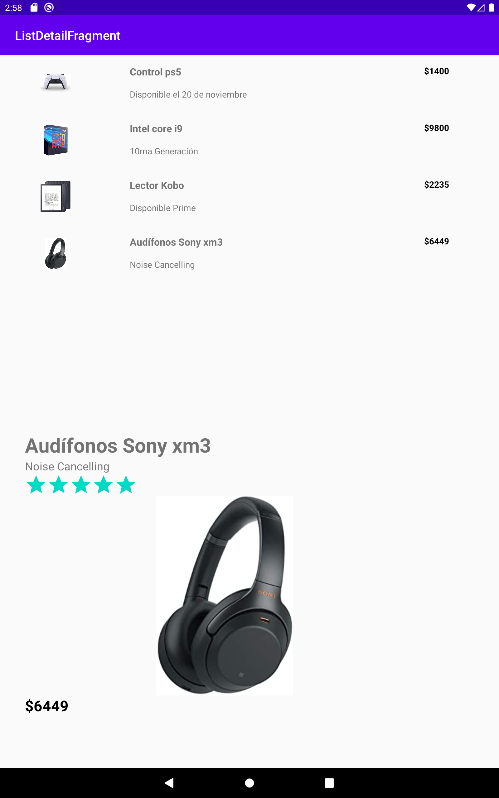

[`Kotlin Intermedio`](../../Readme.md) > [`Sesión 05`](../Readme.md) > `Ejemplo 3`

## Ejemplo 3: Fragments Lista-Detalle (Kotlin)

<div style="text-align: justify;">

### 1. Objetivos :dart:

- Adaptar un diseño de interfaz en relación con el tamaño de una pantalla.

### 2. Requisitos :clipboard:

1. Android Studio instalado en nuestra computadora.
2. Seguir la instrucción específica para esta sesión.

### 3. Desarrollo :computer:

Continuaremos con la aplicación del patron `lista-detalle`. En el ejemplo anterior nos concentramos en dejar listas las vistas para que el patrón funcionara. Ahora es momento de Kotlin.
    
Realiza los pasos siguientes:

1. Vamos a requerir un `Adapter` para nuestro `RecyclerView`, por lo que utilizaremos este código para nuestra clase `RecyclerAdapter`.
```kotlin
//Declaración con constructor
class RecyclerAdapter(
    private val context:Context,
    private val products: MutableList<Product>,
    private val clickListener: (Product) -> Unit): RecyclerView.Adapter<RecyclerAdapter.ViewHolder>() {

    //Aquí atamos el ViewHolder
    override fun onBindViewHolder(holder: ViewHolder, position: Int) {
        val product = products.get(position)
        holder.bind(product, context)

        holder.view.setOnClickListener{clickListener(product)}

    }


    override fun onCreateViewHolder(parent: ViewGroup, viewType: Int): ViewHolder {
        val layoutInflater = LayoutInflater.from(parent.context)
        return ViewHolder(layoutInflater.inflate(R.layout.item_contact, parent, false))
    }

    override fun getItemCount(): Int {
        return products.size
    }

    //El ViewHolder ata los datos del RecyclerView a la Vista para desplegar la información
    //También se encarga de gestionar los eventos de la View, como los clickListeners
    class ViewHolder(val view: View) : RecyclerView.ViewHolder(view) {
        //obteniendo las referencias a las Views
        val productName = view.findViewById(R.id.tvProduct) as TextView
        val description = view.findViewById(R.id.tvDescription) as TextView
        val price = view.findViewById(R.id.tvPrice) as TextView
        val image = view.findViewById(R.id.imgProduct) as ImageView

        //"atando" los datos a las Views
        fun bind(product: Product, context: Context){
            productName.text = product.name
            description.text = product.description
            price.text = product.price
            image.setImageResource(product.idImage)
        }
    }

}
```

2. También requerimos el modelo de nuestro producto.

```kotlin
data class Product (
    val name: String,
    val description: String,
    val price: String,
    val rating: Float,
    val idImage: Int
):
```
3. Para teléfonos móviles, requeriremos, en determinado punto, pasar un producto de un `Activity` a otro, por lo que necesitamos que el Producto sea `Parcelable` (una implementación del SDK de andriod similar al Serializer clásico de Java). Para ello nuestra clase queda así:

```kotlin
import android.os.Parcel
import android.os.Parcelable

class Product (
    val name: String,
    val description: String,
    val price: String,
    val rating: Float,
    val idImage: Int
): Parcelable {
    constructor(parcel: Parcel) : this(
        parcel.readString()!!,
        parcel.readString()!!,
        parcel.readString()!!,
        parcel.readFloat(),
        parcel.readInt()
    ) {
    }

    override fun writeToParcel(parcel: Parcel, flags: Int) {
        parcel.writeString(name)
        parcel.writeString(description)
        parcel.writeString(price)
        parcel.writeFloat(rating)
        parcel.writeInt(idImage)
    }

    override fun describeContents(): Int {
        return 0
    }

    companion object CREATOR : Parcelable.Creator<Product> {
        override fun createFromParcel(parcel: Parcel): Product {
            return Product(parcel)
        }

        override fun newArray(size: Int): Array<Product?> {
            return arrayOfNulls(size)
        }
    }
}
```

4. Creamos la clase para nuestra lista `FragmentList`. Este es el esqueleto:

```kotlin
class ListFragment : Fragment() {

    override fun onCreateView(
        inflater: LayoutInflater, container: ViewGroup?,
        savedInstanceState: Bundle?
    ): View? {
        // Inflate the layout for this fragment
        return inflater.inflate(R.layout.fragment_list, container, false)
    }
}
```

5. Crearemos dos atributos en nuestra clase para setear el adaptador, y la otra será un método que nos indicará qué ejecutar cuando hagamos click a un elemento de la lista.

```kotlin
 private lateinit var mAdapter : RecyclerAdapter
    private var listener : (Product) ->Unit = {}
```

6. Generamos los métodos para configurar la lista de productos...

```kotlin
    //generamos datos dummy con este método
    private fun getProducts(): MutableList<Product>{
        var products:MutableList<Product> = ArrayList()

        products.add(Product("Control ps5", "Disponible el 20 de noviembre", "$1400",4.6f,R.drawable.control))
        products.add(Product("Intel core i9", "10ma Generación", "$9800",4.4f,R.drawable.corei9))
        products.add(Product("Lector Kobo", "Disponible Prime", "$2235",3.8f,R.drawable.kobo))
        products.add(Product("Audífonos Sony xm3", "Noise Cancelling", "$6449",4.8f,R.drawable.xm3))

        return products
    }

    //configuramos lo necesario para desplegar el RecyclerView
    private fun setUpRecyclerView(){
        recyclerProducts.setHasFixedSize(true)
        recyclerProducts.layoutManager = LinearLayoutManager(activity)
        //seteando el Adapter
        mAdapter = RecyclerAdapter( activity!!, getProducts(), listener)
        //asignando el Adapter al RecyclerView
        recyclerProducts.adapter = mAdapter
    }
```

7. Y ejecutamos la configuración en el método `onActivityCreated`.

```kotlin
override fun onActivityCreated(savedInstanceState: Bundle?) {
        super.onActivityCreated(savedInstanceState)
        setUpRecyclerView()
    }

```
Con este método, asignaremos más tarde la tarea a ejecutar al darle click a un elemento desde nuestro `MainActivity`.

```kotlin
    fun setListener(l: (Product) ->Unit){
        listener = l
    }
```

8. Para el detalle del producto, creamos nuestra clase `DetailFragment`. Relacionaremos todas nuestras Views a variables para poder manipular su contenido. 

```kotlin
class DetailFragment : Fragment() {

    private lateinit var tvProduct: TextView
    private lateinit var tvDescription: TextView
    private lateinit var rbRate: RatingBar
    private lateinit var imgProduct: ImageView
    private lateinit var tvPrice: TextView

    override fun onCreateView(
        inflater: LayoutInflater, container: ViewGroup?,
        savedInstanceState: Bundle?
    ): View? {
        val view = inflater.inflate(R.layout.fragment_detail, container, false)

        tvProduct = view.findViewById(R.id.tvProduct)
        tvDescription = view.findViewById(R.id.tvDescription)
        rbRate = view.findViewById(R.id.rbRate)
        imgProduct = view.findViewById(R.id.imgProduct)
        tvPrice = view.findViewById(R.id.tvPrice)

        return view
    }
}
```

9. ¿Recuerdas que inicialmente pusimos el `layout` de nuestro detalle invisible? Esto es debido a que en modo tablet al principio no hemos seleccionado ningún producto, por lo tanto no debemos mostrar nada. Con la función showProduct, haremos visible nuestra información y desplegaremos la información de nuestro producto en los `Views`.

```kotlin
    fun showProduct(product: Product){
        view?.visibility = View.VISIBLE
        tvProduct.text = product.name
        tvDescription.text = product.description
        rbRate.rating = product.rating
        imgProduct.setImageResource(product.idImage)
        tvPrice.text = product.price

    }
```

10. Debido a que nuestros `Fragments` son modulares (y reutilizables), debemos gestionar cómo se va a mostrar nuestro `DetailFragment`, pues en versión tablet nuestros dos `Fragments` se muestran al mismo tiempo en nuestra `MainActivity`, mientras que en versión móvil para visualizar nuestro detalle implica navegar a un nuevo `Activity`.

Obtenemos nuestro Fragment `listFragment` y le asignaremos un listener que corresponde a cuando pulsamos a un elemento de la lista, por medio del método `setListener`; en dicho método revisamos si el `fragmentDetail` existe en nuestro `Activity`, es la versión tablet y solo tendremos que mostrar el contenido mediante el método `showProduct` que creamos previamente para esa clase. En caso contrario, creamos un `Intent`, pasamos como información extra nuestro producto, e iniciamos el nuevo `Activity`.   

```kotlin
class MainActivity : AppCompatActivity() {

    override fun onCreate(savedInstanceState: Bundle?) {
        super.onCreate(savedInstanceState)
        setContentView(R.layout.activity_main)

        val listFragment = supportFragmentManager.findFragmentById(R.id.fragmentList) as ListFragment

        listFragment.setListener{
            val detailFragment = supportFragmentManager.findFragmentById(R.id.fragmentDetail) as? DetailFragment

            // Pantalla grande, mostrar detalle en el fragment
            if(detailFragment!=null){
                detailFragment.showProduct(it)
            } else{ //pantalla pequeña, navegar a un nuevo Activity
                val intent = Intent(this, DetailActivity::class.java)
                intent.putExtra(DetailActivity.PRODUCT,it)
                startActivity(intent)
            }
        }
    }
}
```

11. El último paso es crear la clase `DetailActivity` para nuestro detalle. En esta clase lo que haremos es recuperar la información de nuestro producto y mostrarlo desde nuestro `Fragment` mediante el método `showProduct`.

```kotlin
package org.bedu.listdetailfragment

import androidx.appcompat.app.AppCompatActivity
import android.os.Bundle

class DetailActivity : AppCompatActivity() {

    companion object {
        val PRODUCT = "PRODUCT"
    }

    override fun onCreate(savedInstanceState: Bundle?) {
        super.onCreate(savedInstanceState)
        setContentView(R.layout.activity_detail)

        val product = intent.getParcelableExtra<Product>(PRODUCT)
        val detailFragment = supportFragmentManager.findFragmentById(R.id.fragmentDetail) as? DetailFragment
        detailFragment?.showProduct(product)

    }
}
```

12. Finalmente, al correr la aplicación en un móvil se debe visualizar este flujo:


<sub><sup>lista de productos</sup></sub>


<sub><sup>detalle de producto</sup></sub>


Por otro lado, en un dispositivo tablet obtendremos lo siguiente:



[`Anterior`](../Ejemplo-02/Readme.md) | [`Siguiente`](../Reto-02/Readme.md)
