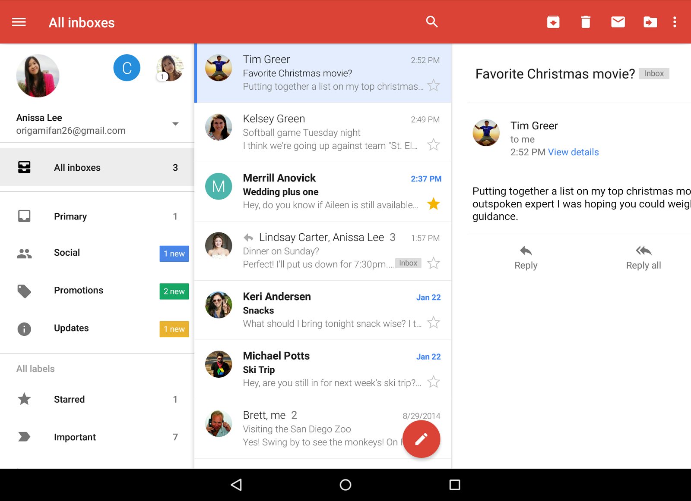
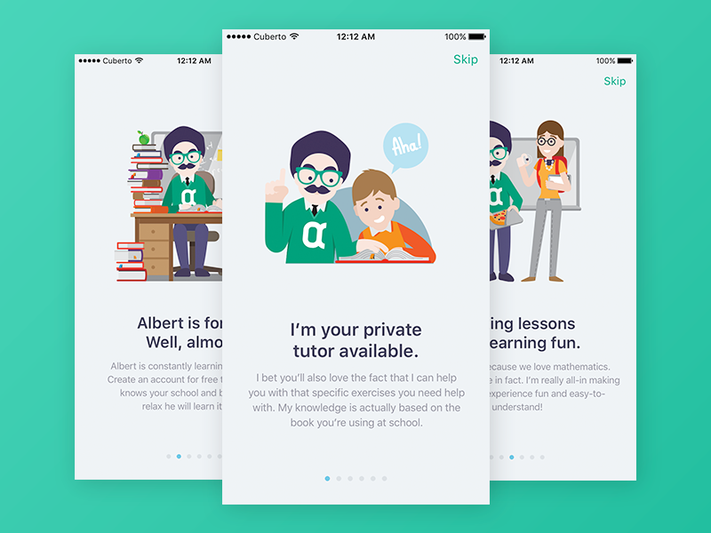
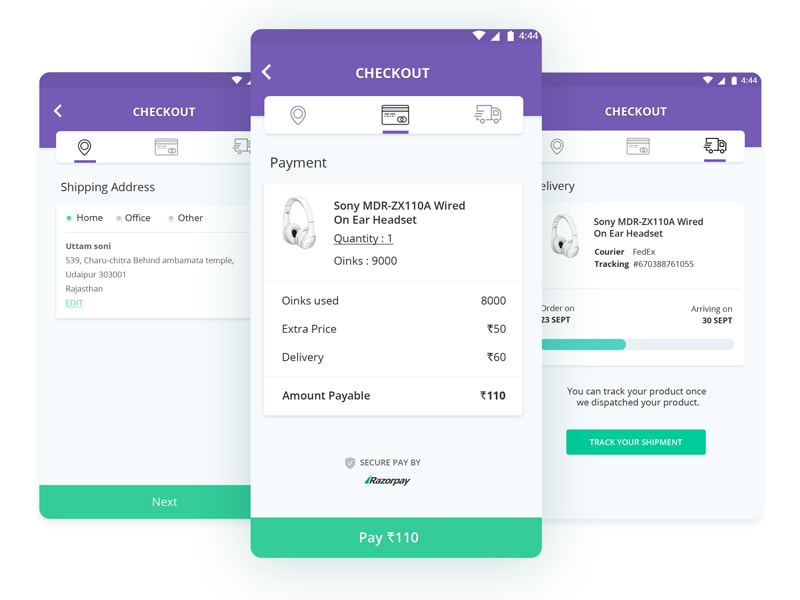

[`Kotlin Intermedio`](../../Readme.md) > [`Sesión 05`](../Readme.md) > `Proyecto`

## Proyecto: Fragments

### 1. Objetivos :dart:

- Modularizar el proyecto mediante ___Fragments___.
- Manejar un flujo entre _fragments_.

### 2. Requisitos :clipboard:

1. Android Studio Instalado en nuestra computadora.

### 3. Desarrollo :computer:

En este reto final, vamos a implementar _fragments_ para lograr una app flexible para diversos dispositivos, o crear un flujo.

Por simplicidad podemos escoger un login con nombre de usuario/correo/teléfono y una contraseña.

### Lista-detalle

Para este apartado, podemos tomar como base el ejercicio realizado en el [Ejemplo 2](../Ejemplo-02) para una lista-detalle, pudiéndolo modificar a un inbox o a otro tipo de lista, dependiendo del proyecto que hayamos elegido.

### Flujo

Podemos crear un flujo en la aplicación similar a los de los tutoriales guiados cuando abres por primera vez una app

O una serie de pasos para completar una tarea.

### Lineamientos

1. Se debe implementar al menos dos _fragments_ en el proyecto.
2. Cualquier forma de implementación de _fragments_ es válido.
3. El uso de los _fragments_ debe ser adecuado (no utilizarlos en lugares donde no se requieran).

[`Anterior`](../Ejemplo-03/Readme.md) | [`Siguiente`](../Postwork/Readme.md)

