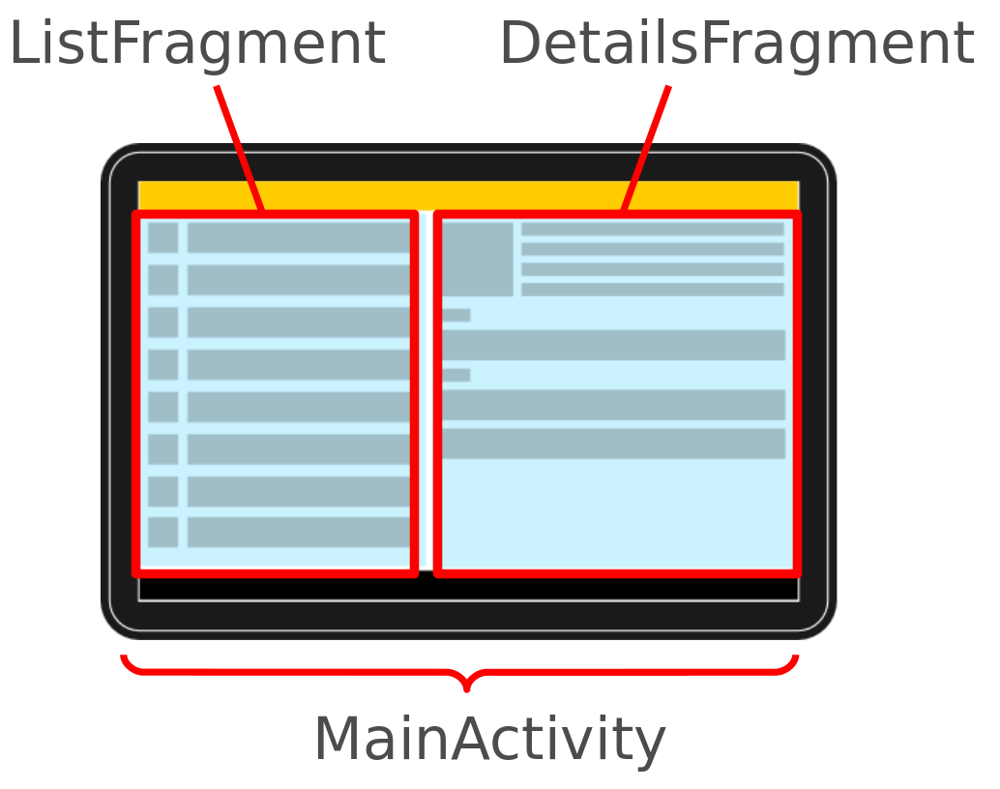

[`Kotlin-Intermedio`](../Readme.md) > `Sesión 5`

## Sesión 5: Fragments

  
  
  
### Introducción: Qué es un Fragment 

Como el nombre lo indica, es un fragmento de la UI que implementa tanto un ciclo de vida y eventos propios. utilizaremos Fragments cuando:

- Requiramos una interfaz de usuario dinámica. 
- Necesitemos reutilizar un pedazo de interfaz con funcionalidad en diversos puntos de nuestra app.
- La navegación en una parte del flujo de la app sea mejor manejable al usar Fragments.

Puedes pensar en un fragmento como una sección modular de una actividad que tiene un ciclo de vida propio, que recibe sus propios eventos de entrada y que puedes agregar o quitar mientras la actividad se esté ejecutando (algo así como una "subactividad" que puedes volver a usar en diferentes actividades). El ciclo de vida de un `Fragment` se puede ver en la siguiente imagen:

<h5>Ciclo de vida de un Fragment</h5>

**Cómo crear un fragmento**

### 1. Objetivos :dart: 

---

- Diseñar interfaces flexibles y gestionables.
- Manejar el ciclo de vida de un Fragment.
- Conducir el flujo de distintos Fragments y su comunicación.
- Utilizar los distintos tipos de Fragments que el SDK proporciona.

### 2. Contenido :blue_book:

---

 

#### <ins>Agregar un Fragment</ins>

Para este ejemplo agregaremos un fragmento al layout del _Activity_ principal y se implementara la funcionalidad correspondiente.

- [**`EJEMPLO 1`**](Ejemplo-01/Readme.md)
- [**`RETO 1`**](Reto-01/Readme.md)

---

 

#### <ins>Flexibilidad: patrón lista-detalle</ins>

Utliizaremos este patrón ampliamente utilizado en aplicaciones para ejemplificar la flexibilidad de un ___Fragment___.

- [**`EJEMPLO 2`**](Ejemplo-02/Readme.md)
- [**`RETO 2`**](Reto-02/Readme.md)

- [**`EJEMPLO 3`**](Ejemplo-03/Readme.md)
- [**`RETO 3`**](Reto-03/Readme.md)

---

 

#### <ins>Transactions</ins>

Ejecutaremos una serie de transacciones para los fragments dentro de un contenedor.

- [**`EJEMPLO 4`**](Ejemplo-04/Readme.md)

---

### 3. Proyecto :hammer:

Con los temas anteriores, elige entre la construcción de una vista lista-detalle, un flujo de Fragments, o idea tu propuesta.

- [**`PROYECTO SESIÓN 5`**](Proyecto/Readme.md)

### 4. Postwork :memo:

Con lo aprendido en esta sesión, continúa con la implementación de Fragments en tu proyecto.

- [**`POSTWORK SESIÓN 5`**](Postwork/Readme.md)

 

[`Anterior`](../Sesion-04/Readme.md) | [`Siguiente`](../Sesion-06/Readme.md)      

