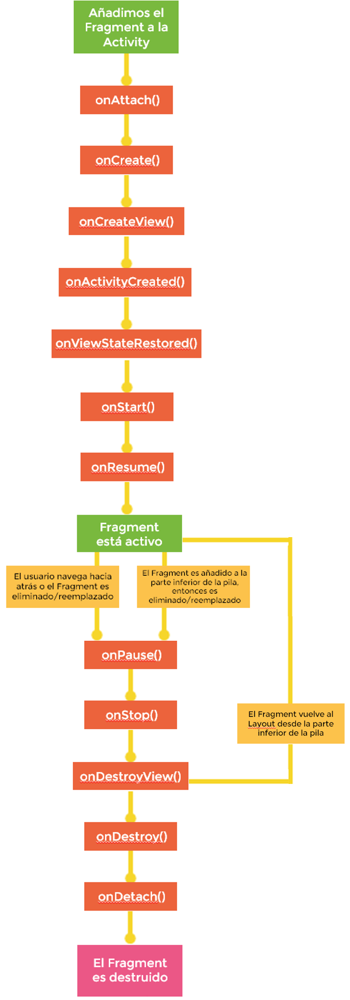

[`Kotlin Intermedio`](../../Readme.md) > [`Sesión 05`](../Readme.md) > `Reto 1`
	
## Reto 1 

<div style="text-align: justify;">

### 1. Objetivos :dart:

- Analizar el ciclo de vida de un _Fragment_ y su comportamiento al realizar diversas acciones.

### 2. Requisitos :clipboard:

1. Android Studio instalado
2. Al menos un Emulador android configurado

### 3. Desarrollo :computer:

Apoyándonos del diagrama que representa el ciclo de vida de un ___Fragment___, realizaremos las tareas enumeradas a continuación.

 
 
 
 También nos apoyaremos de esta tabla que relaciona el ciclo de vida de nuestro fragment con el ciclo del Activity al que lo adjuntamos.
 
 
Estado del _Activity_ |	Callbacks del _Fragment_ llamados |	Ciclo de vida del _Fragment_
--- | --- | ---
Created	| onAttach(), onCreate(), onCreateView(), onActivityCreated() | Fragment agregado y layout inflado.
Started |	onStart() | Fragment activo y visible.
Resumed |	onResume() | Fragment activo y listo para interactuar con el usuario.
Paused |	onPause() | Fragment pausado.
Stopped	| onStop() | Fragment parado e invisible.
Destroyed |	onDestroyView(), onDestroy(), onDetach() | El Fragmento es destruído.


1. Utilizando el ejemplo anterior, utilizaremos todos los callbacks para imprimir un texto cuando este se halla mandado a llamar. Observar como se imprimen los logs en el _logcat_ con diversas acciones (abrir la app, cerrar la app, voltear el teléfono, enviar a segundo plano, etc.).


<details><summary>Solución</summary>
<p>

```kotlin

 override fun onAttach(context: Context) {
        Log.d("Fragment", "onAttach llamado")
        super.onAttach(context)
    }

    override fun onCreate(savedInstanceState: Bundle?) {
        Log.d("Fragment", "onCreate llamado")
        super.onCreate(savedInstanceState)
    }

    override fun onCreateView(
        inflater: LayoutInflater,
        container: ViewGroup?,
        savedInstanceState: Bundle?
    ): View {
        // Inflate the layout for this fragment
        val root = inflater.inflate(R.layout.fragment_layout, container, false)
        Log.d("Fragment", "onCreateView llamado")
        return root
    }

    override fun onActivityCreated(savedInstanceState: Bundle?) {
        Log.d("Fragment", "onActivityCreated llamado")
        super.onActivityCreated(savedInstanceState)
    }

    override fun onStart() {
        Log.d("Fragment", "onStart llamado")
        super.onStart()
    }

    override fun onResume() {
        Log.d("Fragment", "onResume llamado")
        super.onResume()
    }

    override fun onPause() {
        Log.d("Fragment", "onPause llamado")
        super.onPause()
    }

    override fun onStop() {
        Log.d("Fragment", "onStop llamado")
        super.onStop()
    }

    override fun onDestroyView() {
        Log.d("Fragment", "onDestroyView llamado")
        super.onDestroyView()
    }

    override fun onDestroy() {
        Log.d("Fragment", "onDestroy llamado")
        super.onDestroy()
    }

    override fun onDetach() {
        Log.d("Fragment", "onDetach llamado")
        super.onDetach()
    }
```

</p>
</details>
<br/>

2. Agregar un botón que permita navegar a una nueva _Activity_ que crearemos y cuyo diseño de _layout_ sea abierto. Analizar cómo se comporta el ciclo de vida al navegar a dicha _Activity_ y al regresar de ella.

<details><summary>Solución</summary>
<p>

Dentro del _layout_ del _Fragment_ crearemos un botón, el código xml queda similar al siguiente:

```xml
<Button
        android:id="@+id/button"
        android:text="Siguiente"
        app:layout_constraintTop_toBottomOf="@id/imageView"
        app:layout_constraintStart_toStartOf="parent"
        app:layout_constraintEnd_toEndOf="parent"
        android:layout_width="wrap_content"
        android:layout_height="wrap_content"/>
```


El callback ___onCreateView___ debe quedar parecido a lo siguiente
	
```kotlin
    override fun onCreateView(
        inflater: LayoutInflater,
        container: ViewGroup?,
        savedInstanceState: Bundle?
    ): View {
        // Inflate the layout for this fragment
        val root = inflater.inflate(R.layout.fragment_layout, container, false)

        Log.d("Fragment", "onCreateView llamado")
        val btn = root.findViewById<Button>(R.id.button)
        btn.setOnClickListener {
            val intent = Intent(activity, OtherActivity::class.java)
            startActivity(intent)
        }


        return root
    }
```

mediante la variable ___root___ podemos encontrar nuestra representación del botón creado y poder asignarle un _listener_ al darle click. Ahí, podemos declarar un ___Intent___ que nos lleve al nuevo ___Activity___.

</p>
</details>
<br/>

[`Anterior`](../Ejemplo-01/Readme.md) | [`Siguiente`](../Ejemplo-02/Readme.md)


</div>
