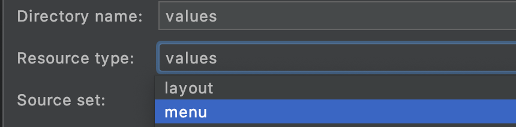
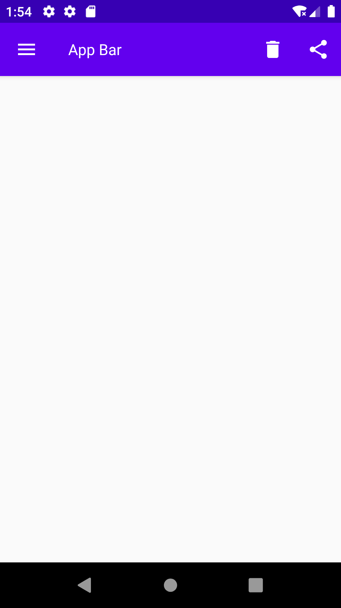
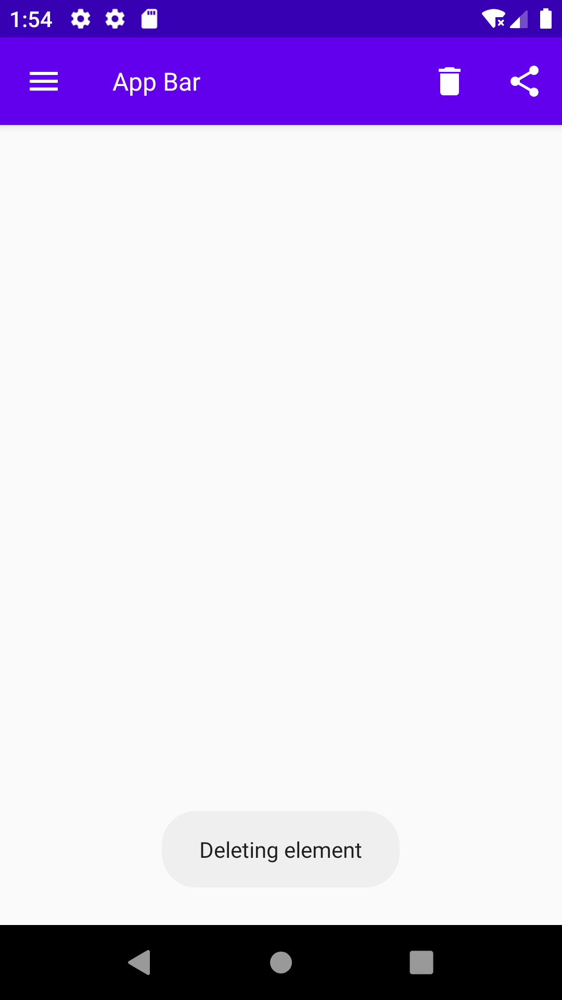
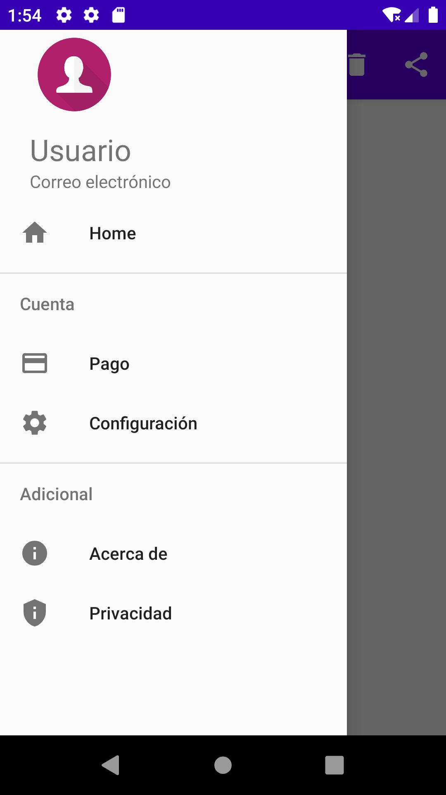

[`Kotlin Intermedio`](../../Readme.md) > [`Sesión 06`](../Readme.md) > `Ejemplo 2`

## Ejemplo 2: Appbar y Navigation Drawer

<div style="text-align: justify;">

### 1. Objetivos :dart:

- Implementar Appbar y NavigationDrawer_ de Material Design en nuestra interfaz.

### 2. Requisitos :clipboard:

1. Android Studio Instalado en nuestra computadora.
2. Seguir la instrucción específica para esta sesión.

### 3. Desarrollo :computer:

Implementaremos ahora dos _componets_ importantes para material design: Appbar y Navigation Drawer.

* En [Este enlace](https://material.io/components/app-bars-top) podemos leer acerca de las App bars.
* En [Este enlace](https://material.io/components/navigation-drawer) podemos leer acerca de las Navigation Drawers.

#### App bar

1. Abre __Android Studio__ y crea un nuevo proyecto con Activity Vacía (Empty Activity).

2. Copiaremos todos los recursos que se encuentran en [Esta carpeta](AppBarAndNavigationDrawer/app/src/main/res/drawable) y las pegamos en nuestro directorio ___drawable___, para utilizarlos posteriormente.

3. Copiaremos todos los recursos que se encuentran en [Esta carpeta](AppBarAndNavigationDrawer/app/src/main/res/values) y las pegamos en nuestro directorio de recursos ___values___, para utilizarlos posteriormente.

4. Ahora insertaremos nuestro AppBar en nuestro _main_activity.xml_, para esto, utilizaremos un ___AppBarLayout___ que en realidad es un _LinearLayout_ que implementa varios conceptos del [App Bar de Material design](https://material.io/components/app-bars-top). Dentro de esta, contenemos nuestro _widget_ ___Toolbar___ que es realmente la barra superior. el _flag_ ___navigationIcon___ es el elemento gráfico al lado izquierdo, en este caso pondremos el ícono de menú hamburguesa.

```xml
<LinearLayout xmlns:android="http://schemas.android.com/apk/res/android"
        xmlns:app="http://schemas.android.com/apk/res-auto"
        xmlns:tools="http://schemas.android.com/tools"
        android:layout_width="match_parent"
        android:layout_height="match_parent"
        tools:context=".MainActivity">

        <com.google.android.material.appbar.AppBarLayout
            android:layout_width="match_parent"
            android:layout_height="wrap_content">

            <androidx.appcompat.widget.Toolbar
                app:navigationIcon="@drawable/menu"
                android:id="@+id/app_bar"
                style="@style/Widget.Toolbar"
                android:layout_width="match_parent"
                android:layout_height="?attr/actionBarSize"
                app:title="@string/app_name" />
        </com.google.android.material.appbar.AppBarLayout>
    </LinearLayout>
```

5. Para agregar opciones a nuestra _AppBar_, creamos un directorio _menu_.



dentro de este, creamos _toolbar_menu.xml_ y agregamos los _items_ que compondrán a nuestro menú:

```xml
<?xml version="1.0" encoding="utf-8"?>
<menu xmlns:android="http://schemas.android.com/apk/res/android"
    xmlns:app="http://schemas.android.com/apk/res-auto">
    <item
        android:id="@+id/delete"
        android:icon="@drawable/delete"
        android:title="@string/delete"
        app:showAsAction="always" />
    <item
        android:id="@+id/share"
        android:icon="@drawable/share"
        android:title="@string/share"
        app:showAsAction="always" />
</menu>
```


5. Asignamos nuestro _Toolbar_ como ___ActionBar___, esto lo hacemos en el ___onCreate___ de nuestra _MainActivity_.

```kotlin
        val appBar = findViewById<Toolbar>(R.id.app_bar)
        this.setSupportActionBar(appBar)
```

Y asociamos nuestra _AppBar_ al menú que creamos con anterioridad:

```kotlin
override fun onCreateOptionsMenu(menu: Menu?): Boolean {
        menuInflater.inflate(R.menu.toolbar_menu, menu)
        return super.onCreateOptionsMenu(menu)
    }
```

Al correr la aplicación, debe mostrarse esta interfaz:



6. Las opciones en el AppBar no tienen ninguna función; es por eso que mostraremos un mensaje distinto para cada opción. Identificaremos el item seleccionado por medio de su id y mostraremos un texto correspondiente.

```kotlin
 override fun onOptionsItemSelected(item: MenuItem): Boolean {
        var msg = ""

        when(item.itemId){
            R.id.delete -> msg=getString(R.string.delete_element)
            R.id.share -> msg=getString(R.string.sharing_element)
        }

        Toast.makeText(this,msg,Toast.LENGTH_SHORT).show()
        return super.onOptionsItemSelected(item)
    }
```

Al correr de nuevo la app, y hacer click en uno de los elementos, se visualiza este _Toast_:



#### Navigation drawer

7. Comenzaremos por crear el menú que irá dentro del layout, creando el ___drawer_menu.xml___ dentro del directorio _menu_.

```xml
<menu xmlns:android="http://schemas.android.com/apk/res/android">
    <group>
        <item
            android:id="@+id/nav_home"
            android:icon="@drawable/home"
            android:title="@string/drawer.home" />
    </group>

    <item android:title="Cuenta">

        <menu>

            <group android:checkableBehavior="single">

                <item
                    android:id="@+id/nav_payment"
                    android:icon="@drawable/payment"
                    android:title="@string/drawer.payments" />

                <item
                    android:id="@+id/nav_settings"
                    android:icon="@drawable/settings"
                    android:title="@string/drawer.settings" />
            </group>
        </menu>
    </item>

    <item android:title="@string/drawer.extra">
        <menu>
            <item
                android:id="@+id/nav_about"
                android:icon="@drawable/info"
                android:title="@string/drawer.about" />

            <item
                android:id="@+id/nav_privacy"
                android:icon="@drawable/privacy"
                android:title="@string/drawer.privacy" />
        </menu>
    </item>
</menu>
```

8. Ahora, crearemos el _layout_ ___drawer_header.xml___ del _header_ de nuestro Drawer.

```xml
<LinearLayout
    xmlns:android="http://schemas.android.com/apk/res/android"
    android:orientation="vertical"
    android:paddingStart="24dp"
    android:paddingTop="48dp"
    android:layout_width="match_parent"
    android:layout_height="wrap_content">
    <ImageView
        android:layout_width="72dp"
        android:layout_height="72dp"
        android:src="@drawable/default_user" />

    <TextView
        android:layout_marginTop="8dp"
        android:layout_width="wrap_content"
        android:layout_height="wrap_content"
        android:text="@string/user"
        android:textSize="24sp" />

    <TextView
        android:layout_width="wrap_content"
        android:layout_height="wrap_content"
        android:text="@string/email"
        android:textSize="14sp" />
</LinearLayout>
```

9. Nuestro _activity_main.xml_ será modificado de tal forma que el _LinearLayout_ quede envuelto por nuestra clase ___DrawerLayout___

```xml
<androidx.drawerlayout.widget.DrawerLayout xmlns:android="http://schemas.android.com/apk/res/android"
    xmlns:app="http://schemas.android.com/apk/res-auto"
    xmlns:tools="http://schemas.android.com/tools"
    android:id="@+id/drawer_layout"
    android:layout_width="match_parent"
    android:layout_height="match_parent"
    tools:context=".MainActivity"
    tools:openDrawer="start"
    android:fitsSystemWindows="true">
	...
</androidx.drawerlayout.widget.DrawerLayout>
```

Sin embargo, requerimos implementar el menú de Navegación y el header, por lo que agregaremos la clase ___NavigationView___ al final del interior de nuestro _DrawerLayout_.

```xml
  <com.google.android.material.navigation.NavigationView
        app:headerLayout="@layout/drawer_header"
        android:id="@+id/nav_view"
        android:layout_gravity="start"
        android:layout_height="match_parent"
        android:layout_width="wrap_content"
        app:menu="@menu/drawer_menu" />
```

El código final de _main_activity.xml_ quedaría de la siguiente forma:

```xml
<androidx.drawerlayout.widget.DrawerLayout xmlns:android="http://schemas.android.com/apk/res/android"
    xmlns:app="http://schemas.android.com/apk/res-auto"
    xmlns:tools="http://schemas.android.com/tools"
    android:id="@+id/drawer_layout"
    android:layout_width="match_parent"
    android:layout_height="match_parent"
    tools:context=".MainActivity"
    tools:openDrawer="start"
    android:fitsSystemWindows="true">

    <LinearLayout xmlns:android="http://schemas.android.com/apk/res/android"
        xmlns:app="http://schemas.android.com/apk/res-auto"
        xmlns:tools="http://schemas.android.com/tools"
        android:layout_width="match_parent"
        android:layout_height="match_parent"
        tools:context=".MainActivity">

        <com.google.android.material.appbar.AppBarLayout
            android:layout_width="match_parent"
            android:layout_height="wrap_content">

            <androidx.appcompat.widget.Toolbar
                app:navigationIcon="@drawable/menu"
                android:id="@+id/app_bar"
                style="@style/Widget.Toolbar"
                android:layout_width="match_parent"
                android:layout_height="?attr/actionBarSize"
                app:title="@string/app_name" />
        </com.google.android.material.appbar.AppBarLayout>
    </LinearLayout>

    <com.google.android.material.navigation.NavigationView
        app:headerLayout="@layout/drawer_header"
        android:id="@+id/nav_view"
        android:layout_gravity="start"
        android:layout_height="match_parent"
        android:layout_width="wrap_content"
        app:menu="@menu/drawer_menu" />
</androidx.drawerlayout.widget.DrawerLayout>
```

10. Debemos relacionar nuestro _AppBar_ con nuestro _NavigationDrawer_, por lo que haremos un método para hacer la configuración necesaria:

```kotlin
private fun setupDrawer(toolbar: Toolbar){
        val drawerLayout = findViewById<DrawerLayout>(R.id.drawer_layout)
        val drawerToggle = ActionBarDrawerToggle(this,drawerLayout,toolbar,R.string.open_drawer,R.string.close_drawer)
    }
```

esta función se llama en el método ___onCreate___:

```kotlin
setupDrawer(appBar)
```

Corremos nuestra app y finalmente, abriremos nuestro _Drawer_ al dar click sobre el menú hamburguesa (o hacer slide a la derecha en el borde izquierdo).




[`Anterior`](../Reto-01/Readme.md) | [`Siguiente`](../Ejemplo-03/Readme.md)


</div>
