[`Kotlin Intermedio`](../../Readme.md) > [`Sesión 06`](../Readme.md) > `Ejemplo 3`

## Ejemplo 3: Themes

<div style="text-align: justify;">

### 1. Objetivos :dart:

- Estilizar una aplicación.

### 2. Requisitos :clipboard:

1. Android Studio Instalado en nuestra computadora.
2. Seguir la instrucción específica para esta sesión.

### 3. Desarrollo :computer:

Para personalizar el estilo de una aplicación y adaptarlo a material design, debemos seguir ciertas reglas de diseño, como la elección de una cierta paleta de colores, el tamaño y fuente de nuestras letras, etc. Todo esto compone el ___Theme___ de nuestra aplicación.

En este ejemplo, aplicaremos un _Theme_ personalizado a nuestra aplicación, para eso, utilizaremos una app preestablecida la cuál modificaremos para lograr nuestra personalización. 

1. Descarga [Este proyecto](Themes), el cual será modificado para estilizarlo. El proyecto cuenta con las siguientes pantallas:

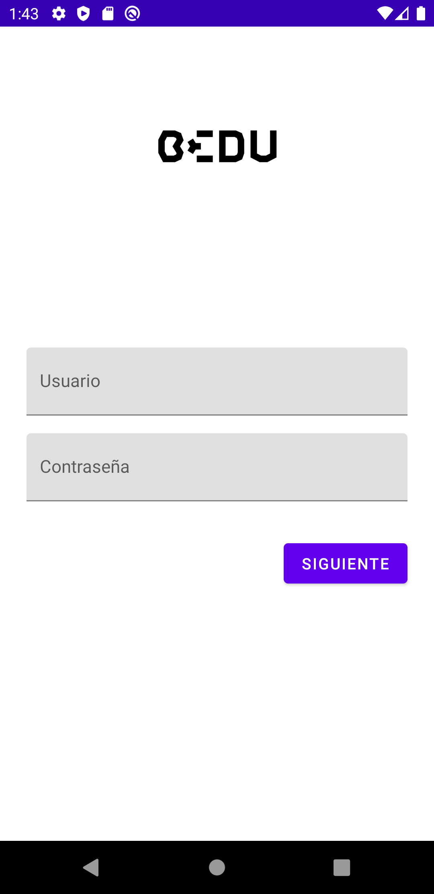

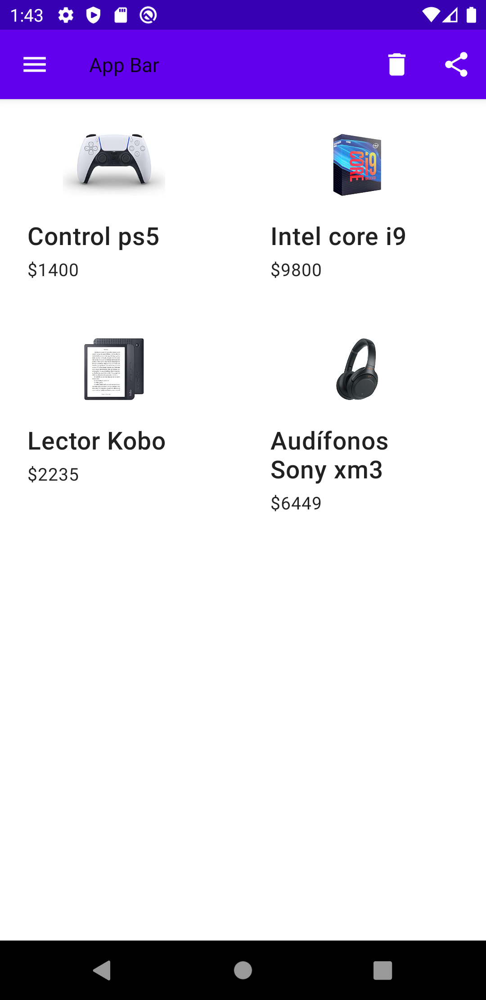

2. Vamos a definir la paleta de colores a utilizar, o al menos parte de esta. Para esto, nos apoyaremos de la herramienta [Color Tool](https://material.io/resources/color/#!/?view.left=0&view.right=0) que se apega a la norma de _Material Design_. El tema de colores de _Material Design_ se aborda en [Este Enlace](https://material.io/design/color/applying-color-to-ui.html#usage). La paleta que escogeremos es la siguiente:


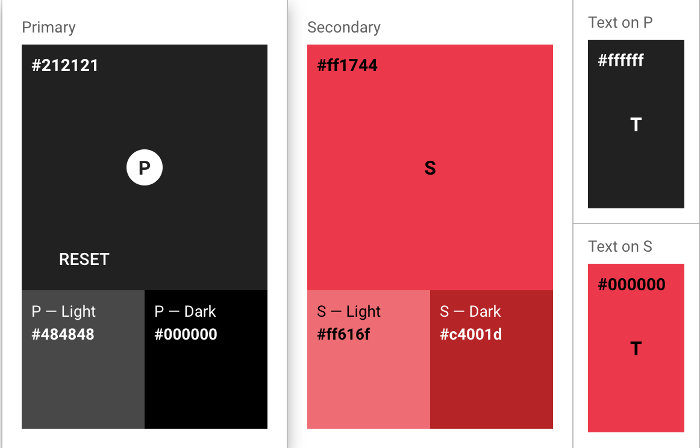

La página de _Color Tool_ ya viene configurada en [Este enlace]https://material.io/resources/color/#!/?view.left=0&view.right=0&secondary.color=FF1744&primary.color=212121

El sitio web muestra una serie de implementaciones de la paleta de colores en los elementos de la UI. Nos basaremos en las siguientes sugerencias:

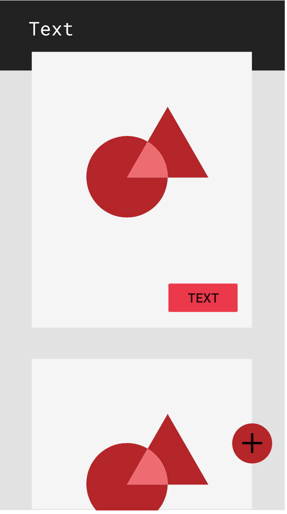 


Para exportar la paleta de colores desde el sitio al archivo _colors.xml_, daremos click a _export > android_. El archivo contendrá el siguiente código:

```xml
<resources>
  <color name="primaryColor">#212121</color>
  <color name="primaryLightColor">#484848</color>
  <color name="primaryDarkColor">#000000</color>
  <color name="secondaryColor">#ff1744</color>
  <color name="secondaryLightColor">#ff616f</color>
  <color name="secondaryDarkColor">#c4001d</color>
  <color name="primaryTextColor">#ffffff</color>
  <color name="secondaryTextColor">#000000</color>
</resources>
```

Ahora, hay qué reemplazar los viejos colores por los nuevos. En el ___AppTheme___ de _styles.xml_ reemplazamos:

* _colorPrimary_ por ___primaryColor___.
* _colorPrimaryDark_ por ___primaryDarkColor___.
* _colorAccent_ por ___secondaryColor___.
* _texColorPrimary_ por ___primaryTextColor___.

Definiremos también un color para los íconos del _App Bar_, que será de color blanco, cambiaremos el ___primaryTextColor___ a negro y el ___secondaryTextColor___ a blanco (_colors.xml_):

```xml
<color name="tabBarIconColor">#ffffff</color>
<color name="primaryTextColor">#000000</color>
<color name="secondaryTextColor">#ffffff</color>
```

y lo utilizaremos dentro de nuestro menú hamburguesa _menu.xml_

```xml
<vector xmlns:android="http://schemas.android.com/apk/res/android"
    ...
    android:tint="@color/tabBarIconColor"
```

Las pantallas deben verse de la siguiente manera:

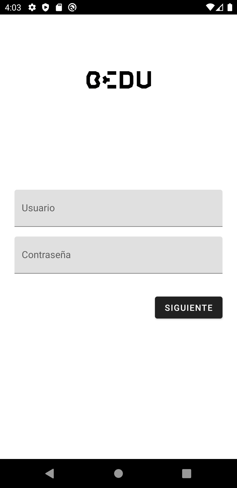

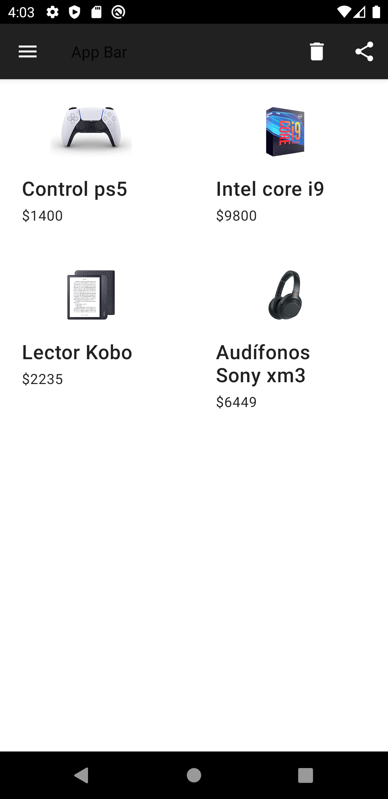

3. Ahora, vamos a estilizar la pantalla de _login_. Según la guía de _Components_ de _Material Design_, tenemos dos estilos de _Text Fields_:

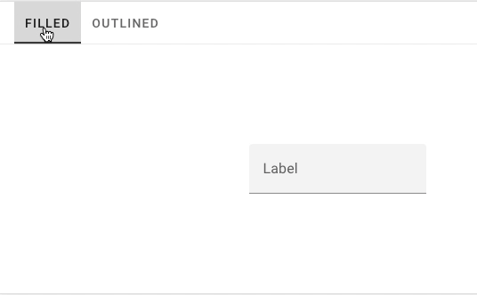

Utilizaremos el tipo _outlined_ para este caso, lo cual lo lograremos heredando de la clase _OutlinedBox_ de _MaterialComponents_. Para obtener atributos del _App Theme_, utilizamos la referencia ___?attr/<nombre_atributo>___, y lo utilizaremos en este caso, para que cuando cambiemos el tema de la app, cambien también en los estilos para nuestros componentes.

```xml
    <style name="Bedu.TextInputLayout" parent="Widget.MaterialComponents.TextInputLayout.OutlinedBox">
        <item name="hintTextAppearance">@style/Bedu.HintText</item>
        <item name="hintTextColor">?attr/colorAccent</item>
        <item name="android:textColorHint">?attr/colorPrimaryDark</item>
        <item name="android:paddingBottom">8dp</item>
        <item name="boxStrokeColor">?attr/colorAccent</item>
    </style>
```
el atributo _hintTextAppearance_ hace referencia al estilo ___Bedu.HintText___, que define el tamaño, color, etc. del _hint_ cuando no está como _label_.Le daremos una apariencia de Subtítulo (probar con distintos) y sobreescribiremos el color al color de texto primario.

```xml
<style name="Bedu.HintText" parent="TextAppearance.MaterialComponents.Subtitle2">
	<item name="android:textColor">?android:attr/textColorPrimary</item>
</style>
```

E implementamos en los ___TextInputLayout___.

```xml
     <com.google.android.material.textfield.TextInputLayout
        android:id="@+id/layout_text_user"
        style="@style/Bedu.TextInputLayout"
	..
	/>
     <com.google.android.material.textfield.TextInputLayout
        android:id="@+id/layout_text_pass"
        style="@style/Bedu.TextInputLayout"
	..
	/>
```

Supongamos que pueden existir en toda la app algunos ___TextInputs___ con tamaños y márgenes diferentes, podemos definir un estilo _parent_ y en los heredados, describir dichas dimensiones:

```xml
 <style name="Bedu.TextInputLayout.Login" parent="Bedu.TextInputLayout">
        <item name="android:layout_width">0dp</item>
        <item name="android:layout_height">wrap_content</item>
        <item name="android:layout_marginStart">24dp</item>
        <item name="android:layout_marginEnd">24dp</item>
        <item name="android:layout_marginTop">8dp</item>
        <item name="android:layout_marginBottom">8dp</item>
    </style>
```

Con esto, en nuestro ___TextInputLayout___ ya no sería necesario agregar estos atributos:

```xml
 <com.google.android.material.textfield.TextInputLayout
        android:id="@+id/layout_text_user"
        style="@style/Bedu.TextInputLayout.Login"
        android:hint="@string/hint_username"
        app:layout_constraintBottom_toTopOf="@+id/text_password"
        app:layout_constraintEnd_toEndOf="parent"
        app:layout_constraintStart_toStartOf="parent"
        app:layout_constraintHorizontal_bias="0.5"
        app:layout_constraintTop_toBottomOf="@+id/bedu"
        app:layout_constraintVertical_bias="0.35000002"
        app:layout_constraintVertical_chainStyle="packed">
	 ...
    </com.google.android.material.textfield.TextInputLayout>
```

Por último, estilizaremos el botón:

```xml
<style name="Bedu.Button" parent="Widget.MaterialComponents.Button">
	<item name="android:textColor">?android:attr/textColorPrimary</item>
        <item name="backgroundTint">?attr/colorAccent</item>
    </style>
```

La pantalla de Login debe quedar de la siguiente forma: 

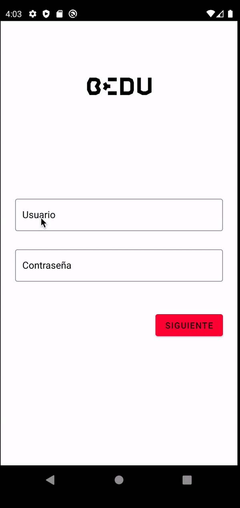


4. Ahora vamos a darle estilo al menú principal. Con los cambios que hemos realizado hata el momento, tenemos lo siguiente:

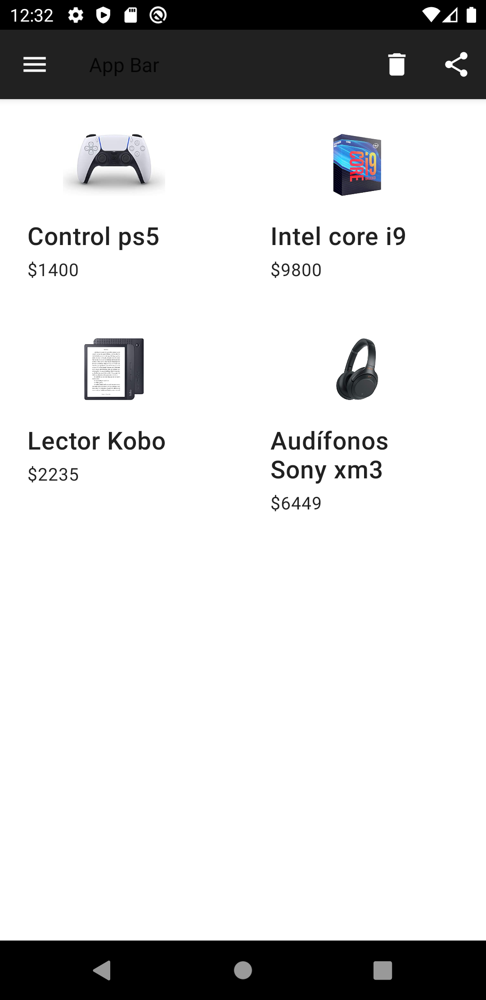

Comenzamos por personalizar nuestro _Toolbar_, para esto, definiremos tres estilos diferentes: 

- El primero para que el título sea de color blanco (El _Theme_ está basado en _Theme.MaterialComponents.Light_ y espera que tu barra tenga un fondo claro con letras oscuras). 
- El segundo, para la apariencia del título del App Bar.
- El último, para el resto de configuración de estilo del _Toolbar_.

```xml
   <style name="Toolbar.Theme" parent="AppTheme">
        <item name="android:textColorPrimary">?android:attr/textColorSecondary</item>
    </style>

    <style name="Toolbar" parent="TextAppearance.MaterialComponents.Headline1">
        <item name="android:textSize">16sp</item>
    </style>

    <style name="Widget.Toolbar" parent="Widget.AppCompat.Toolbar">
        <item name="android:background">?attr/colorPrimary</item>
        <item name="android:theme">@style/Toolbar.Theme</item>
        <item name="popupTheme">@style/ThemeOverlay.AppCompat.Light</item>
        <item name="titleTextAppearance">@style/Toolbar</item>
    </style>
```

Relacionamos nuestro estilo _Widget.Toolbar_ al _Toolbar_en nuestro _fragment_main.xml_

```xml
<androidx.appcompat.widget.Toolbar
                android:id="@+id/app_bar"
		...
                style="@style/Widget.Toolbar"
```

Ahora, vamos a estilizar cada item de nuestros productos. Agregaremos elevación a los _Cardviews_ en _item_contact.xml_.

```xml
<com.google.android.material.card.MaterialCardView
    ...
    app:cardElevation="2dp">
</com.google.android.material.card.MaterialCardView>
```

Debido a que el color de fondo de nuestras imágenes son blacnas, crearemos un separador entre estas dos:

```xml
<com.google.android.material.card.MaterialCardView
	...
    app:cardElevation="2dp">
    <LinearLayout
       ...>
        <ImageView
            android:id="@+id/imgProduct"
            .../>
<View
    android:layout_width="match_parent"
    android:layout_height="0.4dp"
    android:layout_marginHorizontal="8dp"
    android:layout_marginTop="8dp"
    android:background="@color/primaryLightColor"/>
...
```

Nuestra pantalla debe quedar de la siguiente forma:

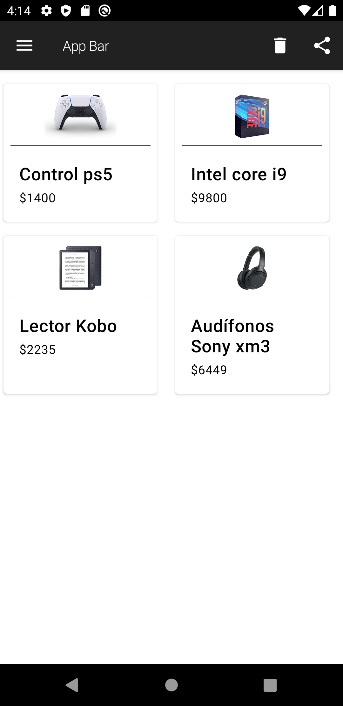


5. La app está lista, pero qué pasa si quisiéramos tener una versión alterna de nuestro _AppTheme_? crearemos uno nuevo:

```xml
    <style name="AppTheme.RedBlue" parent="Theme.MaterialComponents.Light.NoActionBar">\
        <!-- utilizado para el app bar y otros elementos UI primario -->
        <item name="colorPrimary">@color/redBluePrimaryColor</item>
        <!-- utilizado para el status bar, etc. -->
        <item name="colorPrimaryDark">@color/redBluePrimaryDarkColor</item>
        <!-- utilizado por defecto par acentuar en checkboxes inputs, switch, etc. -->
        <item name="colorAccent">@color/redBlueSecondaryColor</item>
        <item name="android:textColorPrimary">@color/redBluePrimaryTextColor</item>
        <item name="android:textColorSecondary">@color/redBlueSecondaryTextColor</item>
    </style>
```

El Theme del _Toolbar_ lo utiliza, por lo que lo utilizaremos en su atributo _parent_.

```xml
    <style name="Toolbar.Theme" parent="AppTheme.RedBlue">	
```

Ahora resta únicamente definirlo como el _Theme_ de la aplicación, para esto abriremos el ___AndroidManifest.xml___ y en ___application___ hallaremos el atributo ___android:theme___, donde colocaremos nuestro _style_.

```xml
    <application
       ...
        android:theme="@style/AppTheme.RedBlue">
        ...
    </application>
```

Corremos una vez más, podremos ver cómo los colores cambiaron exitosamente:

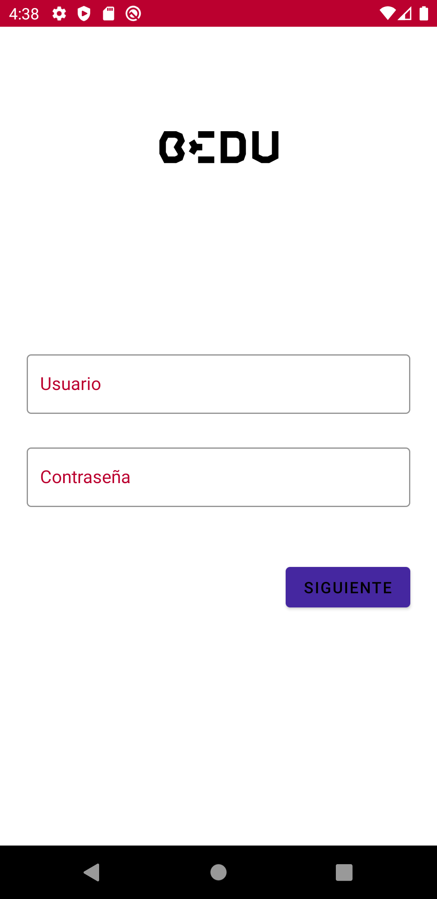 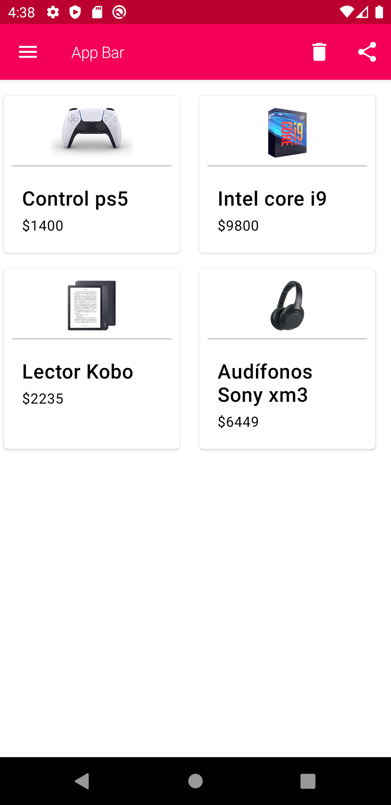


[`Anterior`](../Ejemplo-02/Readme.md) | [`Siguiente`](../Reto-02/Readme.md)


</div>
