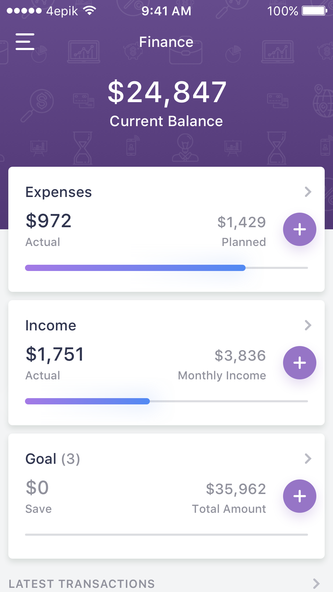
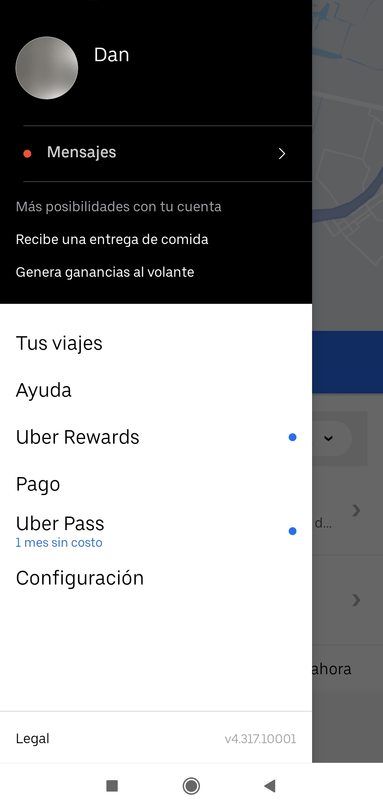

[`Kotlin Intermedio`](../../Readme.md) > [`Sesión 06`](../Readme.md) > `Postwork`

## Postwork

### 1. Objetivos :dart:

- Orientarse en la implementación de _Material Design_ para el proyecto.

### 2. Requisitos :clipboard:

1. Android Studio Instalado en nuestra computadora.

### 3. Desarrollo :computer:

#### CardView

Los _CardView_ son representaciones de _Cards_ de Material Design. Dicha vista suele representar el contenido y acciones de un sujeto. Su uso es bastante flexible, y como ejemplo, vemos su uso en esta aplicación de finanzas personales.

Aunque hemos visto bastantes ejemplos de _CardViews_ representando items de una lista de objetos, pueden ser usadas para una única instancia (rosando los límites de recomendaciones de Material Design).

#### AppBar

Hay distintas formas de aplicar un _AppBar_ para cierta pantalla en específico, para este primer ejemplo, tenemos una app de e-commerce que como opción tenemos un globo que nos lleva a una ventana de chat.

Otro ejemplo, es netflix, cuya Toolbar nos permite elegir otro usuario configurado en la cuenta.

#### Navigation drawer

Para este caso, tenemos a Uber, que en nuestra barra lateral, nos muestra un header con foto de perfil y el nombre, la calificación del usuario, otras opciones en el header y finalmente los items (sin íconos, únicamente una tipografía característica). Hasta abajo, una sección de _legal_.

[`Anterior`](../Proyecto/Readme.md) | [`Siguiente`](../../Sesion-07/Readme.md)

