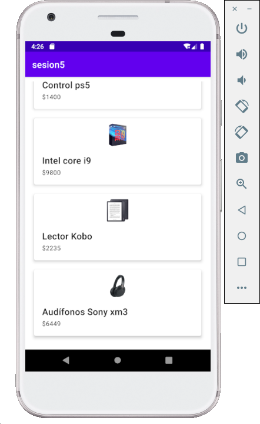

[`Kotlin Intermedio`](../../Readme.md) > [`Sesión 6`](../Readme.md) > `Reto 1`
	
## Reto 1

<div style="text-align: justify;">

### 1. Objetivos :dart:

- Implementar Material Design en un ejemplo.

### 2. Requisitos :clipboard:

1. Android Studio instalado

### 3. Desarrollo :computer:

Tomaremos el ejercicio realizado en el [Reto 2](../Sesion-05/Reto-02) de la [Sesión 5](../Sesion-05) como ejemplo, y reajustaremos el _layout_ de cada item en la lista y también la distribución en el _RecyclerView_, de modo que el listado quede de la siguiente forma:


 

Por practicidad, únicamente se tomará en cuenta el layout en versión móvil en vertical.

1. Utilizando el ejemplo anterior, modificar únicamente el layout para dispositivos grandes (la lista debe abarcar el 40% de la pantalla).

#### Tips:

- Para una separación entre layouts, crearemos la siguiente clase que actuará como _Decorator_ en nuestro _Adapter_.

```kotlin
class GridDecoration(private val largePadding: Int, private val smallPadding: Int) : RecyclerView.ItemDecoration() {

    override fun getItemOffsets(outRect: Rect, view: View,
                                parent: RecyclerView, state: RecyclerView.State) {
        outRect.left = smallPadding
        outRect.right = largePadding
        outRect.bottom = largePadding;

        // Add top margin only for the first item to avoid double space between items
        if (parent.getChildLayoutPosition(view) == 0 || parent.getChildLayoutPosition(view)==1) {
            outRect.top = largePadding;
        } else {
            outRect.top = 0;
        }
    }
}
```

y así queda su implementación en el _RecyclerView_

```kotlin
val largePadding = resources.getDimensionPixelSize(R.dimen.product_grid_spacing)
        val smallPadding = resources.getDimensionPixelSize(R.dimen.product_grid_spacing_small)
        recyclerProducts.addItemDecoration(GridDecoration(largePadding, smallPadding))
```

- Todos los elementos de _item_contact_ que son _atados_ al Producto, deben existir (incluso si no son visibles), de lo contrario esto nos puede generar un error en el código.

- Utilizar _CardView_ sin elevación.


<details><summary>Solución</summary>

```xml
    <com.google.android.material.card.MaterialCardView
        xmlns:android="http://schemas.android.com/apk/res/android"
        xmlns:app="http://schemas.android.com/apk/res-auto"
        android:layout_width="match_parent"
        android:layout_height="wrap_content"
        app:cardBackgroundColor="@android:color/white"
        app:cardElevation="0dp">
        <LinearLayout
            android:paddingTop="12dp"
            android:layout_width="match_parent"
            android:layout_height="wrap_content"
            android:orientation="vertical">
            <ImageView
                android:id="@+id/imgProduct"
                android:layout_width="match_parent"
                android:layout_height="50dp"
                android:scaleType="fitCenter"
                android:src="@drawable/xm3"/>
            <LinearLayout
                android:layout_width="match_parent"
                android:layout_height="wrap_content"
                android:orientation="vertical"
                android:padding="16dp">

                <TextView
                    android:id="@+id/tvProduct"
                    android:layout_width="match_parent"
                    android:layout_height="wrap_content"
                    android:padding="2dp"
                    android:text="Titulo"
                    android:textAppearance="?attr/textAppearanceHeadline6" />
                <TextView
                    android:visibility="gone"
                    android:id="@+id/tvDescription"
                    android:layout_width="match_parent"
                    android:layout_height="wrap_content"
                    android:padding="2dp"
                    android:text="Descripción"
                    android:textAppearance="?attr/textAppearanceHeadline6" />
                <TextView
                    android:id="@+id/tvPrice"
                    android:layout_width="match_parent"
                    android:layout_height="wrap_content"
                    android:padding="2dp"
                    android:text="$100"
                    android:textAppearance="?attr/textAppearanceBody2" />
            </LinearLayout>
        </LinearLayout>
    </com.google.android.material.card.MaterialCardView>
```
</details>
<br/>

[`Anterior`](../Ejemplo-01/Readme.md) | [`Siguiente`](../Ejemplo-02/Readme.md)


</div>
