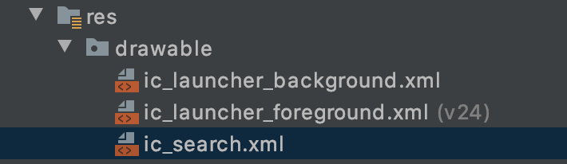
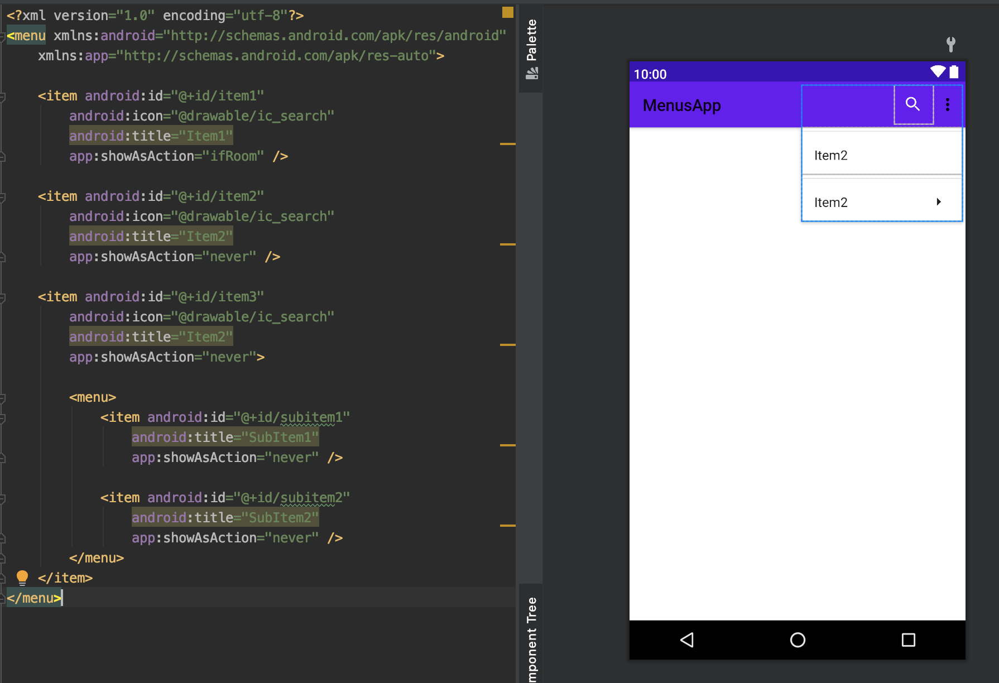

[`Kotlin Intermedio`](../../Readme.md) > [`Sesión 07`](../Readme.md) > `Ejemplo 1`


## Ejemplo 1: Tipos de Menú en Android

### 1. Objetivos :dart:

- Crear los tres tipos de menú en Android (PopUp, Contextual y Opciones) y reconocer los elementos que los conforman.
- Crear menús de opciones mediante las clases dedicadas a esto incluidas en el SDK de Android.


### 2. Requisitos :clipboard:

1. Android Studio 4.1
2. Kotlin 1.3
3. AVD Virtual device con API 11 (Android 3.0) o superior
4. Conexión a internet

### 3. Desarrollo :computer:

Los Menús de opciones en Android pertenecen a una interfaz llamada de la misma forma, [Menu](
https://developer.android.com/reference/kotlin/android/view/Menu?hl=es#).

> interface Menu

Esta interfaz es usada para definir dos tipos de menú, El `ContextMenu` y el `SubMenu`.

La manera mas simple de agregar un menú es "inflando" un archivo XML utilizando **MenuInflater**.

Y para recibir la acción de selección de alguna opción, nos basaremos en los métodos `onOptionsItemSelected(MenuItem)` y `onContextItemSelected(MenuItem)`.

Hay algunas funcionalidades que no son soportadas. Por ejemplo, íconos en el caso de `ContextMenus` y `CheckMarks` en el caso de `OptionMenus`.


#### Definiendo un menú en XML

Para definir un menú, crearemos un archivo XML dentro del directorio del proyecto `res/menu/`.

El menú estará conformado por los siguientes elementos:

- `<menu>` define un **Menu**. Un elemento `<menu>` es el contenedor general y puede tener uno o más elementos `<item>`y `<group>`.


- `<item>` crea un **MenuItem**, que representa un único elemento en un menú. Este elemento puede contener un elemento `<menu>` anidado para crear un submenú.


- `<group>` **contenedor** opcional e **invisible** para elementos `<item>`. Te permite categorizar los elementos de menú para que compartan propiedades. Es solo una agrupación.


Ejemplo de menú en xml:

```xml
<?xml version="1.0" encoding="utf-8"?>
<menu xmlns:android="http://schemas.android.com/apk/res/android">
    <item android:id="@+id/new_game"
          android:icon="@drawable/ic_new_game"
          android:title="@string/new_game"
          android:showAsAction="ifRoom"/>
    <item android:id="@+id/help"
          android:icon="@drawable/ic_help"
          android:title="@string/help" />
</menu>
```

En este código se observa una propiedad llamada `android:showAsAction="ifRoom"`. Esto indica que se mostrará el menú si hay espacio en pantalla. Para ver más sobre esta opción ver la [documentación](https://developer.android.com/guide/topics/resources/menu-resource?hl=es).


<!-- #### Creamos un proyecto nuevo... -->

Ahora identificaremos los tres tipos de menús que podemos crear para una aplicación Android y cómo hacerlo.

---

### OPTIONS MENU

Crearemos un proyecto nuevo en Android, agregaremos un ícono en nuestro folder `res` en `drawables`.  Para agregar un ícono hacemos click derecho y seleccionamos las siguientes opciones _New > Vector Asset_, elegimos un nombre.



Para crear los menús generaremos un nuevo directorio. Click derecho sobre `res` y haciendo click derecho, elegimos _New > Directory_, escribimos **Menu**.

En la carpeta generada, hacemos click derecho y elegimos _New > Menu Resource File_, para agregar el elemento de Menú, escribimos un nombre y lo creamos.


En este archivo en XML vamos a definir los elementos del Menú de Opciones.

```xml
<?xml version="1.0" encoding="utf-8"?>
<menu xmlns:android="http://schemas.android.com/apk/res/android"
    xmlns:app="http://schemas.android.com/apk/res-auto">
    <item android:id="@+id/item1"
        android:icon="@drawable/ic_search"
        android:title="Item1"
        app:showAsAction="ifRoom" />
</menu>
```


Agregamos otro elemento de menú.

> **OJO** 👀
> Observamos que se agrega otro botón de buscar. Para corregir esto nos dirigimos a `showAsAtion` en el código XML, lo cambiamos a `never`.


Ahora, agregaremos un Submenú. Para lograr esto, escribimos dentro de `Item` un bloque de `Menu` con Items en el interior, estos Items serán las opciones del submenú.

```xml
    <item android:id="@+id/item3"
        android:icon="@drawable/ic_search"
        android:title="Item2"
        app:showAsAction="never">

        <menu>
            <item android:id="@+id/subitem1"
                android:title="SubItem1"
                app:showAsAction="never" />

            <item android:id="@+id/subitem2"
                android:title="SubItem2"
                app:showAsAction="never" />
        </menu>
    </item>
```




Ahora bien, nos dirigimos a la clase `MainActivity` y agregamos el código de menú que nos ayudará a mostrar la implementación en XML en pantalla.

```kotlin
class MainActivity : AppCompatActivity() {
    override fun onCreate(savedInstanceState: Bundle?) {
        super.onCreate(savedInstanceState)
        setContentView(R.layout.activity_main)
    }

    override fun onCreateOptionsMenu(menu: Menu?): Boolean {
        val inflater = menuInflater
        inflater.inflate(R.menu.options_menu, menu)
        return super.onCreateOptionsMenu(menu)
    }
}
```


--- 

### CONTEXTUAL MENU

Creamos un nuevo proyecto y dentro nos dirigimos al `activity_main.xml`. Agregamos un TextView.

```xml
    <TextView
        android:id="@+id/txTextView"
        android:layout_width="wrap_content"
        android:layout_height="wrap_content"
        android:text="Hello World!"
        app:layout_constraintBottom_toBottomOf="parent"
        app:layout_constraintLeft_toLeftOf="parent"
        app:layout_constraintRight_toRightOf="parent"
        app:layout_constraintTop_toTopOf="parent" />
```

Creamos un directorio de Menú y agregamos un Menu Resource File llamado `menu_context`. Este menú tendra las opciones de click derecho como Cortar, Copiar, Pegar, etcétera.

```xml
<?xml version="1.0" encoding="utf-8"?>
<menu xmlns:android="http://schemas.android.com/apk/res/android">

    <item android:title="Copy" />
    <item android:title="Paste" />
    <item android:title="Cut" />

</menu>
```


<!-- > **Opcional**:
Nos dirigimos al `Gradle` (Module: app) para agregar la dependencia de Material Design. Sincronizamos.

> implementation 'com.android.support.design:28.0.0' -->


Vamos a **MainActivity** para implementar el **Context Menu**.

Agregamos el elemento que tendrá este menú. Se activará dando un Tap largo.
El elemento se debe registrar con la función `registerForContextMenu(txTextView)` en el método `onCreate`.

```kotlin
    var txTextView: TextView = findViewById(R.id.txTextView)
    registerForContextMenu(txTextView)
```

Y luego inflamos el menú.


```kotlin
override fun onCreateContextMenu( menu: ContextMenu?, v: View?, menuInfo: ContextMenu.ContextMenuInfo?) {
     super.onCreateContextMenu(menu, v, menuInfo)
     var inflater = menuInflater
     inflater.inflate(R.menu.menu_context, menu)
}
```


---

### POPUP MENU

Al igual que con los menús anteriores, es necesario crear un proyecto nuevo, después nos dirigimos al `activity_main.xml` y agregamos un botón.

```xml
    <Button
        android:id="@+id/button"
        android:layout_width="wrap_content"
        android:layout_height="wrap_content"
        android:text="Button"
        tools:layout_editor_absoluteX="159dp"
        tools:layout_editor_absoluteY="297dp"
        tools:ignore="MissingConstraints" />
```

Este **botón** servirá para lanzar el PopUp Menu.

Creamos un Directorio de Menú y un `popmenu.xml` en XML con las opciones que necesitemos. 

```xml
<?xml version="1.0" encoding="utf-8"?>
<menu xmlns:android="http://schemas.android.com/apk/res/android">
    <item android:title="Item1" />
    <item android:title="Item2" />
    <item android:title="Item3" />
</menu>
```

La implementación de este tipo de menú es muy similar a la que vimos para Context Menu.

Vamos al MainActivity, agregamos un `Listener` en la clase, para esto vamos a hacer que la clase extienda a `View.OnClickListener`, que es una clase abstracta en la que se tiene que definir el método `onClick` que será el callback para el evento click.

```kotlin
class MainActivity: AppCompatActivity(), View.OnClickListener {

	 //...

    override fun onClick(v: View?) {
        TODO("Not yet implemented")
    }
}
```

Como siempre vamos a inflar el menú

```kotlin
    override fun onCreateContextMenu(menu: ContextMenu?, v: View?, menuInfo: ContextMenu.ContextMenuInfo?) {
        super.onCreateContextMenu(menu, v, menuInfo)
        var inflater = menuInflater
        inflater.inflate(R.menu.popmenu, menu)
    }
```

Y definimos `onClick` en donde agregaremos una instancia de `PopupMenu`.

```kotlin
    override fun onClick(v: View?) {
        var popMenu = PopupMenu(this, v)
        popMenu.menuInflater.inflate(R.menu.popmenu, popMenu.menu)
        popMenu.show()
    }
```

Por último dentro del método `onCreate` definimos esta clase (`this`) como callback para el `OnClickListener` del botón.

```kotlin
    var button: Button = findViewById(R.id.button)
    registerForContextMenu(button)
    button.setOnClickListener(this)
```


#### Referencias: 

> https://developer.android.com/guide/topics/ui/menus?hl=es#xml


[`Anterior`](../Readme.md) | [`Siguiente`](../Reto-01/Readme.md)


</div>
