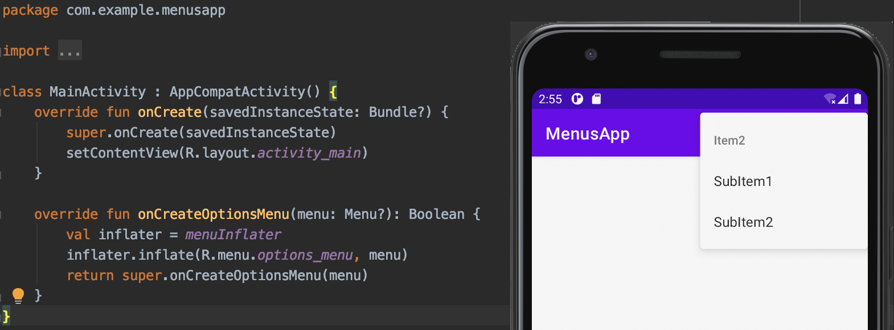
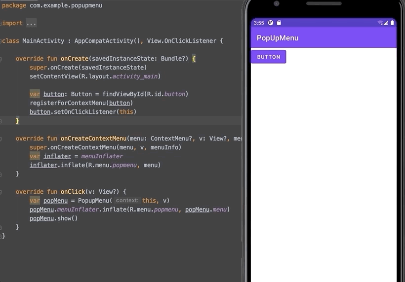

[`Kotlin Intermedio`](../../Readme.md) > [`Sesión 07`](../Readme.md) > `Ejemplo 2`


## Ejemplo 2: Menus y Eventos

<div style="text-align: justify;">

### 1. Objetivos :dart:

- Implementar acciones al seleccionar las opciones de los menus creados en la Sesion-01.

### 2. Requisitos :clipboard:

1. Android Studio 4.1
2. Kotlin 1.3
3. AVD Virtual device con API 11 (Android 3.0) o superior
4. Conexión a internet
5. Códigos de la Sesion-01 completos

### 3. Desarrollo :computer:

### OPTIONS MENU

Retomaremos el Ejemplo de [options_menu](./options_menu), pero esta vez agregaremos funcionalidad a las opciones de menú.




Para ello, nos dirigimos al MainActivity, y escribimos la función encargada de obtener la opción elegida en el menú.

```
override fun onOptionsItemSelected(item: MenuItem): Boolean {
	return super.onOptionsItemSelected(item)
}
```

Luego, comparamos cada `id` dentro del Menu.

```
override fun onOptionsItemSelected(item: MenuItem): Boolean {
        // Handle presses on the action bar menu items
        when (item.itemId) {
            R.id.item1 -> {
                return true
            }
            // implementar resto de opciones
        }
        return super.onOptionsItemSelected(item)
    }
```

Finalmente, para el resto de opciones:

```
 override fun onOptionsItemSelected(item: MenuItem): Boolean {
        // Handle presses on the action bar menu items
        when (item.itemId) {
            R.id.item1 -> {
                Toast.makeText(this, "Item1", Toast.LENGTH_LONG).show()
                return true
            }
            R.id.item2 -> {
                Toast.makeText(this, "Item2", Toast.LENGTH_LONG).show()
                return true
            }
            R.id.item3 -> {
                Toast.makeText(this, "Item3", Toast.LENGTH_LONG).show()
                return true
            }
        }
        return super.onOptionsItemSelected(item)
    }
```


### CONTEXTUAL MENU

Retomaremos el Ejemplo de [context_menu](./context_menu), pero esta vez agregaremos funcionalidad a las opciones de menú.



Para ejecutar acciones de acuerdo al elemento seleccionado del menú, nos basaremos en la función `onContextItemSelected(item: MenuItem?)`.

```
 override fun onContextItemSelected(item: MenuItem): Boolean {
        when(item?.itemId) {
            R.id.copy -> {
                Toast.makeText(this, "Copy", Toast.LENGTH_SHORT).show()
            }
        }
        return super.onContextItemSelected(item)
    }
```

Implementar resto de opciones.


### POPUP MENU

Retomaremos el Ejemplo de [popup_menu](./popup_menu), pero esta vez agregaremos funcionalidad a las opciones de menú.

Este código difiere debido a que implementaremos un closure para el popMenu, dentro de este closure mediante un capture list obtendremos la opcion deseada.

```
override fun onClick(v: View?) {
        var popMenu = PopupMenu(this, v)
        popMenu.menuInflater.inflate(R.menu.popmenu, popMenu.menu)
        // implementar closure
        popMenu.show()
    }
```

Captamos cada opción de menú con su **id** correspondiente.

```
override fun onClick(v: View?) {
    var popMenu = PopupMenu(this, v)
        popMenu.menuInflater.inflate(R.menu.popmenu, popMenu.menu)
        popMenu.setOnMenuItemClickListener { item ->
            when(item.itemId) {
                R.id.item1 -> {
                    Toast.makeText(this, "option 1", Toast.LENGTH_SHORT).show()
                    true
                }
            }
            false
        }
    popMenu.show()
}
```


#### Referencias: 

> https://developer.android.com/guide/topics/ui/menus?hl=es#xml

[`Anterior`](../Reto-01/Readme.md) | [`Siguiente`](../Reto-02/Readme.md)


</div>

