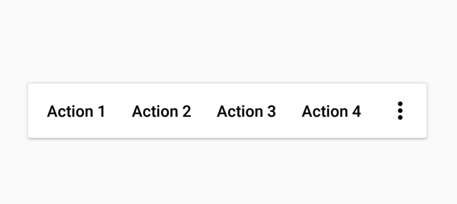

[`Kotlin Intermedio`](../../Readme.md) > [`Sesión 07`](../Readme.md) > `Postwork`

## Postwork: Menus Flotantes

### 1. Objetivos :dart:

- Implementar un ActionMode de manera flotante
- Implementar dos clases, una para el manejo de ActionMode de manera Primaria y otra clase para manejarlo de manera Flotante.

### 2. Requisitos :clipboard:

1. Conocimiento sobre Menu de Opciones.
2. Haber desarrollado el Ejemplo-03.

### 3. Desarrollo :computer:

Como vimos, podemos crear un menu contextual utilizando ActionModes. En este reto debemos crear una clase que permita posicionar el Menú contextual en algun sitio de la pantalla. Por defecto podriamos poner coordenadas (0,0,0,0).

Así como en el ejemplo-03, debemos agregar funcionalidad de onClick en cada opcion.

* Requerimientos:
	* Mostrar mas de dos opciones
	* Mostrar el botón de mas opciones con almenos una opción.

        
Solución

        
 Agrega aqui la solucion

        
Recuerda! escribe cada paso para desarrollar la solución del ejemplo o reto 

[`Anterior`](../Proyecto/Readme.md) | [`Siguiente`](../../Sesion-08/Readme.md)

