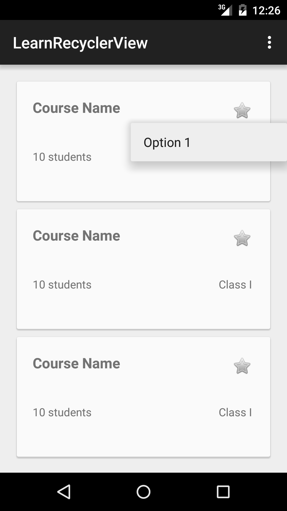
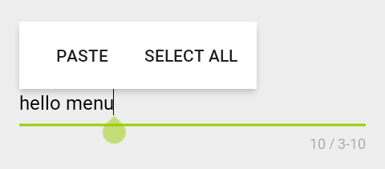
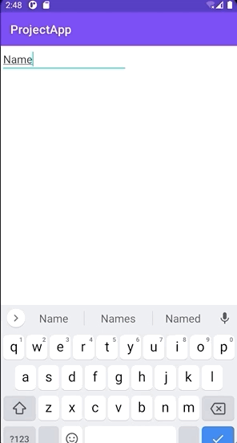

[`Kotlin Intermedio`](../../Readme.md) > [`Sesión 07`](../Readme.md) > `Proyecto`

## Proyecto: Menus y RecyclerView

> <div style="text-align: justify;">

### 1. Objetivos :dart:

- Implementar el uso de Menus Contextuales y Menus Flotantes.

### 2. Requisitos :clipboard:

1. Android Studio Instalado en nuestra computadora.


### 3. Desarrollo :computer:

En este reto final, implementaremos una vista de RecyclerView utilizando CardViews que permita la edición de elementos al seleccionar una celda.

- Las acciones sugeridas a ejecutar son:

	- Duplicar
	- Eliminar
	- Editar



Al seleccionar una opción de menú debe verse actualizado el `RecyclerView`.
Si se implementa la opción de Editar, debe mostrar una nueva vista para editar la información.

### Flujo

El flujo del proyecto comienza con la **Vista-A**, un recycler view. al seleccionar una fila o celda, debe ir a vista de detalle **Vista-B** en donde el título de la celda debe tener uno o varios campos de texto para poder editar su informacion. Con un botón salvaremos la información y regresaremos a la **Vista-A**.

Flujo:

```
**Vista-A** -----[ editar ]--->| **Vista-B**
**Vista-B** |<---[guardar y actualizar]--- **Vista-A**
```

En las opciones de cada campo de texto, se debe implementar un menú contextual con opciones propias. Estas opciones deben ser diferentes a Copiar, Pegar, Cortar texto. Se sugiere algo como, verificar correo electronico, poner texto en mayusculas, compartir en alguna red social.







### Lineamientos

1. Se debe implementar al menos dos vistas en el proyecto.
2. Cualquier forma de implementación de _recyclerview_ es válido.
3. Se deben usar almenos dos tipos de menus contextuales en el proyecto, con opciones propias.
4. Uno de los menús debe ser creado por XML y otro sin XML.


[`Anterior`](../Reto-03/Readme.md) | [`Siguiente`](../Postwork/Readme.md)

</div>
