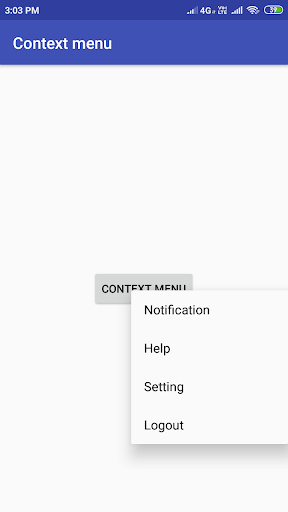
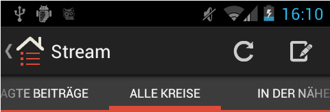

[`Kotlin-Intermedio`](../Readme.md) > `Sesión 7`

## Sesión 7: Menús

> 

  
### 1. Objetivos :dart: 

- Definir elementos de Menús de manera gráfica así como con código.
- Manejar de eventos y cambio de elementos en tiempo de ejecución.
- Menús contextuales y grupos de Menús.
- Implementar `ActionModes`.

### Introducción 

La Navegación en tu app debe ser intuitiva y predecible, tanto para usuarios nuevos, como para quienes vuelven a usarla. Debe ser simple de descubrir cómo moverse en las distintas secciones con comodidad, pero lograr que la navegación sea precedible y accesible puede ser un desafío por las limitaciones de las pantallas pequeñas y la necesidad de priorizar el contenido sobre los componentes de la interfaz.

Los menús son una herramienta básica de navegación que utilizan la mayoría de las aplicaciones móviles, ya que son intuitivos para los usuarios y útiles del lado de desarrollo de la aplicación. En esta sesión aprenderemos la forma de implementarlos en nuestra app, así como diferentes estilos de estos.

### 2. Contenido :blue_book:

---

 

#### <ins>Tipos de menús en Android</ins>

Implementación de los tres tipos de menú en Android, abarcando desde la interfaz gráfica con grupos de elementos, hasta la creación mediante código. Los menús vistos serán: __PopUp__, __Contextual__ y __Opciones__.

- [**`EJEMPLO 1`**](Ejemplo-01/Readme.md)
- [**`RETO 1`**](Reto-01/Readme.md)

---

 

#### <ins>Menús y Eventos</ins>

Crearemos menús que sean capaces de ejecutar acciones.

- [**`EJEMPLO 2`**](Ejemplo-02/Readme.md)
- [**`RETO 2`**](Reto-02/Readme.md)

---

 

#### <ins>Implementación de ActionModes </ins>

Crearemos menús contextuales flotantes.

- [**`EJEMPLO 3`**](Ejemplo-03/Readme.md)
- [**`RETO 3`**](Reto-03/Readme.md)

---

### 3. Proyecto :hammer:

- [**`PROYECTO SESIÓN 7`**](Proyecto/Readme.md)

### 4. Postwork :memo:

Con lo aprendido en esta sesión, continúa con la implementación de ___Menús_ en tu proyecto.

- [**`POSTWORK SESIÓN 7`**](Postwork/Readme.md)

 

[`Anterior`](../Sesion-06/Readme.md) | [`Siguiente`](../Sesion-08/Readme.md)      

