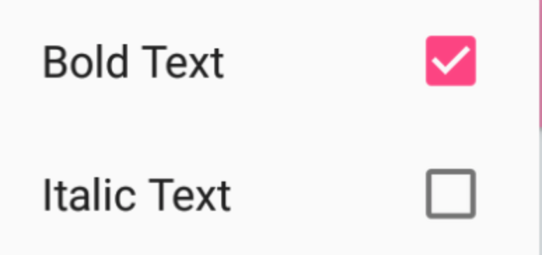
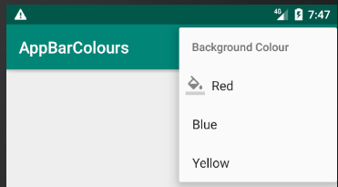

[`Kotlin Intermedio`](../../Readme.md) > [`Sesión 07`](../Readme.md) > `Reto 1`

## Reto 1: Agregando funcionalidad a los Menús

### 1. Objetivos :dart:

- Añadir más elementos a los menús de opciones de Android.

### 2. Requisitos :clipboard:

1. Android Studio 4.1
2. Kotlin 1.3
3. AVD Virtual device con API 11 (Android 3.0) o superior
4. Conexión a internet

### 3. Desarrollo :computer:

El reto consiste en agregar un `CheckBox` en cada elemento de menú, mostrar íconos en cada opción de menú y añadir al menos 5 opciones, y con ellas crear agrupaciones.

> Hint: 
> recuerda el atributo `android:icon`

<!-- 

Solución

Se puede ver la solución en el siguiente [enlace](./options_menu/MenusApp)

 -->

[`Anterior`](../Ejemplo-01/Readme.md) | [`Siguiente`](../Ejemplo-02/Readme.md)

