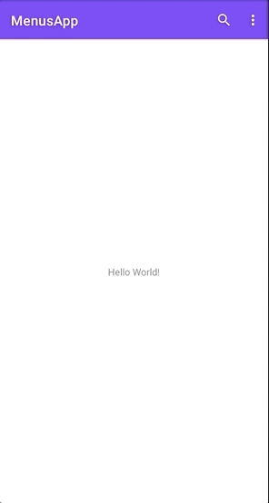

[`Kotlin Intermedio`](../../Readme.md) > [`Sesión 07`](../Readme.md) > `Reto 2`


## Reto 2: Agregando funcionalidad a los Menús

<div style="text-align: justify;">

### 1. Objetivos :dart:

- Añadir más elementos a los menús de opciones de Android.

### 2. Requisitos :clipboard:

1. Android Studio 4.1
2. Kotlin 1.3
3. AVD Virtual device con API 11 (Android 3.0) o superior
4. Conexión a internet

### 3. Desarrollo :computer:

El reto consiste en agregar funcionalidad a cada opción elegida en el menú.

Para ello nos apoyaremos del siguiente código.

```
 if (item.isChecked) {
                    Toast.makeText(this, "Item1 Checked", Toast.LENGTH_LONG).show()
                    item.setChecked(false)
                } else {
                    Toast.makeText(this, "Item1 Not Checked", Toast.LENGTH_LONG).show()
                    item.setChecked(true)
                }
```

Se debe identificar en qué parte del proyecto debe agregarse este código, y, asimismo, es necesario jugar con el método `item.setChecked(false)`.



<details><summary>Solución</summary>

Se puede ver la solución en el siguiente [enlace](option_menu/MenusApp)
</details>


[`Anterior`](../Ejemplo-02/Readme.md) | [`Siguiente`](../Ejemplo-03/Readme.md)


</div>

