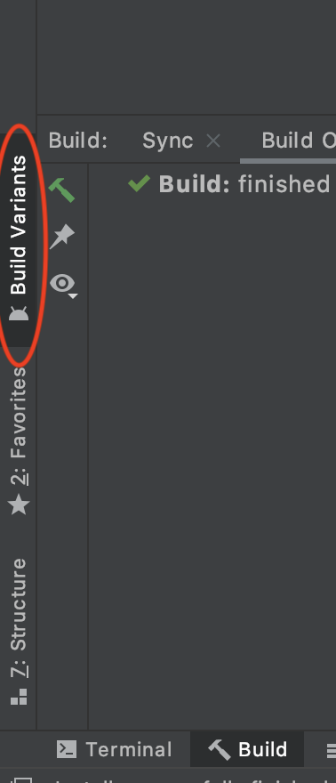
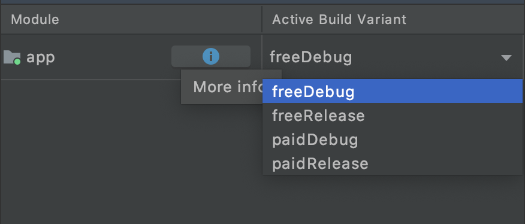
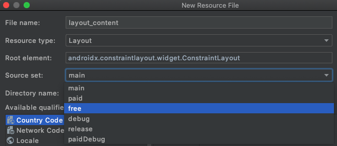
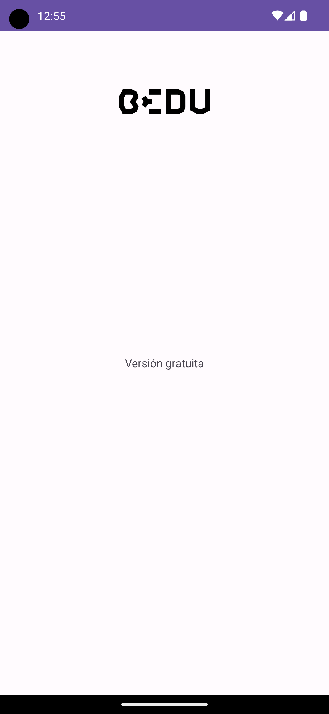
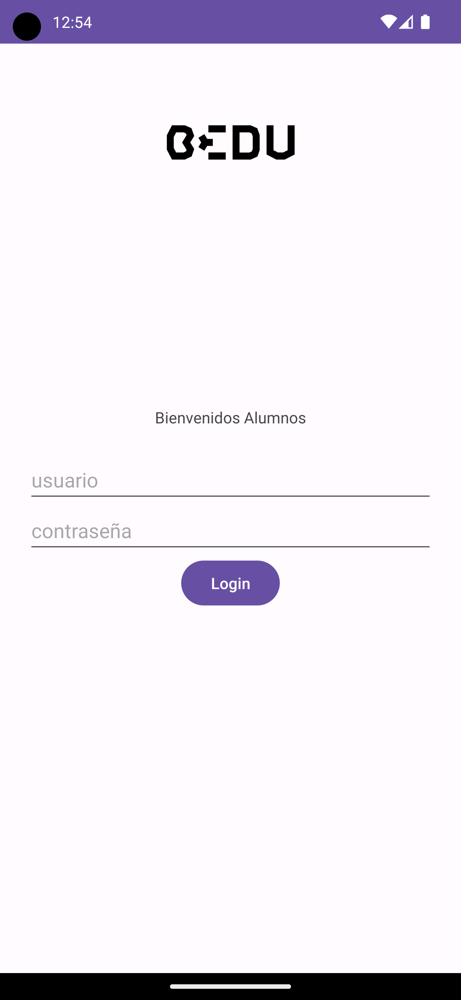

[`Kotlin Intermedio`](../../Readme.md) > [`Sesión 08`](../Readme.md) > `Ejemplo 2`

## Ejemplo 2: Build Variants

<div style="text-align: justify;">

### 1. Objetivos :dart:

- Crear distintas versiones de la aplicación de acuerdo a una propiedad
- Poder compilar una versión _debug_ de nuestra aplicación

### 2. Requisitos :clipboard:

1. Android Studio Instalado en nuestra computadora.
2. Seguir la instrucción específica para esta sesión.

### 3. Desarrollo :computer:

Vamos a suponer una aplicación que pueda usar ciertas características, pero para poder iniciar sesión y hacer uso de otras características, requerimos adquirir la versión de paga de la app, por lo cual para una versión gratuita en la pantalla iniciar sesión, mostraremos un mensaje que nos indique que estamos en la versión gratuita.

1. Abre __Android Studio__ y crea un nuevo proyecto con Activity Vacía (Empty Activity).

2. Ahora vamos a crear el login. Agregamos un _ImageView_ con el logotipo de Bedu. Agregaremos un _layout_, donde agregaremos nuestro formulario de inicio de sesión. Dicho layout se llamará _layout_content_. 

```xml
<androidx.constraintlayout.widget.ConstraintLayout xmlns:android="http://schemas.android.com/apk/res/android"
    xmlns:app="http://schemas.android.com/apk/res-auto"
    xmlns:tools="http://schemas.android.com/tools"
    android:layout_width="match_parent"
    android:layout_height="match_parent"
    tools:context=".MainActivity">

    <ImageView
        android:id="@+id/imageView"
        android:layout_width="128dp"
        android:layout_height="128dp"
        android:layout_marginTop="24dp"
        app:layout_constraintEnd_toEndOf="parent"
        app:layout_constraintStart_toStartOf="parent"
        app:layout_constraintTop_toTopOf="parent"
        android:src="@drawable/bedu" />
    <include
        app:layout_constraintTop_toBottomOf="@id/imageView"
        app:layout_constraintStart_toStartOf="parent"
        app:layout_constraintEnd_toEndOf="parent"
        layout="@layout/layout_content"/>

</androidx.constraintlayout.widget.ConstraintLayout>
```

3. Ahora crearemos nuestro ___layout_content.xml___. Ahí agregaremos nuestro formulario:

```xml 
<?xml version="1.0" encoding="utf-8"?>
<LinearLayout
    android:orientation="vertical"
    android:paddingHorizontal="24dp"
    android:gravity="center"
    xmlns:android="http://schemas.android.com/apk/res/android" android:layout_width="match_parent"
    android:layout_height="match_parent">
    <TextView
        android:id="@+id/saludo"
        android:layout_width="wrap_content"
        android:layout_height="wrap_content"
        android:text="Bienvenidos Alumnos"/>
    <EditText
        android:layout_marginTop="24dp"
        android:text="usuario"
        android:layout_height="wrap_content"
        android:layout_width="match_parent"/>
    <EditText
        android:text="contraseña"
        android:layout_height="wrap_content"
        android:layout_width="match_parent"/>
    <Button
        android:text="Login"
        android:layout_width="wrap_content"
        android:layout_height="wrap_content"/>
</LinearLayout>
```

Esta configuración obedece al caso de la aplicación paga... Pero para la versión gratuita?

4. Abriremos el archivo ___app/build.gradle___ y el ___buildTypes___ agregaremos la opción debug:

```kotlin
debug{
            applicationIdSuffix ".debug"
            debuggable true
        }
```

Con esto, manifestaremos que para la versión build, agregaremos a nuestro applicationId el sufijo _debug_, por tanto, nuestro id sería: __org.bedu.buildvariant.debug__; la bandera _debugabble_ se explica sola. 

5. Ahora, para hacer la diferenciación de la variante gratuita y pagada de la aplicación, utilizaremos el bloque ___productFlavors___.
Podemos agregar a cualquier _productFlavor_ las configuraciones que hacemos en ___defaultConfig___, puesto que este realmente pertenece a dicho bloque.

Cada flavor debe llevar una ___dimension___, que es el parámetro por el cuál existen variantes de la app. Se pueden declarar varias dimensiones, pero en este caso solo ocuparemos el precio, por lo que declaramos lo siguiente:

```kotlin
flavorDimensions 'price'
```

Tendremos dos versiones: _paid_ y _free_, por lo cual declararemos nuestro bloque así:

```kotlin
    productFlavors{
        free{
            applicationId "org.bedu.buildvariant.free"
            dimension "price"
            applicationIdSuffix ".free"
            versionNameSuffix "-free"
        }
        paid{
            applicationId "org.bedu.buildvariant.paid"
            dimension "price"
            applicationIdSuffix ".paid"
            versionNameSuffix "-full"
            /*
	    minSdkVersion 23
            versionCode 3  + android.defaultConfig.versionCode
	    */
        }
    }
```

Sincronizamos el projecto debido a los cambios en _gradle_ y tendremos creadas nuestras ___Build Variants___ (variantes de compilación), la cual su nomenclatura es la siguiente:

> <product-flavor><Build-Type>

Para visualizarlas, observamos la barra lateral izquierda (cerca de las herramientas de debugging) y damos click a la opción ___Build Variants___:



Nos saldrá un menú con todas las variantes:



Al compilar y/o correr nuestra app, se ajustará a la versión seleccionada.

6. Aunque las variantes están creadas, aún falta reemplazar el _layout_ del formulario por el aviso de app gratuita. La fuente de recursos generalizado para todas las variantes de la app se encuentran por defecto en ___app/src/main___, así que para definir un recurso específico para la variante _free_, la agregamos en la ruta ___app/src/debug___.

Al crear un recurso xml, la forma más rápida sería dando click derecho en _src > New > Android Resource File_, seleccionar layout y seleccionar en _Source Set_, a qué variante pertenece el recurso. En este caso será el _layout_content.mxl_



7. El contenido del _layout_content_ para esta versión será un simple texto:

```xml
<LinearLayout
    xmlns:android="http://schemas.android.com/apk/res/android"
    android:layout_width="match_parent"
    android:orientation="vertical"
    android:paddingHorizontal="24dp"
    android:gravity="center"
    android:layout_height="match_parent">
    <TextView
        android:text="Versión gratuita"
        android:layout_width="wrap_content"
        android:layout_height="wrap_content"/>
</LinearLayout>
```

8. Probamos correr la versión ___freeDebug___, debemos visualizar lo siguiente:



9. Para la versión pagada, obtendremos lo siguiente:



[`Anterior`](../Ejemplo-01/Readme.md) | [`Siguiente`](../Reto-01/Readme.md)


</div>
