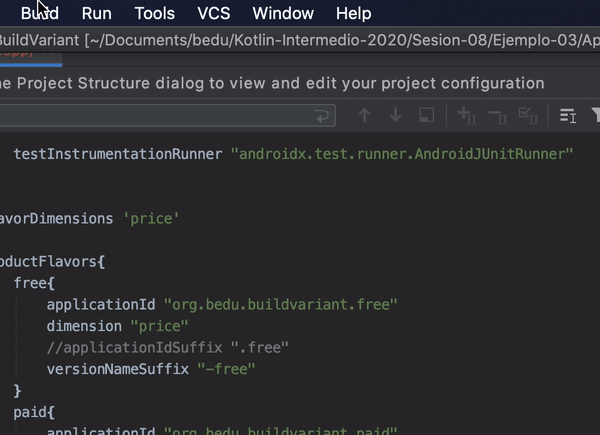
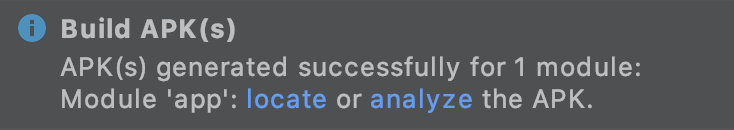
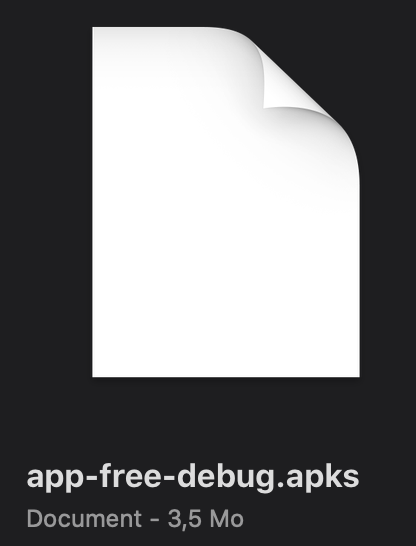
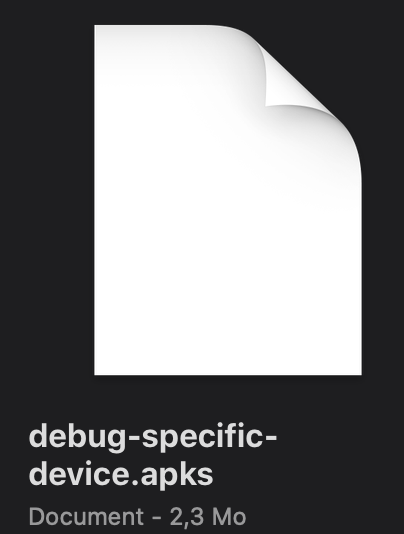
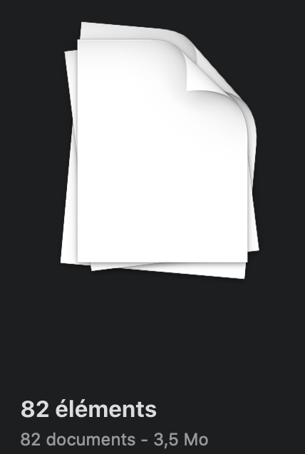
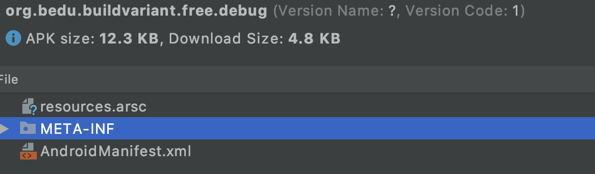
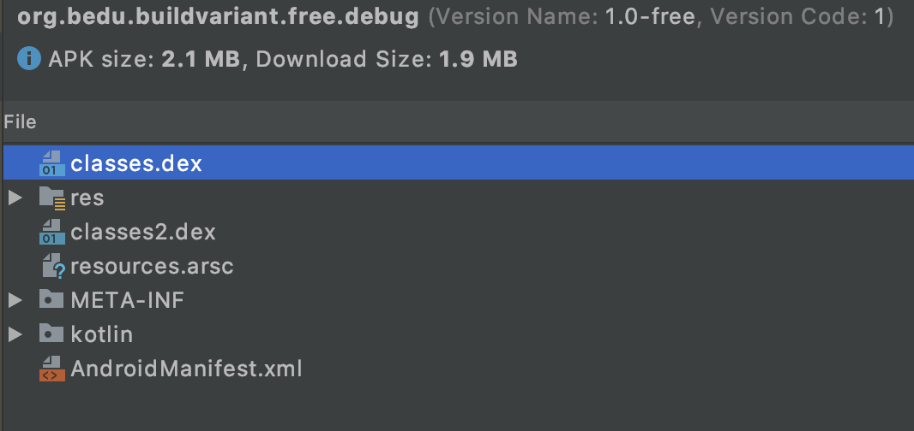
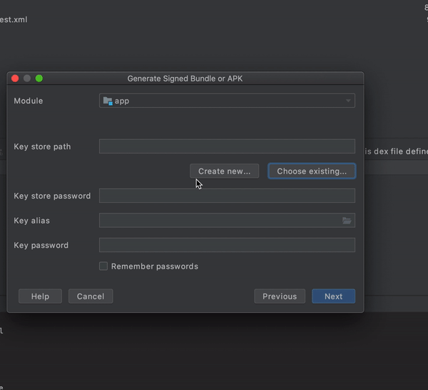

[`Kotlin Intermedio`](../../Readme.md) > [`Sesión 08`](../Readme.md) > `Ejemplo 3`

## Ejemplo 3: Firma de aplicación

<div style="text-align: justify;">

### 1. Objetivos :dart:

- Generar una aplicación de debug.
- Realizar pruebas con un .aab.
- Crear la llave para la firma de aplicaciones _release_.
- Firmar nuestra aplicación para su subida a tienda.

### 2. Requisitos :clipboard:

1. Android Studio Instalado en nuestra computadora.
2. Seguir la instrucción específica para esta sesión.

### 3. Desarrollo :computer:

Después de ejecutar todos los pasos necesarios y recomendados para preparar la app para el lanzamiento, estamos listos para preparar el archivo de nuestra aplicación. Los formatos en los que los podemos subir son los siguientes:

* ___.aab___ (Android App Bundle)
* ___.apk___ (Android Package)

Ambos formatos requieren la generación de una clave y su ___keystore___ para poder ser firmados y subidas a la tienda.


#### Construyendo la app de debug
1. Vamos a generar nuestra app de _debug_, para esto, abrimos la opción _Build > Build Bundle(s) / Apk(s) > Build Apk(s)



Esto nos generará un archivo ___apk___ firmada con la llave de debug, dicha llave se genera la primera vez que se corre el proyecto. La llave se encuentra en la siguiente ruta:

* ___~/.android/___ en OS X y Linux
* ___C:\Users\user\.android\___ en Windows Vista y Windows 7, 8 y 10

El archivo apk utiliza la variante seleccionada en _Build Variants_. El _apk_ generado se encuentra en _{directorio raíz}/app/build/outputs/apk/{flavor}/{buildType}/app-{flavor}-{buildType}.apk_.


#### Estructura del apk

2. El archivo apk es un archivo que contiene todos los elementos para correr la aplicación en distintas densidades de dispositivos y versiones del OS, es similar a un arhicho .zip, por lo tanto, cualquier herramienta de descompresión permite hurgar en el contenido de este. Podemos analizar su contenido por medio del ___Apk Analyzer___, que nos permite ver el contendio de la app. Arrastramos el _apk_ al IDE o bien, en la opción _Build / Analyze Apk_ y seleccionando el archivo. También podemos analizar el apk al momento de generarla, pues saltará una ventana con las siguientes opciones:



Se abrirá una ventana con los siguientes archivos:

* ___classes.dex___, Archivo(s) que contiene(n) el código fuente de nuestra app en formato _Dex_ (el bytecode de la máquina virtual Dalvik).
* ___res___, recursos no compilados en _resources.arc_, contienen recursos para diversas versiones de móviles.
* ___resources.arsc___, Recursos precompilados como _strings, colors etc._
* ___META.INF___, Metadatos de la app como el archivo ___Manifest___ y la firma de la app (___CERT.RSA___).
* ___kotlin___ clases _"built-in"_ de Kotlin como _String, Int_ y otras utilidades.
* ___AndroidManifest.xml___, Archivo xml en formato binario.

Existen otros directorios que se generan en apps más complejas, como con librerías 3rd party.

#### Estructura del aab

3. El _Android App Bundle_ es un archivo que contiene todos los recursos y el código compilado de la app, pero que a diferencia de un _Apk_, no es un archivo instalable, sino que sirve como fuente para extraer lo necesario y compilar un _apk_ específico para un dispositivo con una arquitectura determinada y con un idioma en concreto; esto reduce los recursos dentro del archivo y por lo tanto, el tamaño de la aplicación. Si un dispositivo viene configurado con ciertos idiomas y posteriormente, se configura uno nuevo, el recurso para este idioma (si existe en ) se descarga automáticamente de la ___Play Store___.

___Advertencia:___ Google hará obligatorio la subida de un Android App Bundle para que la aplicación esté en la tienda.


La estructura de un app bundle es la siguiente:


Desde la versión 5.0 de android, se pueden tener _APK's divididas_, que en conjunto se pueden tomar como una sola app. El Base module son los recursos y código de la apk base, una versión que todas las variantes comparten. Los dynamic features son apks divididas que tienen funciones específicas para ciertos dispositivos/clientes.

Para el testing de un _AAB_, existen dos maneras:

* Mediante _Internal Test Track_ en la _Play Store Console_ en _App Releases_, esto implica tener una cuenta de desarrollador y un setup de la aplicación. También se pueden ejectura pruebas cerradas y abiertas.
* Con la herramienta ___bundletool___, que mediante CLI, podemos lanzar archivos _.apk_ para dispositivos específicos, simulando el sistema ___Dynamic Delivery___ que se ejecuta desde los servidores de Google.

En este caso, haremos pruebas mediante la herramienta de linea de comandos ___bundletool___. Para instalarlo, podemos hacer lo siguiente:

* En MacOs, mediante homebrew instalamos la dependencia con:

> brew install bundletool

* Para MacOs y Linux, podemos descargar el proyecto en [Este Enlace](https://github.com/google/bundletool/releases), y agregar un alias para correr el archivo ___.jar___ del proyecto.

> alias bundletool='java -jar bundletool-all.jar'

* O en Windows, mediante

> @doskey bundletool=java -jar {path}\bundletool-all.jar $*

* Para los tres OS, podemos poner utilizar el archivo ___.jar___ con el comando directo de java:

> java -jar bundletool-all.jar {your_arguments_here}

Tomaremos por sentado de que tenemos el alias ___bundletool___.

Un _APK set archive_ o archivo de conjunto de APK en español, que es un conjunto de todas las posibles configuraciones de apks para el proyecto y su extensión es ___apks___. Para generar nuestro set de APK, se utiliza el siguiente comando:

```sh
bundletool build-apks --bundle=/<path>/<nombre_app>.aab --output=/<path>/<nombre_app>.apks
```

En nuestro particular caso, emplearemos el siguiente comando (situando nuestra terminal en la carpeta donde se localiza el bundle):

```sh
bundletool build-apks --bundle=app-free-debug.aab --output=app-free-debug.apks
```

La terminal nos arroja el siguiente mensaje:

> INFO: The APKs will be signed with the debug keystore found at '~/.android/debug.keystore'.

Esto debido a que estamos utilizando la versión debug, que utiliza dicha llave.


Esto generará un _APK set archive_ o archivo de conjunto de APK en español, que es un conjunto de todas las posibles configuraciones de apks para el proyecto y su extensión es ___apks___.

Ahora, vamos a generar un set de APK para nuestro dispositivo, para esto conectaremos un dispositivo físico o abriremos el emulador y corremos la siguiente línea:

```sh
bundletool build-apks --connected-device --bundle=app-free-debug.aab --output=debug-specific-device.apks
```

Si vemos las propiedades de los dos conjuntos de APK, podemos observar que el peso es menor para un dispositivo en específico, pues reduce el rango total de apk's:

  

Vamos a explorar el primer ___.apks___. Descomprimiremos nuestro archivo como si de un _zip_ se tratase

* En macOs y Linux, podemos correr el siguiente comando:

```ssh
unzip app-free-debug.apks -d app-free-debug
```

* En el caso de windows, podemos usar una herramienta de descompresión como winZip (quizá tengamos qué cambiar la extensión por _.zip_).

Hallaremos en nuestra carpeta descomprimida dos elementos: ___toc.pb___ y el directorio ___splits___, que contiene todas las variaciones de la aplicación. Abrimos _splits_, encontramos que el número de aplicaciones son 82 (esto podría variar).



Tomamos uno de estos archivos _apk_ como ___base-es.apk___ y lo leemos con el ___Apk Analyzer___.



La aplicación tiene únicamente tres elementos, a diferencia de los 6 del apk generado desde _android studio_ y... pesa únicamente __12.3KB___?
Si abrimos el ___AndroidManifest___ de esta apk, hallaremos esto:

```xml
<?xml version="1.0" encoding="utf-8"?>
<manifest
    xmlns:android="http://schemas.android.com/apk/res/android"
    android:versionCode="1"
    package="org.bedu.buildvariant.free.debug"
    split="config.es">

    <application
        android:hasCode="false" />
</manifest>
```

en el ___manifest___, hallamos un atributo llamado split, que nos indica que contiene la configuración para español, por lo que concluímos que este ___split___ o app dividida contiene únicamente los recursos de la app en español. Ahora lo intentaremos para el set del dispositivo conectado:

```sh
unzip debug-specific-device.apks -d debug-specific-device
```

Abrimos la carpeta ___debug-sepcific-device/splits___ y encontramos que en este caso, solo hay 3 aplicaciones.


mientras ___base-master.apk___ es la app que tiene los recursos en común (código fuente, assets y recursos), ___base-en.apk___ contiene los recursos en inglés (que son básicamente _strings_) y ___base-xxhdpi.apk___ los recursos para la resolución de pantalla de este dispositivo.

Analizaremos ahora el ___base-master.apk___ en el ___APK Analyzer___:



Puesto que esta es la versión maestra, contiene todo el código fuente (___classes.dex___) y los recursos en común. Esta es la app que tiene mayor parecido a la generada directamente.


Ahora, vamos a instalar la aplicación en nuestro dispositivo (puede ser nuestro emulador o un dispositivo físico):

```sh
bundletool install-apks --apks=/MyApp/my_app.apks
```

Se instalará la aplicación sin que se ejecute automáticamente.

#### Generación del keystore

4. Un keystore es un repositorio asegurado con una contraseña, donde se guardan una serie de llaves y certificados. Cada llave tiene asignado un alias para identificarse y una contraseña para protegerse. Para firmar nuestra aplicación de release, debemos  generar un keystore con una ___signing key___, que es una llave privada que genera un certificado (una llave pública), que es el que encontramos en el ___META_INF___ de nuestro _APK_; esto asegura a Google que nuestra aplicación es auténtica. Una vez que una app es subida, la llave no puede ser cambiada, por lo que perderla implica no poder volver a actualizar la app. La llave de debug es genérica e insegura, por lo que no es válida como una llave de ___release___.

__IMPORTANTE__, el keystore debe ser guardado de forma segura y no debe ser subida como archivo en un CVS (Control Version System) como _Git_.

para generar el keystore, iremos a _Build > Generate Signed Bundle / Apk_, Seleccionamos ___Apk___, le damos a siguiente y en la nueva ventana, damos click a ___create new___:




* ___Key Store Path___ es el directorio donde se guardará nuestro ___keystore___. 
* ___Password y confirm___ es la contraseña del _keystore_.

La siguiente sección es para la llave de firma:

* ___Alias___ es el texto para identificar nuestra llave.
* ___Password y confirm___ es la contraseña de la llave.
* ___validity___ da una fecha de expiración a partir de la generación de la llave (recomendable poner una cantidad de años alta).

La siguiente sección es para el certificado y ninguno de estos campos es obligatorio, por lo que describiremos solo un par de los campos.

* ___First and Last name___ es el nombre del desarrollador (no recomendable poner nombre si la app es de una empresa ).
* ___Country Code___: código del país de dos dígitos, ejemplo: __MX__.

daremos ok y la llave será generada. Ahora, tenemos la ventana previa, con todos los datos de nuestra llave capturados:

a) Pulsamos al checkbox ___Remember Passwords___ para no tener qué capturarlos nuevamente y damos ___Next___.
b) Seleccionamos el build variant deseado ___freeRelease___, 
c) seleccionamos V1 (Jar Signature) y V2 (Full APK Signature) para tener mayor seguridad.
d) Finalizamos el proceso.

El ___apk___ de release estará ubicado en ___app/{flavor}/{buildType}/app-{flavor}-{buildType}.apk___.
	
[`Anterior`](../Reto-01/Readme.md) | [`Siguiente`](../Proyecto/Readme.md)


</div>
