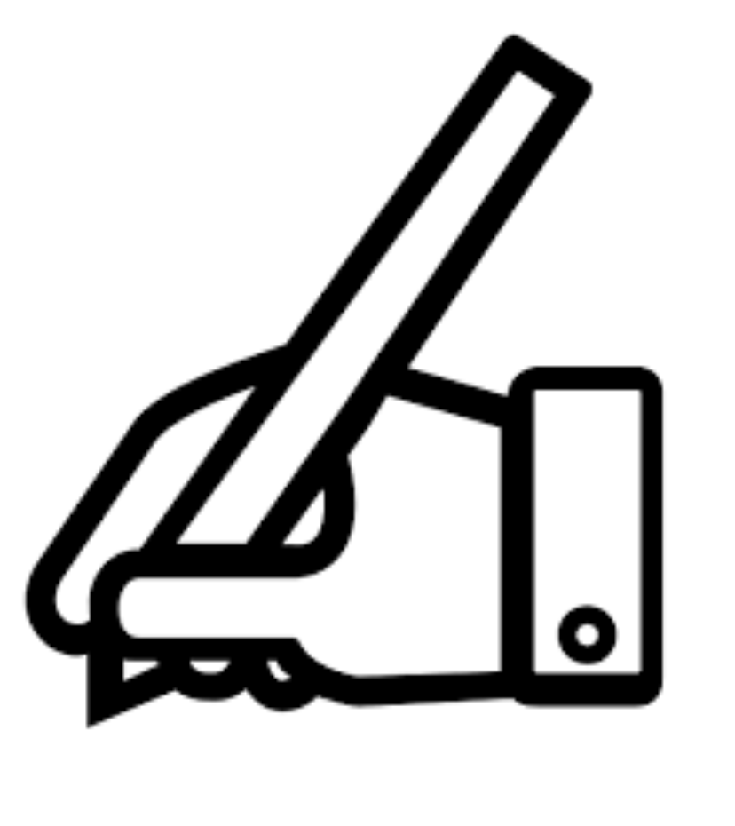

[`Kotlin-Intermedio`](../Readme.md) > `Sesión 8`

## Sesión 8: Gradle y Preparación para lanzamiento

  
  
  
### Introducción

La cantidad de aplicaciones disponibles en Google Play no deja de aumentar. Una de las grandes ventajas de la tienda oficial en Android es que hay muchos tipos de apps diferentes, también de multitud de estudios y desarrolladores. Esto permite que desarrolladores pequeños, que están empezando, puedan publicar sus aplicaciones en la tienda sin demasiados problemas.

### 1. Objetivos :dart: 

---

- Ejecutar pasos previos de configuración.
- Crear un archivo apk a partir del proyecto finalizado.
- Probar aplicación y crear un app bundle
- Preparar para lanzamiento a producción

### 2. Contenido :blue_book:

---

 

#### <ins>Configuración de gradle</ins>

Realizaremos todos los preparativos en los archivos _gradle_ para tener un lanzamiento de la app exitosa.

- [**`EJEMPLO 1`**](Ejemplo-01/Readme.md)

---

 

#### <ins>Build variants</ins>

Crearemos diferentes versiones de una aplicación y aprenderemos para qué sirve esta utilidad.

- [**`EJEMPLO 2`**](Ejemplo-02/Readme.md)
- [**`RETO 1`**](Reto-01/Readme.md)

---

 

#### <ins>Firma de aplicación</ins>

Generaremos un apk de prueba para instalarlo en un dispositivo. Compilaremos un archivo .aab y probaremos su funcionalidad mediante _buildtool_. Firmaremos nuestra aplicación de release y la probaremos en busqueda de algún defecto.

- [**`EJEMPLO 3`**](Ejemplo-03/Readme.md)

---

### 3. Proyecto :hammer:

Cerraremos el proyecto final y dejaremos todo listo para el siguiente nivel.

- [**`PROYECTO SESIÓN 8`**](Proyecto/Readme.md)

### 4. Postwork :memo:

Con lo aprendido en esta sesión, agrega los detalles finales a tu proyecto y prepáralo para el lanzamiento a la tienda.

- [**`POSTWORK SESIÓN 8`**](Postwork/Readme.md)

 

[`Anterior`](../Sesion-07/Readme.md)

