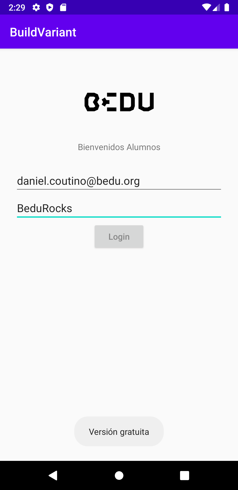

[`Kotlin Intermedio`](../../Readme.md) > [`Sesión 8`](../Readme.md) > `Reto 1`
	
## Reto 1

<div style="text-align: justify;">

### 1. Objetivos :dart:

- Utilizar una variante para restringir un servicio

### 2. Requisitos :clipboard:

1. Android Studio instalado

### 3. Desarrollo :computer:

Tomaremos el ejercicio realizado en el [Ejemplo 2](../Sesion-08/Ejemplo-02) y haremos le unas modificaciones:

- Tanto la versión _free_ como _paid_ utilizarán el formulario, que estará ahora en un fragment ___fragment_login.xml___, que el ___activity_main.xml___ incluirá.
- Al dar click al login en _free_, un ___Toast___ nos advertirá que es la versión gratuita.
- En la versión pagada, se mostrará un ___Toast___ indicando si el usuario o la contraseña están vacíos, en caso contrario, se advertirá del inicio de sesión.
- Los recursos que se ocupen únicamente en un flavor, se deben declarar en el directorio correspondiente (por ejemplo, los _strings_).
- La versión pagada debe enviar un mensaje como este (si los campos tienen texto) 
 
 
 

#### Tips:

- Tanto la versión _free_ como _paid_ tendrán su directorio en _src_.
- No olvides que si utilizas una clase que es diferente para distintas versiones, repítelos en los directorios de flavors correspondientes y no en el _main_, puesto que se duplicarían los 

<details><summary>Solución</summary>

en _free > java > org > bedu > buildvariant_, crear _LoginFragment.kt_

```kotlin
   class LoginFragment : Fragment() {

    override fun onCreateView(
        inflater: LayoutInflater,
        container: ViewGroup?,
        savedInstanceState: Bundle?
    ): View? {
        val view = inflater.inflate(R.layout.fragment_login, container, false)

        val loginButton = view?.findViewById<Button>(R.id.login_button)

        loginButton?.setOnClickListener {
            Toast.makeText(context,getString(R.string.free_version), Toast.LENGTH_SHORT).show()
        }
        return view
    }
}
```
en _free > res > values > strings.xml_

```xml
<resources>
    <string name="free_version">Versión gratuita</string>
</resources>
```
en _paid > java > org > bedu > buildvariant_, crear _LoginFragment.kt_

```kotlin
class LoginFragment : Fragment() {

    override fun onCreateView(
        inflater: LayoutInflater,
        container: ViewGroup?,
        savedInstanceState: Bundle?
    ): View? {
        val view = inflater.inflate(R.layout.fragment_login, container, false)

        val loginButton = view?.findViewById<Button>(R.id.login_button)
        val editUser = view?.findViewById<EditText>(R.id.edit_user)
        val editPassword = view?.findViewById<EditText>(R.id.edit_password)

        loginButton?.setOnClickListener {

            when {
                editUser?.text.toString() == "" -> {
                    Toast.makeText(context,getString(R.string.user_empty), Toast.LENGTH_SHORT).show()
                }
                editPassword?.text.toString() == "" -> {
                    Toast.makeText(context,getString(R.string.pass_empty), Toast.LENGTH_SHORT).show()
                }
                else -> {
                    Toast.makeText(context,getString(R.string.login_successful), Toast.LENGTH_SHORT).show()
                }
            }
        }
        return view
    }
}
```

en _paid > res > values > strings.xml_

```xml
<resources>
    <string name="user_empty">El campo usuario está vacío</string>
    <string name="pass_empty">El campo contraseña está vacío</string>
    <string name="login_successful">login exitoso</string>
</resources>
```


</details>
<br/>


[`Anterior`](../Ejemplo-02/Readme.md) | [`Siguiente`](../Ejemplo-03/Readme.md)


</div>
